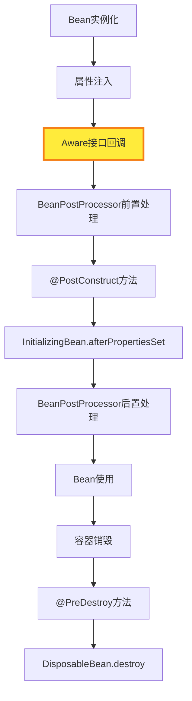

# SpringBoot Aware接口面试知识点与代码应用

## 🎯 核心概念

**Aware接口是Spring提供的一套回调接口，用于让Bean能够感知到Spring容器中的特定对象，并在Bean初始化过程中自动注入这些对象。**

## 📚 常见Aware接口详解

### 1. BeanNameAware - Bean名称感知

```java
public interface BeanNameAware {
    void setBeanName(String name);
}
```

**作用**：让Bean知道自己在容器中的名称
**使用场景**：日志记录、调试、动态Bean操作

### 2. BeanFactoryAware - BeanFactory感知

```java
public interface BeanFactoryAware {
    void setBeanFactory(BeanFactory beanFactory);
}
```

**作用**：让Bean能够访问BeanFactory
**使用场景**：动态获取其他Bean、检查Bean是否存在

### 3. ApplicationContextAware - 应用上下文感知

```java
public interface ApplicationContextAware {
    void setApplicationContext(ApplicationContext applicationContext);
}
```

**作用**：让Bean能够访问ApplicationContext
**使用场景**：发布事件、获取环境信息、访问其他Bean

### 4. EnvironmentAware - 环境信息感知

```java
public interface EnvironmentAware {
    void setEnvironment(Environment environment);
}
```

**作用**：让Bean能够访问环境配置
**使用场景**：读取配置文件、获取系统属性

### 5. ResourceLoaderAware - 资源加载器感知

```java
public interface ResourceLoaderAware {
    void setResourceLoader(ResourceLoader resourceLoader);
}
```

**作用**：让Bean能够加载资源文件
**使用场景**：读取配置文件、加载模板文件

### 6. ApplicationEventPublisherAware - 事件发布器感知

```java
public interface ApplicationEventPublisherAware {
    void setApplicationEventPublisher(ApplicationEventPublisher applicationEventPublisher);
}
```

**作用**：让Bean能够发布应用事件
**使用场景**：发布自定义事件、解耦业务逻辑

## 🔧 实现原理

### 核心处理器：ApplicationContextAwareProcessor

```java
public class ApplicationContextAwareProcessor implements BeanPostProcessor {
    
    @Override
    public Object postProcessBeforeInitialization(Object bean, String beanName) throws BeansException {
        // 处理各种Aware接口
        if (bean instanceof ApplicationContextAware) {
            ((ApplicationContextAware) bean).setApplicationContext(this.applicationContext);
        }
        if (bean instanceof BeanFactoryAware) {
            ((BeanFactoryAware) bean).setBeanFactory(this.beanFactory);
        }
        if (bean instanceof EnvironmentAware) {
            ((EnvironmentAware) bean).setEnvironment(this.environment);
        }
        if (bean instanceof ResourceLoaderAware) {
            ((ResourceLoaderAware) bean).setResourceLoader(this.resourceLoader);
        }
        if (bean instanceof ApplicationEventPublisherAware) {
            ((ApplicationEventPublisherAware) bean).setApplicationEventPublisher(this.applicationEventPublisher);
        }
        if (bean instanceof MessageSourceAware) {
            ((MessageSourceAware) bean).setMessageSource(this.messageSource);
        }
        if (bean instanceof EmbeddedValueResolverAware) {
            ((EmbeddedValueResolverAware) bean).setEmbeddedValueResolver(this.embeddedValueResolver);
        }
        return bean;
    }
}
```

### 在Spring启动流程中的注册

```java
// 在prepareBeanFactory方法中注册
protected void prepareBeanFactory(ConfigurableListableBeanFactory beanFactory) {
    // 添加ApplicationContextAwareProcessor - 处理各种Aware接口的注入
    beanFactory.addBeanPostProcessor(new ApplicationContextAwareProcessor(this));
    
    // 忽略依赖接口 - 防止循环依赖和重复注入
    beanFactory.ignoreDependencyInterface(EnvironmentAware.class);
    beanFactory.ignoreDependencyInterface(EmbeddedValueResolverAware.class);
    beanFactory.ignoreDependencyInterface(ResourceLoaderAware.class);
    beanFactory.ignoreDependencyInterface(ApplicationEventPublisherAware.class);
    beanFactory.ignoreDependencyInterface(MessageSourceAware.class);
    beanFactory.ignoreDependencyInterface(ApplicationContextAware.class);
}
```

## 📋 在Bean生命周期中的位置



**关键时机**：Aware接口的调用发生在属性注入之后，BeanPostProcessor前置处理之前。

## 💻 实际代码应用示例

### 1. 基础Aware接口使用

```java
@Component
public class AwareDemoService implements 
    ApplicationContextAware, 
    BeanNameAware, 
    EnvironmentAware,
    ApplicationEventPublisherAware {
    
    private ApplicationContext applicationContext;
    private String beanName;
    private Environment environment;
    private ApplicationEventPublisher eventPublisher;
    
    @Override
    public void setApplicationContext(ApplicationContext applicationContext) {
        this.applicationContext = applicationContext;
        System.out.println("=== ApplicationContextAware ===");
        System.out.println("ApplicationContext类型: " + applicationContext.getClass().getSimpleName());
    }
    
    @Override
    public void setBeanName(String name) {
        this.beanName = name;
        System.out.println("=== BeanNameAware ===");
        System.out.println("Bean名称: " + name);
    }
    
    @Override
    public void setEnvironment(Environment environment) {
        this.environment = environment;
        System.out.println("=== EnvironmentAware ===");
        System.out.println("Environment类型: " + environment.getClass().getSimpleName());
    }
    
    @Override
    public void setApplicationEventPublisher(ApplicationEventPublisher applicationEventPublisher) {
        this.eventPublisher = applicationEventPublisher;
        System.out.println("=== ApplicationEventPublisherAware ===");
        System.out.println("EventPublisher类型: " + applicationEventPublisher.getClass().getSimpleName());
    }
    
    public void demonstrateAwareUsage() {
        System.out.println("\n=== Aware接口使用演示 ===");
        
        // 使用BeanNameAware
        System.out.println("当前Bean名称: " + beanName);
        
        // 使用EnvironmentAware
        String appName = environment.getProperty("spring.application.name", "unknown");
        System.out.println("应用名称: " + appName);
        
        // 使用ApplicationContextAware
        String[] beanNames = applicationContext.getBeanDefinitionNames();
        System.out.println("容器中Bean数量: " + beanNames.length);
        
        // 使用ApplicationEventPublisherAware
        eventPublisher.publishEvent(new CustomEvent("Hello from Aware!"));
    }
}
```

### 2. 动态Bean操作

```java
@Component
public class DynamicBeanService implements BeanFactoryAware {
    
    private BeanFactory beanFactory;
    
    @Override
    public void setBeanFactory(BeanFactory beanFactory) {
        this.beanFactory = beanFactory;
    }
    
    public void checkBeanExists(String beanName) {
        if (beanFactory.containsBean(beanName)) {
            System.out.println("Bean '" + beanName + "' 存在");
            Object bean = beanFactory.getBean(beanName);
            System.out.println("Bean类型: " + bean.getClass().getSimpleName());
        } else {
            System.out.println("Bean '" + beanName + "' 不存在");
        }
    }
    
    public void getBeanByType(Class<?> type) {
        try {
            Object bean = beanFactory.getBean(type);
            System.out.println("找到Bean: " + bean.getClass().getSimpleName());
        } catch (Exception e) {
            System.out.println("未找到类型为 " + type.getSimpleName() + " 的Bean");
        }
    }
}
```

### 3. 资源加载示例

```java
@Component
public class ResourceLoaderService implements ResourceLoaderAware {
    
    private ResourceLoader resourceLoader;
    
    @Override
    public void setResourceLoader(ResourceLoader resourceLoader) {
        this.resourceLoader = resourceLoader;
    }
    
    public void loadResource(String location) {
        try {
            Resource resource = resourceLoader.getResource(location);
            System.out.println("资源位置: " + resource.getURI());
            System.out.println("资源存在: " + resource.exists());
            System.out.println("资源可读: " + resource.isReadable());
        } catch (Exception e) {
            System.out.println("加载资源失败: " + e.getMessage());
        }
    }
}
```

## 🎯 面试重点问题

### 1. Aware接口的作用是什么？

**答案要点**：

- 让Bean能够感知到Spring容器中的特定对象
- 在Bean初始化过程中自动注入这些对象
- 提供了一种标准化的方式来获取容器信息

### 2. Aware接口的调用时机是什么？

**答案要点**：

- 在Bean实例化和属性注入之后
- 在BeanPostProcessor前置处理之前
- 通过ApplicationContextAwareProcessor实现

### 3. 常见的Aware接口有哪些？

**答案要点**：

- BeanNameAware：获取Bean名称
- BeanFactoryAware：获取BeanFactory
- ApplicationContextAware：获取ApplicationContext
- EnvironmentAware：获取环境信息
- ResourceLoaderAware：获取资源加载器
- ApplicationEventPublisherAware：获取事件发布器

### 4. Aware接口的实现原理是什么？

**答案要点**：

- 通过ApplicationContextAwareProcessor实现
- 在BeanPostProcessor的postProcessBeforeInitialization方法中处理
- 使用instanceof判断Bean是否实现了特定的Aware接口

### 5. 为什么要忽略Aware接口的依赖注入？

**答案要点**：

- 防止循环依赖
- 避免重复注入
- 确保通过专门的方式注入

## 🔍 实际应用场景

### 1. 日志记录

```java
@Component
public class LoggingService implements BeanNameAware {
    private String beanName;
    
    @Override
    public void setBeanName(String name) {
        this.beanName = name;
    }
    
    public void log(String message) {
        System.out.println("[" + beanName + "] " + message);
    }
}
```

### 2. 配置读取

```java
@Component
public class ConfigService implements EnvironmentAware {
    private Environment environment;
    
    @Override
    public void setEnvironment(Environment environment) {
        this.environment = environment;
    }
    
    public String getConfig(String key) {
        return environment.getProperty(key);
    }
}
```

### 3. 事件发布

```java
@Component
public class EventService implements ApplicationEventPublisherAware {
    private ApplicationEventPublisher eventPublisher;
    
    @Override
    public void setApplicationEventPublisher(ApplicationEventPublisher eventPublisher) {
        this.eventPublisher = eventPublisher;
    }
    
    public void publishEvent(String message) {
        eventPublisher.publishEvent(new CustomEvent(message));
    }
}
```

## ⚠️ 注意事项

1. **不要过度使用**：Aware接口会破坏Bean的封装性，应该谨慎使用
2. **避免循环依赖**：使用Aware接口时要避免创建循环依赖
3. **性能考虑**：Aware接口的调用会增加Bean初始化的开销
4. **测试困难**：使用Aware接口的Bean在单元测试中可能难以模拟

## 📝 总结

Aware接口是Spring IoC容器的一个重要特性，它让Bean能够"感知"到容器的存在，并获取必要的容器信息。虽然它提供了强大的功能，但应该谨慎使用，避免破坏Bean的封装性和增加系统的复杂性。

**核心价值**：

- 解耦：让Bean能够访问Spring容器的核心对象
- 灵活性：提供标准化的方式获取容器信息
- 扩展性：可以自定义Aware接口满足特定需求
- 生命周期管理：在合适的时机自动注入依赖
