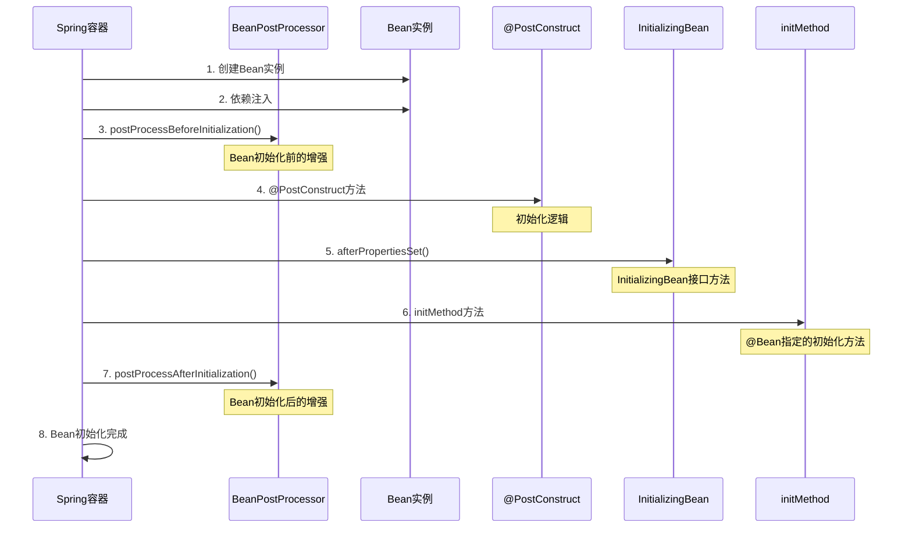

# SpringBoot Bean初始化控制完全指南

## 📚 目录

1. [概述](#概述)
2. [Bean初始化执行顺序](#bean初始化执行顺序)
3. [初始化控制方式详解](#初始化控制方式详解)
4. [实际业务应用场景](#实际业务应用场景)
5. [最佳实践与建议](#最佳实践与建议)
6. [常见问题与解决方案](#常见问题与解决方案)
7. [总结](#总结)

---

## 概述

在SpringBoot应用中，Bean的初始化是一个关键环节。合理控制Bean的初始化过程，可以确保应用的正确启动、依赖关系的正确处理，以及资源的合理管理。

### 为什么需要Bean初始化控制？

- **依赖管理**：确保Bean之间的依赖关系正确建立
- **资源初始化**：数据库连接、缓存、消息队列等资源的初始化
- **配置验证**：验证应用配置的正确性
- **性能优化**：通过延迟初始化减少启动时间
- **条件化创建**：根据环境或配置条件创建不同的Bean

---

## Bean初始化执行顺序

### 完整执行流程



### 执行顺序说明

| 步骤 | 执行内容 | 说明 |
|------|----------|------|
| 1 | Bean实例创建 | 通过构造函数创建Bean实例 |
| 2 | 依赖注入 | 注入@Autowired、@Resource等标注的依赖 |
| 3 | BeanPostProcessor.beforeInitialization | Bean初始化前的增强处理 |
| 4 | @PostConstruct方法 | 标注的初始化方法 |
| 5 | InitializingBean.afterPropertiesSet | 实现接口的初始化方法 |
| 6 | @Bean(initMethod) | 指定的初始化方法 |
| 7 | BeanPostProcessor.afterInitialization | Bean初始化后的增强处理 |
| 8 | Bean初始化完成 | Bean可以正常使用 |

---

## 初始化控制方式详解

### 1. @PostConstruct 注解

**执行时机**：Bean创建完成，依赖注入完成后执行  
**使用场景**：初始化Bean的状态、启动定时任务、建立连接等

#### 基本用法

```java
@Service
public class UserService {
    
    private final UserRepository userRepository;
    private final CacheService cacheService;
    
    public UserService(UserRepository userRepository, CacheService cacheService) {
        this.userRepository = userRepository;
        this.cacheService = cacheService;
    }
    
    @PostConstruct
    public void init() {
        System.out.println("=== @PostConstruct 执行 ===");
        System.out.println("执行时机：Bean创建完成，依赖注入完成后");
        
        // 1. 初始化缓存
        initializeCache();
        
        // 2. 启动定时任务
        startScheduledTasks();
        
        // 3. 建立外部连接
        establishExternalConnections();
        
        // 4. 验证配置
        validateConfiguration();
    }
    
    private void initializeCache() {
        System.out.println("初始化用户缓存...");
        // 预加载常用用户数据到缓存
        List<User> activeUsers = userRepository.findActiveUsers();
        cacheService.put("active_users", activeUsers);
    }
    
    private void startScheduledTasks() {
        System.out.println("启动定时任务...");
        // 启动用户数据同步任务
        // 启动缓存清理任务
    }
    
    private void establishExternalConnections() {
        System.out.println("建立外部连接...");
        // 建立与外部系统的连接
        // 测试连接可用性
    }
    
    private void validateConfiguration() {
        System.out.println("验证配置...");
        // 验证必要的配置项
        // 检查外部服务可用性
    }
}
```

#### 特点

- ✅ 简单易用，注解方式
- ✅ 自动执行，无需手动调用
- ✅ 支持异常处理
- ❌ 无法控制执行顺序
- ❌ 无法传递参数

### 2. InitializingBean 接口

**执行时机**：在@PostConstruct之后执行  
**使用场景**：需要实现接口的初始化逻辑

#### 基本用法

```java
@Service
public class OrderService implements InitializingBean {
    
    private final OrderRepository orderRepository;
    private final PaymentService paymentService;
    
    public OrderService(OrderRepository orderRepository, PaymentService paymentService) {
        this.orderRepository = orderRepository;
        this.paymentService = paymentService;
    }
    
    @Override
    public void afterPropertiesSet() throws Exception {
        System.out.println("=== InitializingBean.afterPropertiesSet() 执行 ===");
        System.out.println("执行时机：@PostConstruct之后");
        
        // 1. 初始化订单状态映射
        initializeOrderStatusMapping();
        
        // 2. 设置支付回调
        setupPaymentCallbacks();
        
        // 3. 初始化订单统计
        initializeOrderStatistics();
    }
    
    private void initializeOrderStatusMapping() {
        System.out.println("初始化订单状态映射...");
        // 建立订单状态与业务逻辑的映射关系
    }
    
    private void setupPaymentCallbacks() {
        System.out.println("设置支付回调...");
        // 注册支付成功/失败的回调处理
    }
    
    private void initializeOrderStatistics() {
        System.out.println("初始化订单统计...");
        // 初始化订单统计相关的数据结构
    }
}
```

#### 特点

- ✅ 接口方式，规范明确
- ✅ 可以抛出异常
- ✅ 支持复杂的初始化逻辑
- ❌ 需要实现接口
- ❌ 增加类与Spring的耦合

### 3. @Bean(initMethod = "methodName") 注解

**执行时机**：在InitializingBean.afterPropertiesSet()之后执行  
**使用场景**：为第三方库的Bean指定初始化方法

#### 基本用法

```java
@Configuration
public class BeanConfig {
    
    @Bean(initMethod = "init", destroyMethod = "cleanup")
    public DataSource dataSource() {
        HikariDataSource dataSource = new HikariDataSource();
        dataSource.setJdbcUrl("jdbc:mysql://localhost:3306/test");
        dataSource.setUsername("root");
        dataSource.setPassword("password");
        return dataSource;
    }
    
    @Bean(initMethod = "start", destroyMethod = "stop")
    public RedisTemplate<String, Object> redisTemplate() {
        RedisTemplate<String, Object> template = new RedisTemplate<>();
        // 配置Redis连接
        return template;
    }
}

// 第三方库的Bean类
public class CustomDataSource {
    
    public void init() {
        System.out.println("=== @Bean(initMethod) 执行 ===");
        System.out.println("执行时机：InitializingBean.afterPropertiesSet()之后");
        
        // 初始化数据源连接池
        initializeConnectionPool();
        
        // 测试数据库连接
        testDatabaseConnection();
    }
    
    private void initializeConnectionPool() {
        System.out.println("初始化连接池...");
        // 创建连接池
        // 设置连接池参数
    }
    
    private void testDatabaseConnection() {
        System.out.println("测试数据库连接...");
        // 执行测试查询
        // 验证连接可用性
    }
    
    public void cleanup() {
        System.out.println("清理数据源资源...");
        // 关闭连接池
        // 释放资源
    }
}
```

#### 特点

- ✅ 灵活，可指定任意方法
- ✅ 适合第三方库Bean
- ✅ 支持销毁方法
- ❌ 需要手动指定方法名
- ❌ 方法名硬编码

### 4. @DependsOn 注解

**执行时机**：控制Bean的创建顺序  
**使用场景**：确保依赖的Bean先创建

#### 基本用法

```java
@Service
@DependsOn({"configService", "cacheService"})
public class BusinessService {
    
    private final ConfigService configService;
    private final CacheService cacheService;
    
    public BusinessService(ConfigService configService, CacheService cacheService) {
        this.configService = configService;
        this.cacheService = cacheService;
    }
    
    @PostConstruct
    public void init() {
        System.out.println("=== @DependsOn 控制的Bean初始化 ===");
        System.out.println("执行时机：依赖的Bean创建完成后");
        
        // 确保configService和cacheService已经初始化完成
        String config = configService.getConfig("business.config");
        cacheService.initialize(config);
    }
}

@Service
public class ConfigService {
    
    @PostConstruct
    public void init() {
        System.out.println("ConfigService 初始化完成");
    }
}

@Service
public class CacheService {
    
    @PostConstruct
    public void init() {
        System.out.println("CacheService 初始化完成");
    }
}
```

#### 特点

- ✅ 精确控制依赖关系
- ✅ 确保初始化顺序
- ✅ 支持多个依赖
- ❌ 增加耦合度
- ❌ 可能影响启动性能

### 5. @Lazy 注解

**执行时机**：延迟初始化，只有在第一次使用时才创建  
**使用场景**：减少启动时间，按需创建Bean

#### 基本用法

```java
@Service
@Lazy
public class HeavyService {
    
    @PostConstruct
    public void init() {
        System.out.println("=== @Lazy Bean 初始化 ===");
        System.out.println("执行时机：第一次使用时");
        
        // 执行重量级初始化操作
        performHeavyInitialization();
    }
    
    private void performHeavyInitialization() {
        System.out.println("执行重量级初始化...");
        try {
            Thread.sleep(3000); // 模拟重量级操作
            System.out.println("重量级初始化完成");
        } catch (InterruptedException e) {
            Thread.currentThread().interrupt();
        }
    }
}

@Service
public class LightService {
    
    @Autowired
    @Lazy
    private HeavyService heavyService;
    
    public void doSomething() {
        // 只有在调用这个方法时，heavyService才会被初始化
        heavyService.performHeavyInitialization();
    }
}
```

#### 特点

- ✅ 减少启动时间
- ✅ 按需创建Bean
- ✅ 节省内存资源
- ❌ 首次使用可能较慢
- ❌ 可能隐藏初始化问题

### 6. @Conditional 注解

**执行时机**：根据条件决定是否创建Bean  
**使用场景**：根据环境、配置等条件创建不同的Bean

#### 基本用法

```java
@Configuration
public class ConditionalBeanConfig {
    
    @Bean
    @ConditionalOnProperty(name = "app.cache.enabled", havingValue = "true")
    public CacheService cacheService() {
        System.out.println("=== @Conditional Bean 创建 ===");
        System.out.println("执行时机：满足条件时");
        return new CacheService();
    }
    
    @Bean
    @ConditionalOnClass(name = "com.redis.RedisTemplate")
    public RedisService redisService() {
        System.out.println("Redis服务Bean创建");
        return new RedisService();
    }
    
    @Bean
    @ConditionalOnMissingBean(CacheService.class)
    public NoOpCacheService noOpCacheService() {
        System.out.println("NoOp缓存服务Bean创建");
        return new NoOpCacheService();
    }
}
```

#### 常用条件注解

| 注解 | 说明 | 示例 |
|------|------|------|
| @ConditionalOnProperty | 根据配置属性 | @ConditionalOnProperty(name = "app.cache.enabled") |
| @ConditionalOnClass | 根据类是否存在 | @ConditionalOnClass(name = "com.redis.RedisTemplate") |
| @ConditionalOnMissingBean | 根据Bean是否存在 | @ConditionalOnMissingBean(CacheService.class) |
| @ConditionalOnWebApplication | 根据应用类型 | @ConditionalOnWebApplication(type = SERVLET) |
| @ConditionalOnProfile | 根据Profile | @ConditionalOnProfile("dev") |

#### 特点

- ✅ 灵活的条件控制
- ✅ 支持多种条件类型
- ✅ 减少不必要的Bean创建
- ❌ 条件复杂时难以维护
- ❌ 可能影响测试

### 7. BeanPostProcessor 接口

**执行时机**：在Bean初始化前后执行  
**使用场景**：对Bean进行增强、监控、代理等

#### 基本用法

```java
@Component
public class CustomBeanPostProcessor implements BeanPostProcessor {
    
    @Override
    public Object postProcessBeforeInitialization(Object bean, String beanName) throws BeansException {
        System.out.println("=== BeanPostProcessor.beforeInitialization ===");
        System.out.println("执行时机：Bean初始化之前");
        System.out.println("Bean名称: " + beanName + ", Bean类型: " + bean.getClass().getSimpleName());
        
        // 在Bean初始化前进行增强
        if (bean instanceof UserService) {
            System.out.println("对UserService进行初始化前增强");
        }
        
        return bean;
    }
    
    @Override
    public Object postProcessAfterInitialization(Object bean, String beanName) throws BeansException {
        System.out.println("=== BeanPostProcessor.afterInitialization ===");
        System.out.println("执行时机：Bean初始化之后");
        System.out.println("Bean名称: " + beanName + ", Bean类型: " + bean.getClass().getSimpleName());
        
        // 在Bean初始化后进行增强
        if (bean instanceof UserService) {
            System.out.println("对UserService进行初始化后增强");
            // 可以返回代理对象
            return createProxy(bean);
        }
        
        return bean;
    }
    
    private Object createProxy(Object bean) {
        // 创建代理对象的逻辑
        return bean;
    }
}
```

#### 特点

- ✅ 强大的扩展能力
- ✅ 影响所有Bean
- ✅ 支持代理创建
- ❌ 影响性能
- ❌ 调试困难

---

## 实际业务应用场景

### 1. 数据库连接池初始化

```java
@Configuration
public class DatabaseConfig {
    
    @Bean
    @ConfigurationProperties(prefix = "spring.datasource.hikari")
    public HikariDataSource dataSource() {
        HikariDataSource dataSource = new HikariDataSource();
        return dataSource;
    }
    
    @Bean
    @DependsOn("dataSource")
    public JdbcTemplate jdbcTemplate(DataSource dataSource) {
        return new JdbcTemplate(dataSource);
    }
}

@Service
public class DatabaseService {
    
    private final JdbcTemplate jdbcTemplate;
    
    public DatabaseService(JdbcTemplate jdbcTemplate) {
        this.jdbcTemplate = jdbcTemplate;
    }
    
    @PostConstruct
    public void init() {
        System.out.println("=== 数据库服务初始化 ===");
        
        // 1. 测试数据库连接
        testDatabaseConnection();
        
        // 2. 创建必要的表
        createTablesIfNotExists();
        
        // 3. 初始化基础数据
        initializeBaseData();
    }
    
    private void testDatabaseConnection() {
        try {
            jdbcTemplate.queryForObject("SELECT 1", Integer.class);
            System.out.println("数据库连接测试成功");
        } catch (Exception e) {
            throw new RuntimeException("数据库连接失败", e);
        }
    }
    
    private void createTablesIfNotExists() {
        // 创建表的SQL
        String createTableSql = """
            CREATE TABLE IF NOT EXISTS users (
                id BIGINT PRIMARY KEY AUTO_INCREMENT,
                username VARCHAR(50) NOT NULL,
                email VARCHAR(100) NOT NULL,
                created_at TIMESTAMP DEFAULT CURRENT_TIMESTAMP
            )
            """;
        
        jdbcTemplate.execute(createTableSql);
        System.out.println("用户表创建完成");
    }
    
    private void initializeBaseData() {
        // 检查是否存在管理员用户
        Integer adminCount = jdbcTemplate.queryForObject(
            "SELECT COUNT(*) FROM users WHERE username = 'admin'", 
            Integer.class
        );
        
        if (adminCount == 0) {
            jdbcTemplate.update(
                "INSERT INTO users (username, email) VALUES (?, ?)",
                "admin", "admin@example.com"
            );
            System.out.println("管理员用户创建完成");
        }
    }
}
```

### 2. 缓存服务初始化

```java
@Service
@ConditionalOnProperty(name = "app.cache.enabled", havingValue = "true")
public class CacheService implements InitializingBean {
    
    private final RedisTemplate<String, Object> redisTemplate;
    private final CacheManager cacheManager;
    
    public CacheService(RedisTemplate<String, Object> redisTemplate, 
                       CacheManager cacheManager) {
        this.redisTemplate = redisTemplate;
        this.cacheManager = cacheManager;
    }
    
    @PostConstruct
    public void init() {
        System.out.println("=== 缓存服务初始化 ===");
        
        // 1. 测试Redis连接
        testRedisConnection();
        
        // 2. 清理过期缓存
        clearExpiredCache();
        
        // 3. 设置缓存配置
        setupCacheConfiguration();
    }
    
    @Override
    public void afterPropertiesSet() throws Exception {
        System.out.println("=== 缓存服务属性设置后 ===");
        
        // 1. 初始化缓存统计
        initializeCacheStatistics();
        
        // 2. 启动缓存监控
        startCacheMonitoring();
    }
    
    private void testRedisConnection() {
        try {
            redisTemplate.opsForValue().set("test_key", "test_value", 10, TimeUnit.SECONDS);
            String value = (String) redisTemplate.opsForValue().get("test_key");
            if ("test_value".equals(value)) {
                System.out.println("Redis连接测试成功");
            }
        } catch (Exception e) {
            throw new RuntimeException("Redis连接失败", e);
        }
    }
    
    private void clearExpiredCache() {
        System.out.println("清理过期缓存...");
        // 清理逻辑
    }
    
    private void setupCacheConfiguration() {
        System.out.println("设置缓存配置...");
        // 配置缓存策略
    }
    
    private void initializeCacheStatistics() {
        System.out.println("初始化缓存统计...");
        // 初始化统计信息
    }
    
    private void startCacheMonitoring() {
        System.out.println("启动缓存监控...");
        // 启动监控任务
    }
}
```

### 3. 消息队列服务初始化

```java
@Service
@ConditionalOnClass(name = "org.springframework.amqp.rabbit.core.RabbitTemplate")
public class MessageQueueService {
    
    private final RabbitTemplate rabbitTemplate;
    private final MessageConverter messageConverter;
    
    public MessageQueueService(RabbitTemplate rabbitTemplate, 
                              MessageConverter messageConverter) {
        this.rabbitTemplate = rabbitTemplate;
        this.messageConverter = messageConverter;
    }
    
    @PostConstruct
    public void init() {
        System.out.println("=== 消息队列服务初始化 ===");
        
        // 1. 测试消息队列连接
        testMessageQueueConnection();
        
        // 2. 创建必要的队列和交换机
        createQueuesAndExchanges();
        
        // 3. 设置消息监听器
        setupMessageListeners();
    }
    
    private void testMessageQueueConnection() {
        try {
            rabbitTemplate.convertAndSend("test.queue", "test message");
            System.out.println("消息队列连接测试成功");
        } catch (Exception e) {
            throw new RuntimeException("消息队列连接失败", e);
        }
    }
    
    private void createQueuesAndExchanges() {
        System.out.println("创建队列和交换机...");
        // 创建队列和交换机的逻辑
    }
    
    private void setupMessageListeners() {
        System.out.println("设置消息监听器...");
        // 设置监听器的逻辑
    }
}
```

### 4. 定时任务服务初始化

```java
@Service
public class ScheduledTaskService {
    
    private final TaskRepository taskRepository;
    private final TaskExecutor taskExecutor;
    
    public ScheduledTaskService(TaskRepository taskRepository, TaskExecutor taskExecutor) {
        this.taskRepository = taskRepository;
        this.taskExecutor = taskExecutor;
    }
    
    @PostConstruct
    public void init() {
        System.out.println("=== 定时任务服务初始化 ===");
        
        // 1. 加载待执行任务
        loadPendingTasks();
        
        // 2. 启动任务调度器
        startTaskScheduler();
        
        // 3. 恢复中断的任务
        resumeInterruptedTasks();
    }
    
    private void loadPendingTasks() {
        System.out.println("加载待执行任务...");
        List<Task> pendingTasks = taskRepository.findPendingTasks();
        for (Task task : pendingTasks) {
            scheduleTask(task);
        }
    }
    
    private void startTaskScheduler() {
        System.out.println("启动任务调度器...");
        // 启动调度器逻辑
    }
    
    private void resumeInterruptedTasks() {
        System.out.println("恢复中断的任务...");
        List<Task> interruptedTasks = taskRepository.findInterruptedTasks();
        for (Task task : interruptedTasks) {
            resumeTask(task);
        }
    }
    
    private void scheduleTask(Task task) {
        // 调度任务逻辑
    }
    
    private void resumeTask(Task task) {
        // 恢复任务逻辑
    }
}
```

---

## 最佳实践与建议

### 1. 选择合适的初始化方式

#### 推荐使用场景

```java
// 推荐：使用@PostConstruct进行简单的初始化
@Service
public class UserService {
    
    @PostConstruct
    public void init() {
        // 简单的初始化逻辑
        initializeCache();
        startScheduledTasks();
    }
}

// 推荐：使用InitializingBean进行复杂的初始化
@Service
public class ComplexService implements InitializingBean {
    
    @Override
    public void afterPropertiesSet() throws Exception {
        // 复杂的初始化逻辑
        performComplexInitialization();
    }
}

// 推荐：使用@Bean(initMethod)为第三方库Bean指定初始化
@Bean(initMethod = "init", destroyMethod = "cleanup")
public ThirdPartyService thirdPartyService() {
    return new ThirdPartyService();
}
```

#### 选择原则

| 场景 | 推荐方式 | 原因 |
|------|----------|------|
| 简单初始化 | @PostConstruct | 简单易用，注解方式 |
| 复杂初始化 | InitializingBean | 支持异常处理，逻辑清晰 |
| 第三方库Bean | @Bean(initMethod) | 灵活，不修改源码 |
| 控制依赖关系 | @DependsOn | 精确控制创建顺序 |
| 性能优化 | @Lazy | 延迟初始化，减少启动时间 |
| 条件化创建 | @Conditional | 根据条件创建Bean |
| Bean增强 | BeanPostProcessor | 强大的扩展能力 |

### 2. 控制Bean初始化顺序

#### 使用@DependsOn控制依赖关系

```java
// 使用@DependsOn控制依赖关系
@Service
@DependsOn({"configService", "cacheService"})
public class BusinessService {
    // 确保configService和cacheService先初始化
}

// 使用@Order控制执行顺序
@Component
@Order(1)
public class FirstInitializer implements ApplicationContextInitializer<ConfigurableApplicationContext> {
    // 第一个执行
}

@Component
@Order(2)
public class SecondInitializer implements ApplicationContextInitializer<ConfigurableApplicationContext> {
    // 第二个执行
}
```

#### 依赖关系设计原则

- **最小依赖原则**：尽量减少Bean之间的依赖关系
- **单向依赖原则**：避免循环依赖
- **接口隔离原则**：依赖接口而不是具体实现
- **延迟加载原则**：非关键Bean使用@Lazy延迟初始化

### 3. 异常处理策略

#### 关键初始化异常处理

```java
@Service
public class RobustService {
    
    @PostConstruct
    public void init() {
        try {
            // 关键初始化逻辑
            performCriticalInitialization();
        } catch (Exception e) {
            // 记录日志并重新抛出异常
            logger.error("Critical initialization failed", e);
            throw new RuntimeException("Service cannot start", e);
        }
    }
    
    private void performCriticalInitialization() {
        // 关键初始化逻辑
    }
}
```

#### 非关键初始化异常处理

```java
@Service
public class GracefulService {
    
    @PostConstruct
    public void init() {
        try {
            // 非关键初始化逻辑
            performNonCriticalInitialization();
        } catch (Exception e) {
            // 记录日志但不影响应用启动
            logger.warn("Non-critical initialization failed, continuing...", e);
        }
    }
    
    private void performNonCriticalInitialization() {
        // 非关键初始化逻辑
    }
}
```

### 4. 性能优化

#### 使用@Lazy延迟初始化

```java
// 使用@Lazy延迟初始化重量级Bean
@Service
@Lazy
public class HeavyService {
    
    @PostConstruct
    public void init() {
        // 重量级初始化操作
        performHeavyInitialization();
    }
}

// 使用@Conditional按需创建Bean
@Bean
@ConditionalOnProperty(name = "app.feature.enabled", havingValue = "true")
public FeatureService featureService() {
    return new FeatureService();
}
```

#### 性能优化建议

- **延迟初始化**：非关键Bean使用@Lazy
- **条件化创建**：根据配置按需创建Bean
- **异步初始化**：耗时操作使用异步方式
- **资源池化**：数据库连接、线程池等使用池化技术

### 5. 测试策略

#### 单元测试

```java
@ExtendWith(MockitoExtension.class)
class UserServiceTest {
    
    @Mock
    private UserRepository userRepository;
    
    @Mock
    private CacheService cacheService;
    
    @InjectMocks
    private UserService userService;
    
    @Test
    void testInitialization() {
        // 模拟依赖
        when(userRepository.findActiveUsers()).thenReturn(Arrays.asList(new User()));
        
        // 手动调用初始化方法
        userService.init();
        
        // 验证初始化结果
        verify(cacheService).put(eq("active_users"), any());
    }
}
```

#### 集成测试

```java
@SpringBootTest
@TestPropertySource(properties = {
    "app.cache.enabled=true",
    "app.feature.enabled=true"
})
class BeanInitializationIntegrationTest {
    
    @Autowired
    private ApplicationContext applicationContext;
    
    @Test
    void testBeanInitializationOrder() {
        // 验证Bean初始化顺序
        assertThat(applicationContext.getBean("configService")).isNotNull();
        assertThat(applicationContext.getBean("cacheService")).isNotNull();
        assertThat(applicationContext.getBean("businessService")).isNotNull();
    }
}
```

---

## 常见问题与解决方案

### 1. Bean初始化顺序问题

#### 问题描述
Bean初始化顺序不正确，导致依赖的Bean还未初始化完成就被使用。

#### 解决方案

```java
// 使用@DependsOn明确指定依赖关系
@Service
@DependsOn({"configService", "cacheService"})
public class BusinessService {
    // 确保依赖的Bean先初始化
}

// 使用@Order控制执行顺序
@Component
@Order(1)
public class FirstService {
    // 第一个初始化
}

@Component
@Order(2)
public class SecondService {
    // 第二个初始化
}
```

### 2. 循环依赖问题

#### 问题描述
Bean之间存在循环依赖，导致应用启动失败。

#### 解决方案

```java
// 使用@Lazy打破循环依赖
@Service
public class ServiceA {
    
    @Autowired
    @Lazy
    private ServiceB serviceB; // 延迟注入，打破循环依赖
}

@Service
public class ServiceB {
    
    @Autowired
    private ServiceA serviceA;
}

// 或者使用ApplicationContextAware
@Service
public class ServiceA implements ApplicationContextAware {
    
    private ApplicationContext applicationContext;
    
    @Override
    public void setApplicationContext(ApplicationContext applicationContext) throws BeansException {
        this.applicationContext = applicationContext;
    }
    
    public void doSomething() {
        ServiceB serviceB = applicationContext.getBean(ServiceB.class);
        // 使用serviceB
    }
}
```

### 3. 初始化异常处理

#### 问题描述
Bean初始化过程中抛出异常，导致应用启动失败。

#### 解决方案

```java
@Service
public class RobustService {
    
    @PostConstruct
    public void init() {
        try {
            // 关键初始化逻辑
            performCriticalInitialization();
        } catch (Exception e) {
            // 记录日志
            logger.error("Critical initialization failed", e);
            
            // 根据业务需求决定是否抛出异常
            if (isCriticalService()) {
                throw new RuntimeException("Critical service cannot start", e);
            } else {
                logger.warn("Non-critical service initialization failed, continuing...");
            }
        }
    }
    
    private boolean isCriticalService() {
        // 判断是否为关键服务
        return true;
    }
}
```

### 4. 性能问题

#### 问题描述
Bean初始化过程耗时过长，影响应用启动性能。

#### 解决方案

```java
// 使用@Lazy延迟初始化
@Service
@Lazy
public class HeavyService {
    
    @PostConstruct
    public void init() {
        // 重量级初始化操作
        performHeavyInitialization();
    }
}

// 使用异步初始化
@Service
public class AsyncService {
    
    @PostConstruct
    public void init() {
        // 异步执行重量级初始化
        CompletableFuture.runAsync(this::performHeavyInitialization);
    }
    
    private void performHeavyInitialization() {
        // 重量级初始化操作
    }
}

// 使用@Conditional按需创建
@Bean
@ConditionalOnProperty(name = "app.feature.enabled", havingValue = "true")
public FeatureService featureService() {
    return new FeatureService();
}
```

### 5. 测试问题

#### 问题描述
Bean初始化逻辑难以测试，特别是涉及外部依赖的情况。

#### 解决方案

```java
// 使用@MockBean模拟外部依赖
@SpringBootTest
@MockBean(DataSource.class)
class DatabaseServiceTest {
    
    @Autowired
    private DatabaseService databaseService;
    
    @Test
    void testInitialization() {
        // 测试初始化逻辑
        assertThat(databaseService).isNotNull();
    }
}

// 使用@TestConfiguration提供测试配置
@SpringBootTest
@TestConfiguration
class TestConfig {
    
    @Bean
    @Primary
    public DataSource testDataSource() {
        return new EmbeddedDatabaseBuilder()
            .setType(EmbeddedDatabaseType.H2)
            .build();
    }
}
```

---

## 总结

### 核心要点

1. **Bean初始化执行顺序**：Bean创建 → 依赖注入 → BeanPostProcessor.beforeInitialization → @PostConstruct → InitializingBean.afterPropertiesSet → @Bean(initMethod) → BeanPostProcessor.afterInitialization

2. **初始化控制方式**：
   - **@PostConstruct**：最常用的初始化方式，简单易用
   - **InitializingBean**：接口方式，适合复杂初始化逻辑
   - **@Bean(initMethod)**：为第三方库Bean指定初始化方法
   - **@DependsOn**：控制Bean创建顺序
   - **@Lazy**：延迟初始化，优化启动性能
   - **@Conditional**：条件化创建Bean
   - **BeanPostProcessor**：强大的Bean增强能力

3. **选择原则**：
   - 简单初始化 → @PostConstruct
   - 复杂初始化 → InitializingBean
   - 第三方库Bean → @Bean(initMethod)
   - 控制依赖关系 → @DependsOn
   - 性能优化 → @Lazy
   - 条件化创建 → @Conditional
   - Bean增强 → BeanPostProcessor

### 最佳实践

1. **合理选择初始化方式**：根据具体场景选择最合适的初始化方式
2. **控制依赖关系**：使用@DependsOn明确Bean之间的依赖关系
3. **异常处理**：合理处理初始化过程中的异常
4. **性能优化**：使用@Lazy和@Conditional优化启动性能
5. **测试策略**：编写完整的单元测试和集成测试

### 注意事项

1. **避免循环依赖**：合理设计Bean之间的依赖关系
2. **异常处理**：区分关键和非关键初始化，合理处理异常
3. **性能考虑**：避免在初始化过程中执行耗时操作
4. **测试覆盖**：确保初始化逻辑有完整的测试覆盖

通过合理使用这些Bean初始化控制方式，可以构建出健壮、高效、可维护的SpringBoot应用。
