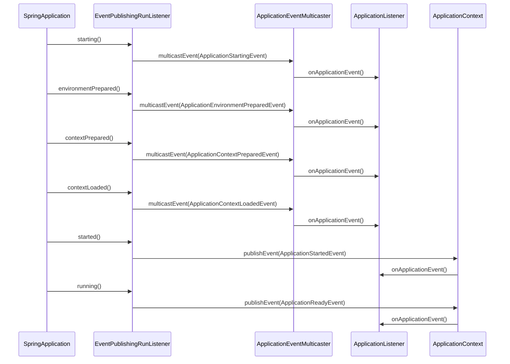
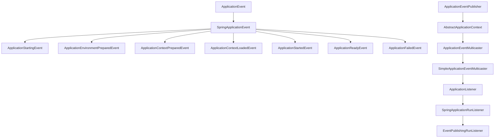
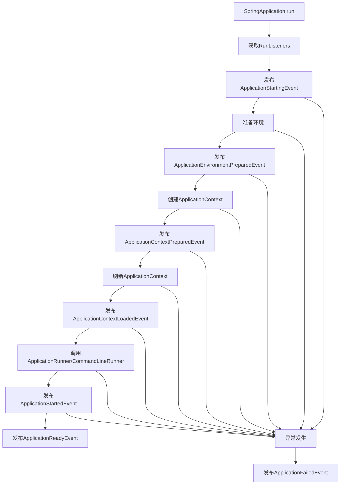
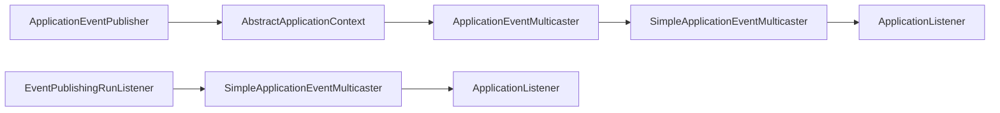
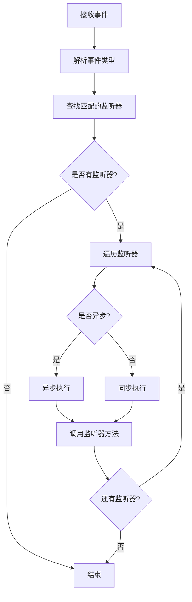
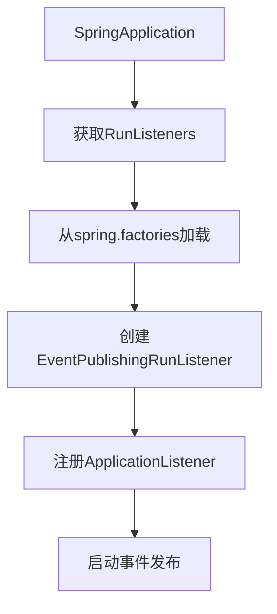
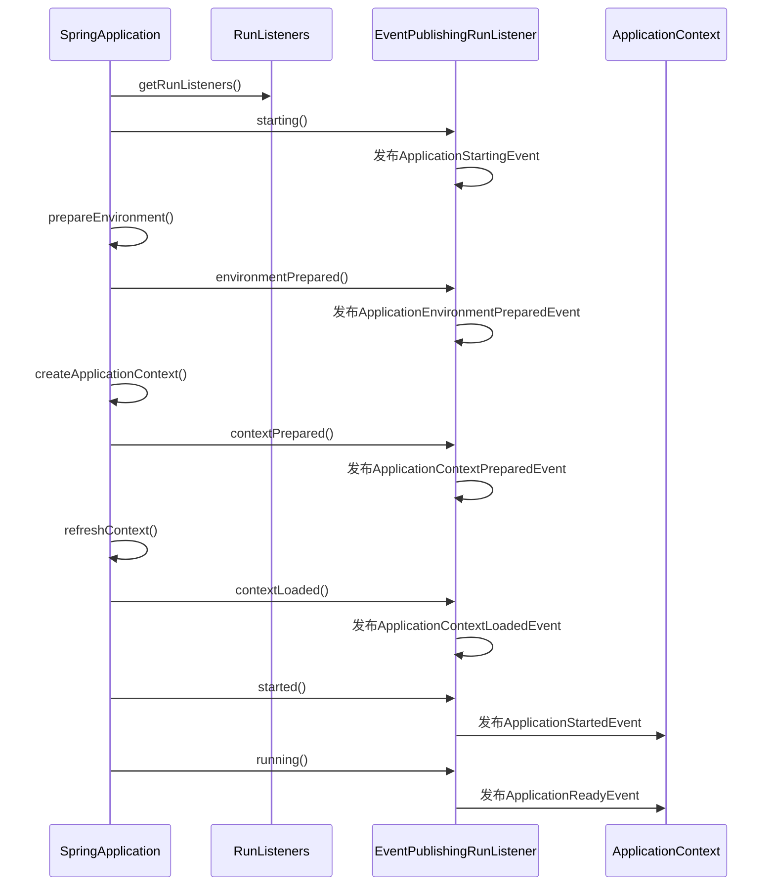
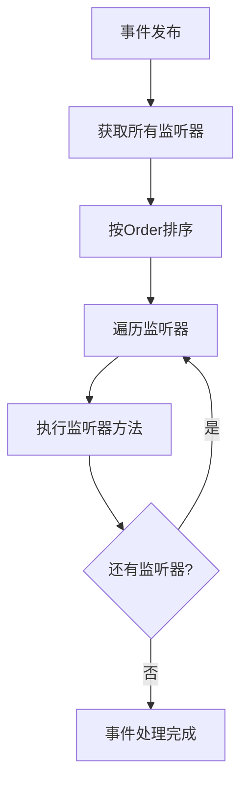
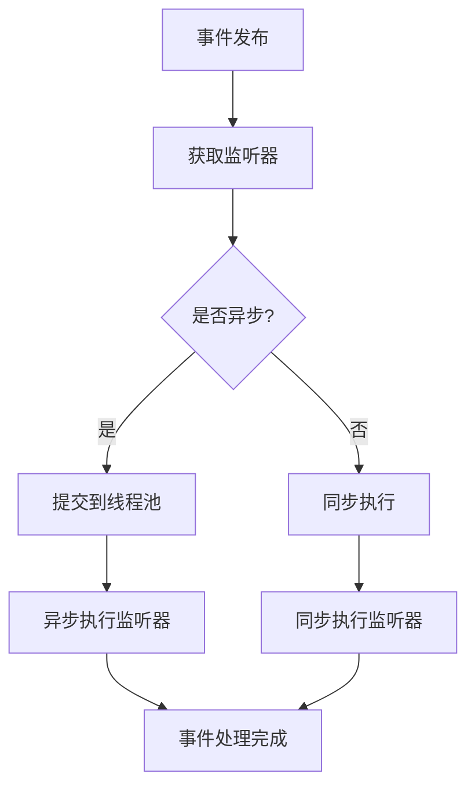

# SpringBoot启动流程-事件发布监听机制-完整指南

## 1. 事件发布监听机制概述

SpringBoot的事件发布监听机制是启动流程中的重要组成部分，它基于Spring Framework的观察者模式实现，允许在应用启动的不同阶段发布事件，并支持多个监听器同时响应这些事件。

### 1.1 核心组件

- **ApplicationEvent**: 应用事件抽象类
- **ApplicationEventPublisher**: 事件发布器接口
- **ApplicationEventMulticaster**: 事件多播器接口
- **ApplicationListener**: 事件监听器接口
- **SpringApplicationRunListener**: SpringBoot启动监听器接口

### 1.2 事件发布流程时序图



## 2. 事件体系结构

### 2.1 事件体系架构图



### 2.2 SpringBoot启动事件类型

| 事件类型 | 发布时机 | 说明 |
|---------|---------|------|
| `ApplicationStartingEvent` | 应用开始启动 | 最早发布的事件，此时环境还未准备 |
| `ApplicationEnvironmentPreparedEvent` | 环境准备完成 | 环境配置加载完成，但上下文还未创建 |
| `ApplicationContextPreparedEvent` | 上下文准备完成 | 上下文创建完成，但还未刷新 |
| `ApplicationContextLoadedEvent` | 上下文加载完成 | 上下文刷新完成，Bean定义加载完成 |
| `ApplicationStartedEvent` | 应用启动完成 | 所有Bean初始化完成，但还未调用Runner |
| `ApplicationReadyEvent` | 应用就绪 | 所有启动任务完成，应用可以接收请求 |
| `ApplicationFailedEvent` | 启动失败 | 任何阶段发生异常时发布 |

### 2.3 事件发布流程图



## 3. 事件发布器体系

### 3.1 事件发布器架构



### 3.2 核心接口

**ApplicationEventPublisher接口**:

```java
public interface ApplicationEventPublisher {
    void publishEvent(ApplicationEvent event);
    void publishEvent(Object event);
}
```

**事件发布流程**:

1. 事件发布器接收事件
2. 将事件传递给事件多播器
3. 多播器查找匹配的监听器
4. 调用监听器的处理方法

## 4. 事件多播器机制

### 4.1 多播器工作流程



### 4.2 核心功能

**ApplicationEventMulticaster接口**:

```java
public interface ApplicationEventMulticaster {
    void addApplicationListener(ApplicationListener<?> listener);
    void removeApplicationListener(ApplicationListener<?> listener);
    void multicastEvent(ApplicationEvent event);
}
```

**关键特性**:

- **监听器管理**: 动态添加/移除监听器
- **事件分发**: 将事件分发给所有匹配的监听器
- **异步支持**: 支持异步事件处理
- **异常处理**: 提供异常处理机制
- **缓存优化**: 缓存监听器查找结果

## 5. SpringBoot启动监听器

### 5.1 SpringApplicationRunListener接口

```java
public interface SpringApplicationRunListener {
    void starting(ConfigurableBootstrapContext bootstrapContext);
    void environmentPrepared(ConfigurableBootstrapContext bootstrapContext, ConfigurableEnvironment environment);
    void contextPrepared(ConfigurableApplicationContext context);
    void contextLoaded(ConfigurableApplicationContext context);
    void started(ConfigurableApplicationContext context);
    void running(ConfigurableApplicationContext context);
    void failed(ConfigurableApplicationContext context, Throwable exception);
}
```

### 5.2 EventPublishingRunListener核心实现

**关键方法**:

```java
public class EventPublishingRunListener implements SpringApplicationRunListener {
    
    private final SimpleApplicationEventMulticaster initialMulticaster;
    
    @Override
    public void starting(ConfigurableBootstrapContext bootstrapContext) {
        // 发布ApplicationStartingEvent
        this.initialMulticaster.multicastEvent(new ApplicationStartingEvent(this.application, this.args));
    }
    
    @Override
    public void environmentPrepared(ConfigurableBootstrapContext bootstrapContext, 
            ConfigurableEnvironment environment) {
        // 发布ApplicationEnvironmentPreparedEvent
        this.initialMulticaster.multicastEvent(
                new ApplicationEnvironmentPreparedEvent(this.application, this.args, environment));
    }
    
    @Override
    public void started(ConfigurableApplicationContext context) {
        // 发布ApplicationStartedEvent
        context.publishEvent(new ApplicationStartedEvent(this.application, this.args, context));
    }
    
    @Override
    public void running(ConfigurableApplicationContext context) {
        // 发布ApplicationReadyEvent
        context.publishEvent(new ApplicationReadyEvent(this.application, this.args, context));
    }
}
```

### 5.3 监听器注册机制



## 6. 启动事件发布顺序

### 6.1 事件发布时序图



### 6.2 事件发布顺序表

| 序号 | 事件类型 | 发布时机 | 发布者 |
|------|---------|---------|--------|
| 1 | `ApplicationStartingEvent` | 应用开始启动 | EventPublishingRunListener |
| 2 | `ApplicationEnvironmentPreparedEvent` | 环境准备完成 | EventPublishingRunListener |
| 3 | `ApplicationContextPreparedEvent` | 上下文准备完成 | EventPublishingRunListener |
| 4 | `ApplicationContextLoadedEvent` | 上下文加载完成 | EventPublishingRunListener |
| 5 | `ApplicationStartedEvent` | 应用启动完成 | ApplicationContext |
| 6 | `ApplicationReadyEvent` | 应用就绪 | ApplicationContext |
| 7 | `ApplicationFailedEvent` | 启动失败 | EventPublishingRunListener/ApplicationContext |

## 7. 自定义事件监听器

### 7.1 实现ApplicationListener接口

```java
@Component
public class CustomApplicationListener implements ApplicationListener<ApplicationReadyEvent> {
    
    private static final Logger logger = LoggerFactory.getLogger(CustomApplicationListener.class);
    
    @Override
    public void onApplicationEvent(ApplicationReadyEvent event) {
        logger.info("Application is ready! Context: {}", event.getApplicationContext().getDisplayName());
        performCustomLogic();
    }
    
    private void performCustomLogic() {
        logger.info("Performing custom startup logic...");
    }
}
```

### 7.2 使用@EventListener注解

```java
@Component
public class EventListenerComponent {
    
    private static final Logger logger = LoggerFactory.getLogger(EventListenerComponent.class);
    
    @EventListener
    public void handleApplicationStarting(ApplicationStartingEvent event) {
        logger.info("Application is starting...");
    }
    
    @EventListener
    public void handleApplicationReady(ApplicationReadyEvent event) {
        logger.info("Application is ready!");
        executePostStartupLogic();
    }
    
    @EventListener
    public void handleApplicationFailed(ApplicationFailedEvent event) {
        logger.error("Application failed to start: {}", event.getException().getMessage());
        handleStartupFailure(event.getException());
    }
    
    private void executePostStartupLogic() {
        // 启动后的业务逻辑
    }
    
    private void handleStartupFailure(Throwable exception) {
        // 启动失败处理逻辑
    }
}
```

### 7.3 条件化事件监听

```java
@Component
public class ConditionalEventListener {
    
    @EventListener(condition = "#event.environment.getActiveProfiles()[0] == 'dev'")
    public void handleDevEnvironment(ApplicationEnvironmentPreparedEvent event) {
        System.out.println("Development environment detected!");
    }
    
    @EventListener(condition = "#event.environment.getActiveProfiles()[0] == 'prod'")
    public void handleProdEnvironment(ApplicationEnvironmentPreparedEvent event) {
        System.out.println("Production environment detected!");
    }
}
```

## 8. 事件监听器执行顺序控制

### 8.1 执行顺序控制方式

| 方式 | 注解/接口 | 说明 | 示例 |
|------|----------|------|------|
| **@Order** | `@Order(value)` | 数值越小，优先级越高 | `@Order(1)` |
| **Ordered接口** | `implements Ordered` | 实现getOrder()方法 | `getOrder() { return 100; }` |
| **@Priority** | `@Priority(value)` | 数值越小，优先级越高 | `@Priority(1)` |

**注意**：@Order由Spring原生支持，@Priority是JSR标准，在Spring 项目中，两者存在时优先使用@Order

### 8.2 实际应用示例

```java
@Component
@Order(1)
public class FirstEventListener implements ApplicationListener<ApplicationReadyEvent> {
    @Override
    public void onApplicationEvent(ApplicationReadyEvent event) {
        System.out.println("First listener executed");
    }
}

@Component
@Order(2)
public class SecondEventListener implements ApplicationListener<ApplicationReadyEvent> {
    @Override
    public void onApplicationEvent(ApplicationReadyEvent event) {
        System.out.println("Second listener executed");
    }
}

@Component
public class OrderedEventListener implements ApplicationListener<ApplicationReadyEvent>, Ordered {
    @Override
    public void onApplicationEvent(ApplicationReadyEvent event) {
        System.out.println("Ordered listener executed");
    }
    
    @Override
    public int getOrder() {
        return 100; // 数值越小，优先级越高
    }
}
```

### 8.3 执行顺序流程图



## 9. 异步事件处理

### 9.1 异步事件处理配置

```java
@Configuration
@EnableAsync
public class AsyncEventConfig {
    
    @Bean(name = "applicationEventMulticaster")
    public ApplicationEventMulticaster applicationEventMulticaster() {
        SimpleApplicationEventMulticaster multicaster = new SimpleApplicationEventMulticaster();
        multicaster.setTaskExecutor(new SimpleAsyncTaskExecutor());
        return multicaster;
    }
}
```

### 9.2 异步事件监听器

```java
@Component
public class AsyncEventListener {
    
    @Async
    @EventListener
    public void handleAsyncEvent(ApplicationReadyEvent event) {
        // 异步处理事件
        System.out.println("Async event handling: " + Thread.currentThread().getName());
    }
}
```

### 9.3 异步处理流程图



## 10. 自定义事件类型

### 10.1 定义自定义事件

```java
public class CustomStartupEvent extends ApplicationEvent {
    
    private final String message;
    private final Map<String, Object> data;
    
    public CustomStartupEvent(Object source, String message, Map<String, Object> data) {
        super(source);
        this.message = message;
        this.data = data;
    }
    
    public String getMessage() {
        return message;
    }
    
    public Map<String, Object> getData() {
        return data;
    }
}
```

### 10.2 发布和监听自定义事件

```java
@Component
public class CustomEventPublisher {
    
    @Autowired
    private ApplicationEventPublisher eventPublisher;
    
    public void publishCustomEvent() {
        Map<String, Object> data = new HashMap<>();
        data.put("timestamp", System.currentTimeMillis());
        data.put("version", "1.0.0");
        
        CustomStartupEvent event = new CustomStartupEvent(this, "Custom startup event", data);
        eventPublisher.publishEvent(event);
    }
}

@Component
public class CustomEventListener {
    
    @EventListener
    public void handleCustomEvent(CustomStartupEvent event) {
        System.out.println("Received custom event: " + event.getMessage());
        System.out.println("Event data: " + event.getData());
    }
}
```

## 11. 最佳实践和常见问题

### 11.1 事件监听器设计原则

1. **保持监听器方法简洁**: 只处理必要的逻辑
2. **异常处理**: 在监听器中添加适当的异常处理
3. **避免阻塞操作**: 对于耗时操作使用异步处理
4. **使用条件化监听**: 根据条件决定是否执行监听器
5. **合理使用执行顺序**: 通过@Order控制监听器执行顺序

### 11.2 实际应用示例

```java
@Component
public class BestPracticeEventListener {
    
    private static final Logger logger = LoggerFactory.getLogger(BestPracticeEventListener.class);
    
    @EventListener
    public void handleApplicationReady(ApplicationReadyEvent event) {
        try {
            performEssentialStartupTasks();
        } catch (Exception e) {
            logger.error("Error in startup event handler", e);
        }
    }
    
    @Async
    @EventListener
    public void handleNonCriticalEvent(ApplicationStartedEvent event) {
        performNonCriticalTasks();
    }
    
    @EventListener(condition = "#event.environment.getProperty('app.feature.enabled', 'false') == 'true'")
    public void handleFeatureEnabledEvent(ApplicationReadyEvent event) {
        enableFeature();
    }
    
    private void performEssentialStartupTasks() {
        // 关键启动任务
    }
    
    private void performNonCriticalTasks() {
        // 非关键任务
    }
    
    private void enableFeature() {
        // 启用特定功能
    }
}
```

### 11.3 常见问题解决

**问题1: 事件监听器未执行**

- 确保监听器被正确注册为Spring Bean
- 检查事件类型是否匹配
- 验证条件化监听的条件是否正确

**问题2: 执行顺序问题**

- 使用@Order注解控制执行顺序
- 实现Ordered接口
- 数值越小，优先级越高

**问题3: 异步事件处理异常**

- 配置异常处理器
- 使用@EnableAsync启用异步支持
- 设置合适的线程池

## 12. 总结

SpringBoot的事件发布监听机制核心特点：

1. **完整的事件体系**: 覆盖启动流程的各个阶段
2. **灵活的事件监听**: 支持多种监听器实现方式
3. **强大的执行控制**: 支持顺序控制和条件化监听
4. **异步处理能力**: 支持异步事件处理
5. **自定义扩展**: 支持自定义事件类型和监听器

掌握这个机制对于SpringBoot应用的启动流程控制和扩展开发至关重要。
