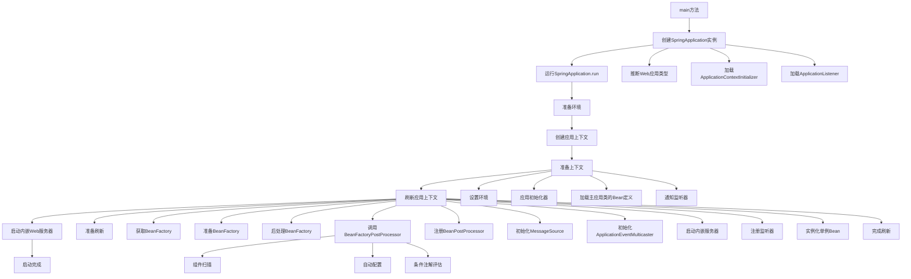
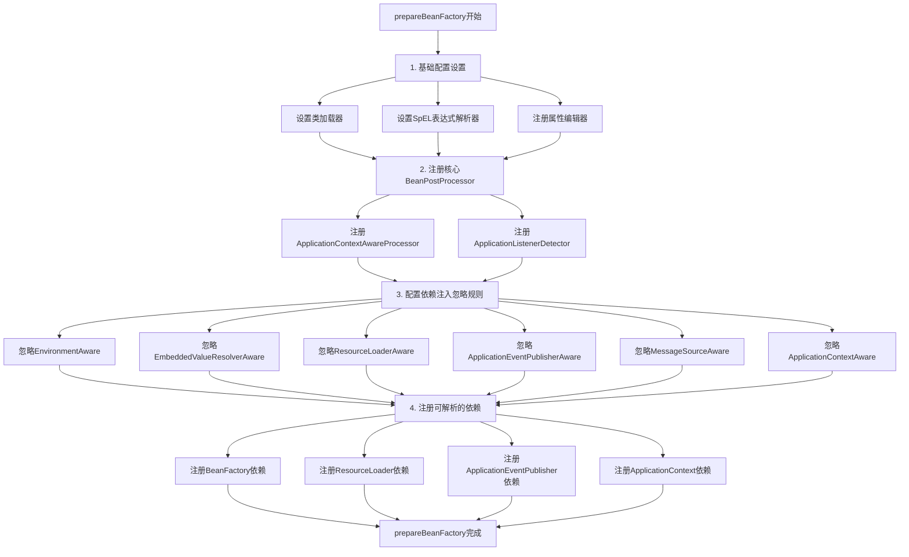
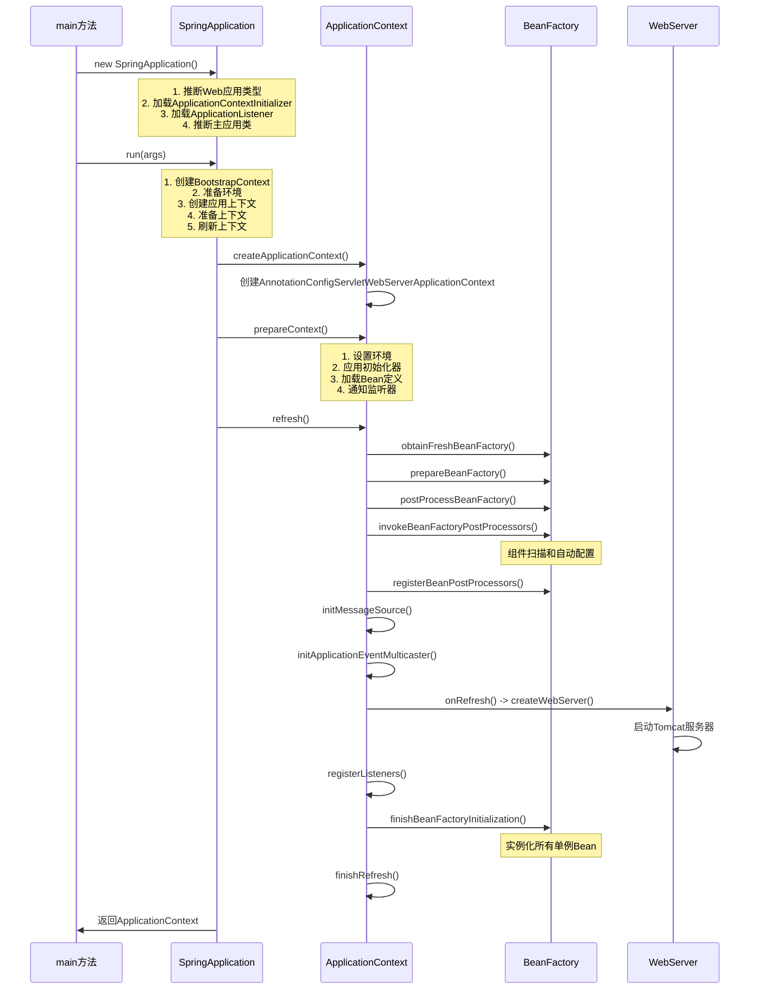

# SpringBoot启动流程完整源码分析指南

## 🎯 启动流程概览

SpringBoot的启动流程是一个复杂而精妙的过程，主要包含以下几个关键阶段：

### 📋 主要阶段说明

1. **main方法** - 应用入口点，启动SpringBoot应用
   - 调用`SpringApplication.run()`方法
   - 传入主应用类和命令行参数

2. **创建SpringApplication实例** - 初始化SpringBoot应用配置
   - 推断Web应用类型（SERVLET/REACTIVE/NONE）
   - 加载ApplicationContextInitializer和ApplicationListener
   - 推断主应用类

3. **运行SpringApplication.run** - 执行完整的启动流程
   - 创建Bootstrap上下文
   - 准备环境
   - 创建应用上下文
   - 准备上下文
   - 刷新应用上下文

4. **准备环境** - 加载配置文件，设置属性源
   - 加载application.properties/yml文件
   - 设置系统属性和环境变量
   - 配置属性源优先级

5. **创建应用上下文** - 根据应用类型创建对应的ApplicationContext
   - SERVLET类型：AnnotationConfigServletWebServerApplicationContext
   - REACTIVE类型：AnnotationConfigReactiveWebServerApplicationContext
   - NONE类型：AnnotationConfigApplicationContext

6. **准备上下文** - 配置上下文环境，加载Bean定义
   - 设置环境到上下文
   - 执行ApplicationContextInitializer
   - 加载主应用类的Bean定义
   - 通知监听器

7. **刷新应用上下文** - 核心步骤：创建Bean，启动服务
   - 这是SpringBoot启动的核心，包含12个详细步骤
   - 执行组件扫描和自动配置
   - 创建所有Bean实例

8. **启动内嵌Web服务器** - 创建并启动Tomcat等Web服务器
   - 在refresh()方法的onRefresh()步骤中执行
   - 默认使用Tomcat作为内嵌服务器

9. **启动完成** - 应用完全启动，可以接收请求
   - 发布ContextRefreshedEvent事件
   - 调用ApplicationRunner和CommandLineRunner



## 📝 详细源码分析（按执行顺序）

### 1. 主入口 - main方法

```java
public static void main(String[] args) {
    // 方式1：直接运行（推荐）
    SpringApplication.run(SpringbootLearningApplication.class, args);
    
    // 方式2：分步执行（用于调试和理解）
    SpringApplication app = new SpringApplication(SpringbootLearningApplication.class);
    ConfigurableApplicationContext context = app.run(args);
}
```

**关键点：**

- 这是整个SpringBoot应用的入口点
- 可以传入命令行参数
- 返回ConfigurableApplicationContext，这是Spring容器的核心接口

### 2. 创建SpringApplication实例

```java
public SpringApplication(Class<?>... primarySources) {
    this(null, primarySources);
}

public SpringApplication(ResourceLoader resourceLoader, Class<?>... primarySources) {
    this.resourceLoader = resourceLoader;
    Assert.notNull(primarySources, "PrimarySources must not be null");
    
    // 关键步骤1：设置主类
    this.primarySources = new LinkedHashSet<>(Arrays.asList(primarySources));
    
    // 关键步骤2：推断Web应用类型
    this.webApplicationType = WebApplicationType.deduceFromClasspath();
    
    // 关键步骤3：加载BootstrapRegistryInitializer
    this.bootstrapRegistryInitializers = new ArrayList<>(
        getSpringFactoriesInstances(BootstrapRegistryInitializer.class));
    
    // 关键步骤4：加载ApplicationContextInitializer
    setInitializers((Collection) getSpringFactoriesInstances(ApplicationContextInitializer.class));
    
    // 关键步骤5：加载ApplicationListener
    setListeners((Collection) getSpringFactoriesInstances(ApplicationListener.class));
    
    // 关键步骤6：推断主应用类
    this.mainApplicationClass = deduceMainApplicationClass();
}
```

**关键点：**

- 推断应用类型（SERVLET/REACTIVE/NONE）
- 加载各种初始化器和监听器
- 从spring.factories文件加载配置

#### 2.1 Web应用类型推断

```java
static WebApplicationType deduceFromClasspath() {
    // 检查WebFlux相关类
    if (ClassUtils.isPresent("org.springframework.web.reactive.DispatcherHandler", null)
            && !ClassUtils.isPresent("org.springframework.web.servlet.DispatcherServlet", null)
            && !ClassUtils.isPresent("org.glassfish.jersey.servlet.ServletContainer", null)) {
        return WebApplicationType.REACTIVE;
    }
    
    // 检查Servlet相关类
    for (String className : SERVLET_INDICATOR_CLASSES) {
        if (!ClassUtils.isPresent(className, null)) {
            return WebApplicationType.NONE;
        }
    }
    return WebApplicationType.SERVLET;
}

private static final String[] SERVLET_INDICATOR_CLASSES = { 
    "javax.servlet.Servlet", 
    "org.springframework.web.context.ConfigurableWebApplicationContext" 
};
```

**推断逻辑：**

- 如果存在`DispatcherHandler`但不存在`DispatcherServlet` → REACTIVE
- 如果不存在Servlet相关类 → NONE
- 否则 → SERVLET

#### 2.2 加载SpringFactories

```java
private <T> Collection<T> getSpringFactoriesInstances(Class<T> type) {
    return getSpringFactoriesInstances(type, new Class<?>[] {});
}

private <T> Collection<T> getSpringFactoriesInstances(Class<T> type, Class<?>[] parameterTypes, Object... args) {
    ClassLoader classLoader = getClassLoader();
    
    // 从META-INF/spring.factories加载工厂类名
    Set<String> names = new LinkedHashSet<>(SpringFactoriesLoader.loadFactoryNames(type, classLoader));
    
    // 通过反射创建实例
    List<T> instances = createSpringFactoriesInstances(type, parameterTypes, classLoader, args, names);
    
    // 按照@Order注解排序
    AnnotationAwareOrderComparator.sort(instances);
    return instances;
}
```

**加载过程：**

1. 扫描`META-INF/spring.factories`文件
2. 根据类型加载对应的实现类
3. 通过反射创建实例
4. 按照`@Order`注解排序

### 3. 运行SpringApplication

```java
public ConfigurableApplicationContext run(String... args) {
    StopWatch stopWatch = new StopWatch();
    stopWatch.start();
    
    // 步骤1：创建Bootstrap上下文
    DefaultBootstrapContext bootstrapContext = createBootstrapContext();
    ConfigurableApplicationContext context = null;
    
    // 步骤2：配置无头模式
    configureHeadlessProperty();
    
    // 步骤3：获取运行监听器
    SpringApplicationRunListeners listeners = getRunListeners(args);
    listeners.starting(bootstrapContext, this.mainApplicationClass);
    
    try {
        // 步骤4：准备应用参数
        ApplicationArguments applicationArguments = new DefaultApplicationArguments(args);
        
        // 步骤5：准备环境
        ConfigurableEnvironment environment = prepareEnvironment(listeners, bootstrapContext, applicationArguments);
        
        // 步骤6：配置忽略Bean信息
        configureIgnoreBeanInfo(environment);
        
        // 步骤7：打印Banner
        Banner printedBanner = printBanner(environment);
        
        // 步骤8：创建应用上下文
        context = createApplicationContext();
        // 设置一个应用启动监控器,可以精确地记录每个 Bean 的实例化、依赖注入、以及各种后置处理器执行所花费的时间
        context.setApplicationStartup(this.applicationStartup);
        
        // 步骤9：准备上下文
        prepareContext(bootstrapContext, context, environment, listeners, applicationArguments, printedBanner);
        
        // 步骤10：刷新上下文（核心步骤）
        refreshContext(context);
        
        // 步骤11：刷新后处理
        afterRefresh(context, applicationArguments);
        
        stopWatch.stop();
        if (this.logStartupInfo) {
            new StartupInfoLogger(this.mainApplicationClass).logStarted(getApplicationLog(), stopWatch);
        }
        
        // 步骤12：通知监听器启动完成
        listeners.started(context);
        
        // 步骤13：调用运行器
        callRunners(context, applicationArguments);
    }
    catch (Throwable ex) {
        handleRunFailure(context, listeners, null, ex);
        throw new IllegalStateException(ex);
    }
    
    try {
        // 步骤14：通知监听器运行中
        listeners.running(context);
    }
    catch (Throwable ex) {
        handleRunFailure(context, listeners, null, ex);
        throw new IllegalStateException(ex);
    }
    return context;
}
```

**关键点：**

- 这是启动流程的核心方法
- 包含14个关键步骤
- 第10步refreshContext是最重要的

#### 3.1 环境准备

```java
private ConfigurableEnvironment prepareEnvironment(SpringApplicationRunListeners listeners,
        DefaultBootstrapContext bootstrapContext, ApplicationArguments applicationArguments) {
    
    // 获取或创建环境
    ConfigurableEnvironment environment = getOrCreateEnvironment();
    
    // 配置环境
    configureEnvironment(environment, applicationArguments.getSourceArgs());
    
    // 附加配置属性源
    ConfigurationPropertySources.attach(environment);
    
    // 通知监听器环境准备完成
    listeners.environmentPrepared(bootstrapContext, environment);
    
    // 移动默认属性源到末尾
    DefaultPropertiesPropertySource.moveToEnd(environment);
    
    // 验证环境前缀
    Assert.state(!environment.containsProperty("spring.main.environment-prefix"),
            "Environment prefix cannot be set via properties.");
    
    // 绑定到SpringApplication
    // 主要负责将外部配置（比如 application.properties 或 application.yml 中的配置）绑定到 SpringApplication 对象中
    bindToSpringApplication(environment);
    
    // 转换环境类型
    if (!this.isCustomEnvironment) {
        environment = new EnvironmentConverter(getClassLoader()).convertEnvironmentIfNecessary(environment,
                deduceEnvironmentClass());
    }
    
    // 再次附加配置属性源
    ConfigurationPropertySources.attach(environment);
    return environment;
}
```

**环境准备步骤：**

1. **获取或创建环境**：`getOrCreateEnvironment()`
2. **配置环境**：`configureEnvironment()`
3. **附加配置属性源**：`ConfigurationPropertySources.attach()`
4. **通知监听器**：`listeners.environmentPrepared()`
5. **绑定到SpringApplication**：`bindToSpringApplication()`

#### 3.2 创建应用上下文

```java
protected ConfigurableApplicationContext createApplicationContext() {
    return this.applicationContextFactory.create(this.webApplicationType);
}

// ApplicationContextFactory实现
public class DefaultApplicationContextFactory implements ApplicationContextFactory {
    @Override
    public ConfigurableApplicationContext create(WebApplicationType webApplicationType) {
        try {
            // 根据之前的Web类型推断，一般是返回AnnotationConfigServletWebServerApplicationContext
            return switch (webApplicationType) {
                case SERVLET -> new AnnotationConfigServletWebServerApplicationContext();
                case REACTIVE -> new AnnotationConfigReactiveWebServerApplicationContext();
                case NONE -> new AnnotationConfigApplicationContext();
            };
        }
        catch (Exception ex) {
            throw new IllegalStateException("Unable create a default ApplicationContext, "
                    + "please specify an ApplicationContextClass", ex);
        }
    }
}
```

**上下文类型选择：**

- **SERVLET** → `AnnotationConfigServletWebServerApplicationContext`
- **REACTIVE** → `AnnotationConfigReactiveWebServerApplicationContext`
- **NONE** → `AnnotationConfigApplicationContext`

#### 3.3 准备上下文（prepareContext）

```java
private void prepareContext(DefaultBootstrapContext bootstrapContext, ConfigurableApplicationContext context,
        ConfigurableEnvironment environment, SpringApplicationRunListeners listeners,
        ApplicationArguments applicationArguments, Banner printedBanner) {
    
    // 1. 设置环境到上下文
    context.setEnvironment(environment);
    
    // 2. 后处理应用上下文
    postProcessApplicationContext(context);
    
    // 3. 执行应用初始化器
    applyInitializers(context);
    
    // 4. 通知监听器上下文已准备
    listeners.contextPrepared(context);
    
    // 5. 记录启动信息
    if (this.logStartupInfo) {
        logStartupInfo(context.getParent() == null);
        logStartupProfileInfo(context);
    }
    
    // 6. 添加Banner到上下文
    ConfigurableListableBeanFactory beanFactory = context.getBeanFactory();
    beanFactory.registerSingleton("springApplicationArguments", applicationArguments);
    if (printedBanner != null) {
        beanFactory.registerSingleton("springBootBanner", printedBanner);
    }
    
    // 7. 设置是否为Web环境
    if (beanFactory instanceof DefaultListableBeanFactory) {
        ((DefaultListableBeanFactory) beanFactory)
                .setAllowBeanDefinitionOverriding(this.allowBeanDefinitionOverriding);
    }
    
    // 8. 设置懒加载
    if (this.lazyInitialization) {
        context.addBeanFactoryPostProcessor(new LazyInitializationBeanFactoryPostProcessor());
    }
    
    // 9. 获取所有源
    // 主要是主应用类的源（包含@SpringBootApplication、@ComponentScan、@EnableAutoConfiguration、@Configuration等)
    Set<Object> sources = getAllSources();
    Assert.notEmpty(sources, "Sources must not be empty");
    
    // 10. 加载Bean定义
    load(context, sources.toArray(new Object[0]));
    
    // 11. 通知监听器上下文已加载
    listeners.contextLoaded(context);
}
```

**准备上下文的关键步骤：**

1. **设置环境**：将准备好的环境设置到应用上下文中
2. **后处理应用上下文**：对上下文进行后处理，如设置资源加载器
3. **执行应用初始化器**：执行所有ApplicationContextInitializer
4. **通知监听器**：通知监听器上下文已准备
5. **记录启动信息**：记录启动相关的日志信息
6. **注册单例Bean**：注册应用参数和Banner等单例Bean
7. **设置Bean工厂属性**：配置Bean定义覆盖、懒加载等属性
8. **加载Bean定义**：加载所有源中的Bean定义
9. **通知上下文加载完成**：通知监听器上下文已加载

**load方法详解：**

```java
protected void load(ApplicationContext context, Object[] sources) {
    if (logger.isDebugEnabled()) {
        logger.debug("Loading source " + StringUtils.arrayToCommaDelimitedString(sources));
    }
    
    // 创建Bean定义加载器
    BeanDefinitionLoader loader = createBeanDefinitionLoader(getBeanDefinitionRegistry(context), sources);
    
    // 设置Bean名称生成器
    if (this.beanNameGenerator != null) {
        loader.setBeanNameGenerator(this.beanNameGenerator);
    }
    
    // 设置资源加载器
    if (this.resourceLoader != null) {
        loader.setResourceLoader(this.resourceLoader);
    }
    
    // 设置环境
    if (this.environment != null) {
        loader.setEnvironment(this.environment);
    }
    
    // 加载Bean定义（这里会注册主应用类）
    loader.load();
}

// BeanDefinitionLoader.load()方法
public int load() {
    int count = 0;
    for (Object source : this.sources) {
        count += load(source);
    }
    return count;
}

private int load(Object source) {
    Assert.notNull(source, "Source must not be null");
    
    // 1. 处理Class类型（主应用类）
    if (source instanceof Class<?>) {
        return load((Class<?>) source);
    }
    
    // 2. 处理Resource类型
    if (source instanceof Resource) {
        return load((Resource) source);
    }
    
    // 3. 处理Package类型
    if (source instanceof Package) {
        return load((Package) source);
    }
    
    // 4. 处理CharSequence类型
    if (source instanceof CharSequence) {
        return load((CharSequence) source);
    }
    
    throw new IllegalArgumentException("Invalid source type " + source.getClass());
}

// 加载Class类型（主应用类）
private int load(Class<?> source) {
    if (isGroovyPresent() && GroovyBeanDefinitionSource.class.isAssignableFrom(source)) {
        // Groovy支持
        GroovyBeanDefinitionSource loader = BeanUtils.instantiateClass(source, GroovyBeanDefinitionSource.class);
        return load(loader);
    }
    
    // 使用AnnotatedBeanDefinitionReader注册主应用类
    this.annotatedReader.register(source);
    return 1;
}
```

**主应用类注册过程：**

```java
// AnnotatedBeanDefinitionReader.register()
public void register(Class<?>... componentClasses) {
    for (Class<?> componentClass : componentClasses) {
        registerBean(componentClass);
    }
}

public void registerBean(Class<?> beanClass) {
    doRegisterBean(beanClass, null, null, null, null);
}

private <T> void doRegisterBean(Class<T> beanClass, @Nullable String name,
        @Nullable Class<? extends Annotation>[] qualifiers, @Nullable Supplier<T> supplier,
        @Nullable BeanDefinitionCustomizer[] customizers) {
    
    // 1. 创建Bean定义
    AnnotatedGenericBeanDefinition abd = new AnnotatedGenericBeanDefinition(beanClass);
    
    // 2. 检查是否需要跳过
    if (this.conditionEvaluator.shouldSkip(abd.getMetadata())) {
        return;
    }
    
    // 3. 设置作用域
    ScopeMetadata scopeMetadata = this.scopeMetadataResolver.resolveScopeMetadata(abd);
    abd.setScope(scopeMetadata.getScopeName());
    
    // 4. 生成Bean名称
    String beanName = (name != null ? name : this.beanNameGenerator.generateBeanName(abd, this.registry));
    
    // 5. 处理通用注解
    AnnotationConfigUtils.processCommonDefinitionAnnotations(abd);
    
    // 6. 处理限定符
    if (qualifiers != null) {
        for (Class<? extends Annotation> qualifier : qualifiers) {
            if (Primary.class == qualifier) {
                abd.setPrimary(true);
            } else if (Lazy.class == qualifier) {
                abd.setLazyInit(true);
            } else {
                abd.addQualifier(new AutowireCandidateQualifier(qualifier));
            }
        }
    }
    
    // 7. 处理自定义器
    if (customizers != null) {
        for (BeanDefinitionCustomizer customizer : customizers) {
            customizer.customize(abd);
        }
    }
    
    // 8. 创建Bean定义持有者
    BeanDefinitionHolder definitionHolder = new BeanDefinitionHolder(abd, beanName);
    definitionHolder = AnnotationConfigUtils.applyScopedProxyMode(scopeMetadata, definitionHolder, this.registry);
    
    // 9. 注册Bean定义
    BeanDefinitionReaderUtils.registerBeanDefinition(definitionHolder, this.registry);
}
```

**关键点：**

- **主应用类注册**：在prepareContext阶段，主应用类被注册为Bean定义
- **@SpringBootApplication注解**：包含@ComponentScan、@EnableAutoConfiguration等元注解
- **为后续扫描做准备**：主应用类注册后，在refresh阶段会被ConfigurationClassPostProcessor处理
- **组件扫描触发**：@ComponentScan注解会在ConfigurationClassPostProcessor阶段被解析和执行

```java
private BeanDefinitionRegistry getBeanDefinitionRegistry(ApplicationContext context) {
    if (context instanceof BeanDefinitionRegistry) {
        return (BeanDefinitionRegistry) context;
    }
    if (context instanceof AbstractApplicationContext) {
        return (BeanDefinitionRegistry) ((AbstractApplicationContext) context).getBeanFactory();
    }
    throw new IllegalStateException("Could not locate BeanDefinitionRegistry");
}
```

**关键点：**

- 这是连接SpringApplication和ApplicationContext的重要桥梁
- 负责将主类和其他源加载到Spring容器中
- 执行所有的ApplicationContextInitializer
- 为后续的refresh()方法做好准备

### 4. 刷新应用上下文（核心步骤）

```java
public void refresh() throws BeansException, IllegalStateException {
    synchronized (this.startupShutdownMonitor) {
        StartupStep contextRefresh = this.applicationStartup.start("spring.context.refresh");
        
        // 1. 准备刷新
        prepareRefresh();
        
        // 2. 获取BeanFactory
        ConfigurableListableBeanFactory beanFactory = obtainFreshBeanFactory();
        
        // 3. 准备BeanFactory
        prepareBeanFactory(beanFactory);
        
        try {
            // 4. 后处理BeanFactory
            postProcessBeanFactory(beanFactory);
            
            StartupStep beanPostProcess = this.applicationStartup.start("spring.beans.instantiate");
            
            // 5. 调用BeanFactoryPostProcessor
            invokeBeanFactoryPostProcessors(beanFactory);
            
            // 6. 注册BeanPostProcessor
            registerBeanPostProcessors(beanFactory);
            
            beanPostProcess.end();
            
            // 7. 初始化MessageSource
            initMessageSource();
            
            // 8. 初始化ApplicationEventMulticaster
            initApplicationEventMulticaster();
            
            // 9. 刷新特定上下文（重要：启动内嵌服务器）
            onRefresh();
            
            // 10. 注册监听器
            registerListeners();
            
            // 11. 实例化所有单例Bean
            finishBeanFactoryInitialization(beanFactory);
            
            // 12. 完成刷新
            finishRefresh();
        }
        catch (BeansException ex) {
            if (logger.isWarnEnabled()) {
                logger.warn("Exception encountered during context initialization - " +
                        "cancelling refresh attempt: " + ex);
            }
            destroyBeans();
            cancelRefresh(ex);
            throw ex;
        }
        finally {
            resetCommonCaches();
            contextRefresh.end();
        }
    }
}
```

**关键点：**

- 这是SpringBoot启动的核心方法
- 包含12个关键步骤
- 第5步BeanFactoryPostProcessor是组件扫描和自动配置的核心
- 第9步onRefresh()启动内嵌服务器
- 第11步实例化所有单例Bean

#### 4.1 关键步骤详解

#### 步骤1：准备刷新

```java
protected void prepareRefresh() {
    this.startupDate = System.currentTimeMillis();
    this.closed.set(false);
    this.active.set(true);
    
    if (logger.isDebugEnabled()) {
        if (logger.isTraceEnabled()) {
            logger.trace("Refreshing " + this);
        }
        else {
            logger.debug("Refreshing " + getDisplayName());
        }
    }
    
    // 初始化属性源
    initPropertySources();
    
    // 验证必需属性
    getEnvironment().validateRequiredProperties();
    
    // 存储早期应用监听器
    if (this.earlyApplicationListeners == null) {
        this.earlyApplicationListeners = new LinkedHashSet<>(this.applicationListeners);
    }
    else {
        this.applicationListeners.clear();
        this.applicationListeners.addAll(this.earlyApplicationListeners);
    }
    
    // 存储早期应用事件
    this.earlyApplicationEvents = new LinkedHashSet<>();
}
```

#### 步骤2：获取BeanFactory

```java
protected final void refreshBeanFactory() throws BeansException {
    if (hasBeanFactory()) {
        destroyBeans();
        closeBeanFactory();
    }
    try {
        DefaultListableBeanFactory beanFactory = createBeanFactory();
        beanFactory.setSerializationId(getId());
        customizeBeanFactory(beanFactory);
        loadBeanDefinitions(beanFactory);
        this.beanFactory = beanFactory;
    }
    catch (IOException ex) {
        throw new ApplicationContextException("I/O error parsing bean definition source for " + getDisplayName(), ex);
    }
}
```

#### 步骤3：准备BeanFactory

```java
protected void prepareBeanFactory(ConfigurableListableBeanFactory beanFactory) {
    // ========== 1. 基础配置设置 ==========
    
    // 设置类加载器 - 用于Bean类的加载和反射操作
    // 这个类加载器通常是从ApplicationContext获取的，用于加载Bean定义中的类
    beanFactory.setBeanClassLoader(getBeanClassLoader());
    
    // 设置表达式解析器 - 用于解析SpEL表达式（如@Value注解中的表达式）
    // StandardBeanExpressionResolver是Spring提供的标准SpEL解析器实现
    // 支持在Bean定义和注解中使用SpEL表达式，如@Value("#{systemProperties['user.name']}")
    beanFactory.setBeanExpressionResolver(new StandardBeanExpressionResolver(beanFactory.getBeanClassLoader()));
    
    // 设置属性编辑器注册器 - 用于类型转换和属性编辑
    // ResourceEditorRegistrar注册了各种资源相关的属性编辑器
    // 支持将字符串转换为Resource、URL、ClassPathResource等类型
    // 例如：@Value("classpath:application.properties") 中的字符串会被转换为ClassPathResource
    beanFactory.addPropertyEditorRegistrar(new ResourceEditorRegistrar(this, getEnvironment()));
    
    // ========== 2. 注册核心BeanPostProcessor ==========
    
    // 添加ApplicationContextAwareProcessor - 处理各种Aware接口的注入
    // 这个处理器负责在Bean初始化时注入ApplicationContext相关的依赖
    // 支持的Aware接口包括：ApplicationContextAware、EnvironmentAware、ResourceLoaderAware等
    // 当Bean实现了这些接口时，会自动注入相应的对象
    beanFactory.addBeanPostProcessor(new ApplicationContextAwareProcessor(this));
    
    // 添加ApplicationListenerDetector - 检测和注册ApplicationListener
    // 这个处理器负责检测Bean是否实现了ApplicationListener接口
    // 如果是，则自动将其注册为应用事件监听器
    // 支持单例Bean和原型Bean的事件监听
    beanFactory.addBeanPostProcessor(new ApplicationListenerDetector(this));
    
    // ========== 3. 配置依赖注入忽略规则 ==========
    
    // 忽略依赖接口 - 防止循环依赖和重复注入
    // 当Bean需要注入这些接口类型的依赖时，Spring会忽略自动注入
    // 因为这些依赖会通过ApplicationContextAwareProcessor手动注入
    
    // 忽略EnvironmentAware - 环境对象注入接口
    // 防止Bean在依赖注入时自动注入Environment，改为通过setEnvironment方法注入
    beanFactory.ignoreDependencyInterface(EnvironmentAware.class);
    
    // 忽略EmbeddedValueResolverAware - 嵌入式值解析器注入接口
    // 用于解析@Value注解中的占位符和SpEL表达式
    beanFactory.ignoreDependencyInterface(EmbeddedValueResolverAware.class);
    
    // 忽略ResourceLoaderAware - 资源加载器注入接口
    // 用于加载类路径、文件系统等资源
    beanFactory.ignoreDependencyInterface(ResourceLoaderAware.class);
    
    // 忽略ApplicationEventPublisherAware - 应用事件发布器注入接口
    // 用于发布应用事件，如ContextRefreshedEvent、ContextStartedEvent等
    beanFactory.ignoreDependencyInterface(ApplicationEventPublisherAware.class);
    
    // 忽略MessageSourceAware - 消息源注入接口
    // 用于国际化消息处理，支持多语言消息解析
    beanFactory.ignoreDependencyInterface(MessageSourceAware.class);
    
    // 忽略ApplicationContextAware - 应用上下文注入接口
    // 最常用的Aware接口，允许Bean直接访问ApplicationContext
    beanFactory.ignoreDependencyInterface(ApplicationContextAware.class);
    
    // ========== 4. 注册可解析的依赖 ==========
    
    // 注册可解析的依赖 - 为依赖注入提供特殊类型的解析
    // 当Bean需要注入这些类型时，Spring会使用注册的实例而不是创建新的Bean
    
    // 注册BeanFactory依赖 - 当Bean需要注入BeanFactory时，使用当前的BeanFactory实例
    // 例如：@Autowired private BeanFactory beanFactory;
    beanFactory.registerResolvableDependency(BeanFactory.class, beanFactory);
    
    // 注册ResourceLoader依赖 - 当Bean需要注入ResourceLoader时，使用ApplicationContext
    // ApplicationContext实现了ResourceLoader接口，可以加载各种资源
    // 例如：@Autowired private ResourceLoader resourceLoader;
    beanFactory.registerResolvableDependency(ResourceLoader.class, this);
    
    // 注册ApplicationEventPublisher依赖 - 当Bean需要发布事件时，使用ApplicationContext
    // ApplicationContext实现了ApplicationEventPublisher接口，可以发布应用事件
    // 例如：@Autowired private ApplicationEventPublisher eventPublisher;
    beanFactory.registerResolvableDependency(ApplicationEventPublisher.class, this);
    
    // 注册ApplicationContext依赖 - 当Bean需要注入ApplicationContext时，使用当前上下文
    // 这是最常用的依赖注入，允许Bean直接访问Spring容器
    // 例如：@Autowired private ApplicationContext applicationContext;
    beanFactory.registerResolvableDependency(ApplicationContext.class, this);
}
```

**prepareBeanFactory方法详细说明：**

### 1. 基础配置设置

- **类加载器设置**：为BeanFactory配置类加载器，用于加载Bean定义中的类
- **表达式解析器**：配置SpEL表达式解析器，支持@Value注解中的表达式解析
- **属性编辑器**：注册资源相关的属性编辑器，支持字符串到Resource类型的转换

### 2. 核心BeanPostProcessor注册

- **ApplicationContextAwareProcessor**：处理各种Aware接口的依赖注入
- **ApplicationListenerDetector**：自动检测和注册事件监听器

### 3. 依赖注入忽略规则

- 防止循环依赖和重复注入
- 确保Aware接口通过专门的后处理器注入

### 4. 可解析依赖注册

- 为特殊类型提供依赖注入支持
- 避免创建不必要的Bean实例

**执行时机：** 在BeanFactory创建完成后，Bean定义加载之前执行
**作用：** 为BeanFactory配置基础功能，为后续的Bean创建和依赖注入做准备

### prepareBeanFactory执行流程图



### 实际应用示例

#### 1. Aware接口注入示例

```java
@Component
public class MyService implements ApplicationContextAware, EnvironmentAware {
    
    private ApplicationContext applicationContext;
    private Environment environment;
    
    // 这些方法会被ApplicationContextAwareProcessor自动调用
    @Override
    public void setApplicationContext(ApplicationContext applicationContext) throws BeansException {
        this.applicationContext = applicationContext;
        System.out.println("ApplicationContext已注入: " + applicationContext.getDisplayName());
    }
    
    @Override
    public void setEnvironment(Environment environment) {
        this.environment = environment;
        System.out.println("Environment已注入: " + environment.getActiveProfiles());
    }
    
    public void doSomething() {
        // 使用注入的ApplicationContext
        String[] beanNames = applicationContext.getBeanDefinitionNames();
        System.out.println("容器中的Bean数量: " + beanNames.length);
        
        // 使用注入的Environment
        String appName = environment.getProperty("spring.application.name", "unknown");
        System.out.println("应用名称: " + appName);
    }
}
```

#### 2. 事件监听器自动注册示例

```java
@Component
public class MyEventListener implements ApplicationListener<ContextRefreshedEvent> {
    
    @Override
    public void onApplicationEvent(ContextRefreshedEvent event) {
        System.out.println("应用上下文刷新完成: " + event.getApplicationContext().getDisplayName());
        System.out.println("刷新时间: " + new Date(event.getTimestamp()));
    }
}

// 这个类会被ApplicationListenerDetector自动检测并注册为事件监听器
// 无需手动注册，Spring会自动处理
```

#### 3. 依赖注入示例

```java
@Service
public class UserService {
    
    // 这些依赖会被自动注入，因为它们在prepareBeanFactory中注册为可解析依赖
    @Autowired
    private BeanFactory beanFactory;
    
    @Autowired
    private ResourceLoader resourceLoader;
    
    @Autowired
    private ApplicationEventPublisher eventPublisher;
    
    @Autowired
    private ApplicationContext applicationContext;
    
    public void processUser() {
        // 使用BeanFactory
        UserRepository userRepo = beanFactory.getBean(UserRepository.class);
        
        // 使用ResourceLoader加载资源
        Resource resource = resourceLoader.getResource("classpath:user-config.properties");
        
        // 发布事件
        eventPublisher.publishEvent(new UserProcessedEvent("用户处理完成"));
        
        // 使用ApplicationContext
        String[] profiles = applicationContext.getEnvironment().getActiveProfiles();
        System.out.println("当前激活的Profile: " + Arrays.toString(profiles));
    }
}
```

#### 4. SpEL表达式解析示例

```java
@Component
public class ConfigService {
    
    // 这些@Value注解中的SpEL表达式会被StandardBeanExpressionResolver解析
    @Value("#{systemProperties['user.name']}")
    private String systemUser;
    
    @Value("#{@userService.getDefaultUser().name}")
    private String defaultUserName;
    
    @Value("#{T(java.lang.Math).random() * 100}")
    private double randomNumber;
    
    @Value("#{environment['spring.profiles.active'] ?: 'default'}")
    private String activeProfile;
    
    public void showConfig() {
        System.out.println("系统用户: " + systemUser);
        System.out.println("默认用户名: " + defaultUserName);
        System.out.println("随机数: " + randomNumber);
        System.out.println("激活的Profile: " + activeProfile);
    }
}
```

### 关键设计思想

1. **基础设施配置**：为BeanFactory配置必要的基础设施，如类加载器、表达式解析器等
2. **Aware接口支持**：通过专门的BeanPostProcessor处理Aware接口的依赖注入
3. **依赖注入优化**：通过忽略规则和可解析依赖注册，优化依赖注入过程
4. **事件系统支持**：自动检测和注册事件监听器，简化事件驱动的开发
5. **资源访问支持**：提供统一的资源访问接口，支持各种资源类型的加载

### 面试重点

1. **prepareBeanFactory的作用**：为BeanFactory配置基础功能，为Bean创建做准备
2. **Aware接口的处理**：通过ApplicationContextAwareProcessor自动注入各种Aware接口
3. **依赖注入忽略规则**：防止循环依赖，确保Aware接口通过专门处理器注入
4. **可解析依赖注册**：为特殊类型提供依赖注入支持，避免创建不必要的Bean
5. **事件监听器自动注册**：通过ApplicationListenerDetector自动检测和注册事件监听器

#### 步骤4：后处理BeanFactory

```java
protected void postProcessBeanFactory(ConfigurableListableBeanFactory beanFactory) {
    // 子类可以重写此方法来添加自定义的BeanFactoryPostProcessor
    // 在SpringBoot中，这个方法通常为空，由子类实现
}
```

#### 步骤5：调用BeanFactoryPostProcessor（组件扫描和自动装配的核心）

```java
protected void invokeBeanFactoryPostProcessors(ConfigurableListableBeanFactory beanFactory) {
    PostProcessorRegistrationDelegate.invokeBeanFactoryPostProcessors(beanFactory, this);
}
```

**详细执行过程：**

```java
// PostProcessorRegistrationDelegate.invokeBeanFactoryPostProcessors()
public static void invokeBeanFactoryPostProcessors(
        ConfigurableListableBeanFactory beanFactory, List<BeanFactoryPostProcessor> beanFactoryPostProcessors) {
    
    // 1. 首先处理BeanDefinitionRegistryPostProcessor
    // 这是自动配置和组件扫描的关键入口
    String[] postProcessorNames = beanFactory.getBeanNamesForType(BeanDefinitionRegistryPostProcessor.class, true, false);
    
    for (String ppName : postProcessorNames) {
        if (beanFactory.isTypeMatch(ppName, PriorityOrdered.class)) {
            currentRegistryProcessors.add(beanFactory.getBean(ppName, BeanDefinitionRegistryPostProcessor.class));
            processedBeans.add(ppName);
        }
    }
    
    // 2. 按优先级排序并执行
    sortPostProcessors(currentRegistryProcessors, beanFactory);
    registryProcessors.addAll(currentRegistryProcessors);
    invokeBeanDefinitionRegistryPostProcessors(currentRegistryProcessors, registry);
    
    // 3. 处理ConfigurationClassPostProcessor（自动配置的核心）
    // 这个处理器负责：
    // - 扫描@Component、@Service、@Repository、@Controller等注解
    // - 处理@Configuration类
    // - 执行@Import注解
    // - 处理@ConditionalOnXxx条件注解
    // - 加载spring.factories中的自动配置类
}
```

**ConfigurationClassPostProcessor详细分析：**

```java
// ConfigurationClassPostProcessor.postProcessBeanDefinitionRegistry()
@Override
public void postProcessBeanDefinitionRegistry(BeanDefinitionRegistry registry) {
    int registryId = System.identityHashCode(registry);
    if (this.registriesPostProcessed.contains(registryId)) {
        throw new IllegalStateException("Cannot process configuration classes");
    }
    if (this.factoriesPostProcessed.contains(registryId)) {
        throw new IllegalStateException("Cannot process configuration classes");
    }
    
    this.registriesPostProcessed.add(registryId);
    
    // 核心方法：处理配置类
    processConfigBeanDefinitions(registry);
}

private void processConfigBeanDefinitions(BeanDefinitionRegistry registry) {
    List<BeanDefinitionHolder> configCandidates = new ArrayList<>();
    String[] candidateNames = registry.getBeanDefinitionNames();
    
    // 1. 识别配置类（@Configuration、@Component等）
    for (String beanName : candidateNames) {
        BeanDefinition beanDef = registry.getBeanDefinition(beanName);
        if (ConfigurationClassUtils.isFullConfigurationClass(beanDef) ||
                ConfigurationClassUtils.isLiteConfigurationClass(beanDef)) {
            configCandidates.add(new BeanDefinitionHolder(beanDef, beanName));
        }
    }
    
    // 2. 创建配置类解析器
    ConfigurationClassParser parser = new ConfigurationClassParser(
            this.metadataReaderFactory, this.problemReporter, this.environment,
            this.resourceLoader, this.componentScanBeanNameGenerator, registry);
    
    Set<BeanDefinitionHolder> candidates = new LinkedHashSet<>(configCandidates);
    Set<ConfigurationClass> alreadyParsed = new HashSet<>(configCandidates.size());
    
    do {
        // 3. 解析配置类（包括组件扫描和自动配置）
        parser.parse(candidates);
        parser.validate();
        
        Set<ConfigurationClass> configClasses = new LinkedHashSet<>(parser.getConfigurationClasses());
        configClasses.removeAll(alreadyParsed);
        
        // 4. 创建BeanDefinitionReader
        if (this.reader == null) {
            this.reader = new ConfigurationClassBeanDefinitionReader(
                    registry, this.sourceExtractor, this.resourceLoader, this.environment,
                    this.importBeanNameGenerator, parser.getImportRegistry());
        }
        
        // 5. 加载Bean定义
        this.reader.loadBeanDefinitions(configClasses);
        alreadyParsed.addAll(configClasses);
        
        candidates.clear();
        if (registry.getBeanDefinitionCount() > candidateNames.length) {
            String[] newCandidateNames = registry.getBeanDefinitionNames();
            Set<String> oldCandidateNames = new HashSet<>(Arrays.asList(candidateNames));
            Set<String> alreadyParsedClasses = new HashSet<>();
            for (ConfigurationClass configurationClass : alreadyParsed) {
                alreadyParsedClasses.add(configurationClass.getMetadata().getClassName());
            }
            for (String candidateName : newCandidateNames) {
                if (!oldCandidateNames.contains(candidateName)) {
                    BeanDefinition bd = registry.getBeanDefinition(candidateName);
                    if (ConfigurationClassUtils.checkConfigurationClassCandidate(bd, this.metadataReaderFactory) &&
                            !alreadyParsedClasses.contains(bd.getBeanClassName())) {
                        candidates.add(new BeanDefinitionHolder(bd, candidateName));
                    }
                }
            }
            candidateNames = newCandidateNames;
        }
    }
    while (!candidates.isEmpty());
}
```

**组件扫描详细过程：**

```java
// ComponentScanAnnotationParser.parse()
public Set<BeanDefinitionHolder> parse(AnnotationAttributes componentScan, String declaringClass) {
    ClassPathBeanDefinitionScanner scanner = new ClassPathBeanDefinitionScanner(this.registry,
            componentScan.getBoolean("useDefaultFilters"), this.environment, this.resourceLoader);
    
    // 1. 设置Bean名称生成器
    Class<? extends BeanNameGenerator> generatorClass = componentScan.getClass("nameGenerator");
    BeanNameGenerator beanNameGenerator = (generatorClass != BeanNameGenerator.class ?
            BeanUtils.instantiateClass(generatorClass) : this.beanNameGenerator);
    scanner.setBeanNameGenerator(beanNameGenerator);
    
    // 2. 设置作用域代理模式
    ScopedProxyMode scopedProxyMode = componentScan.getEnum("scopedProxy");
    if (scopedProxyMode != ScopedProxyMode.DEFAULT) {
        scanner.setScopedProxyMode(scopedProxyMode);
    } else {
        Class<? extends ScopeMetadataResolver> resolverClass = componentScan.getClass("scopeResolver");
        scanner.setScopeMetadataResolver(BeanUtils.instantiateClass(resolverClass));
    }
    
    // 3. 设置资源模式
    scanner.setResourcePattern(componentScan.getString("resourcePattern"));
    
    // 4. 添加包含过滤器
    for (AnnotationAttributes filter : componentScan.getAnnotationArray("includeFilters")) {
        for (TypeFilter typeFilter : typeFiltersFor(filter)) {
            scanner.addIncludeFilter(typeFilter);
        }
    }
    
    // 5. 添加排除过滤器
    for (AnnotationAttributes filter : componentScan.getAnnotationArray("excludeFilters")) {
        for (TypeFilter typeFilter : typeFiltersFor(filter)) {
            scanner.addExcludeFilter(typeFilter);
        }
    }
    
    // 6. 执行扫描
    return scanner.doScan(StringUtils.toStringArray(basePackages));
}

// ClassPathBeanDefinitionScanner.doScan()
protected Set<BeanDefinitionHolder> doScan(String... basePackages) {
    Set<BeanDefinitionHolder> beanDefinitions = new LinkedHashSet<>();
    for (String basePackage : basePackages) {
        // 扫描包下的所有类
        Set<BeanDefinition> candidates = findCandidateComponents(basePackage);
        for (BeanDefinition candidate : candidates) {
            ScopeMetadata scopeMetadata = this.scopeMetadataResolver.resolveScopeMetadata(candidate);
            candidate.setScope(scopeMetadata.getScopeName());
            String beanName = this.beanNameGenerator.generateBeanName(candidate, this.registry);
            
            // 处理通用注解
            if (candidate instanceof AbstractBeanDefinition) {
                postProcessBeanDefinition((AbstractBeanDefinition) candidate, beanName);
            }
            
            // 处理通用注解（@Lazy、@Primary、@DependsOn等）
            if (candidate instanceof AnnotatedBeanDefinition) {
                AnnotationConfigUtils.processCommonDefinitionAnnotations((AnnotatedBeanDefinition) candidate);
            }
            
            // 检查是否已经注册
            if (checkCandidate(beanName, candidate)) {
                BeanDefinitionHolder definitionHolder = new BeanDefinitionHolder(candidate, beanName);
                definitionHolder = AnnotationConfigUtils.applyScopedProxyMode(scopeMetadata, definitionHolder, this.registry);
                beanDefinitions.add(definitionHolder);
                registerBeanDefinition(definitionHolder, this.registry);
            }
        }
    }
    return beanDefinitions;
}
```

**自动配置详细过程：**

```java
// AutoConfigurationImportSelector.selectImports()
@Override
public String[] selectImports(AnnotationMetadata annotationMetadata) {
    if (!isEnabled(annotationMetadata)) {
        return NO_IMPORTS;
    }
    
    // 1. 获取自动配置条目
    AutoConfigurationEntry autoConfigurationEntry = getAutoConfigurationEntry(annotationMetadata);
    return StringUtils.toStringArray(autoConfigurationEntry.getConfigurations());
}

protected AutoConfigurationEntry getAutoConfigurationEntry(AnnotationMetadata annotationMetadata) {
    if (!isEnabled(annotationMetadata)) {
        return EMPTY_ENTRY;
    }
    
    // 2. 获取注解属性
    AnnotationAttributes attributes = getAttributes(annotationMetadata);
    
    // 3. 获取候选配置
    List<String> configurations = getCandidateConfigurations(annotationMetadata, attributes);
    
    // 4. 去重
    configurations = removeDuplicates(configurations);
    
    // 5. 获取排除项
    Set<String> exclusions = getExclusions(annotationMetadata, attributes);
    checkExcludedClasses(configurations, exclusions);
    
    // 6. 移除排除项
    configurations.removeAll(exclusions);
    
    // 7. 过滤（应用条件注解）
    configurations = getConfigurationClassFilter().filter(configurations);
    
    // 8. 触发自动配置导入事件
    fireAutoConfigurationImportEvents(configurations, exclusions);
    
    return new AutoConfigurationEntry(configurations, exclusions);
}

// 从spring.factories加载自动配置类
protected List<String> getCandidateConfigurations(AnnotationMetadata metadata, AnnotationAttributes attributes) {
    List<String> configurations = SpringFactoriesLoader.loadFactoryNames(getSpringFactoriesLoaderFactoryClass(),
            getBeanClassLoader());
    Assert.notEmpty(configurations, "No auto configuration classes found in META-INF/spring.factories. " +
            "If you are using a custom packaging, make sure that file is correct.");
    return configurations;
}
```

**关键点：**

- **组件扫描**：在BeanFactoryPostProcessor阶段扫描@Component、@Service等注解
- **自动配置**：通过@EnableAutoConfiguration触发，加载spring.factories中的配置类
- **条件注解**：@ConditionalOnXxx注解在这里被评估和执行
- **Bean定义注册**：扫描到的类和自动配置类被注册为Bean定义
- **优先级处理**：按照@Order、@Priority等注解排序执行

#### 步骤6：注册BeanPostProcessor

```java
protected void registerBeanPostProcessors(ConfigurableListableBeanFactory beanFactory) {
    PostProcessorRegistrationDelegate.registerBeanPostProcessors(beanFactory, this);
}
```

**关键点：**

- 注册Bean后处理器
- 用于Bean实例化前后的处理
- AOP代理在这里注册

#### 步骤7：初始化MessageSource

```java
/**
 * 初始化MessageSource国际化消息源
 * MessageSource是Spring框架中用于处理国际化消息的核心接口
 * 支持多语言环境下的消息获取和格式化
 */
protected void initMessageSource() {
    // 获取BeanFactory，用于查找和注册MessageSource Bean
    ConfigurableListableBeanFactory beanFactory = getBeanFactory();
    
    // 检查是否已经存在名为"messageSource"的Bean
    // MESSAGE_SOURCE_BEAN_NAME常量值为"messageSource"
    if (beanFactory.containsLocalBean(MESSAGE_SOURCE_BEAN_NAME)) {
        // 如果存在，则从BeanFactory中获取该Bean
        // 这里会触发Bean的实例化过程（如果还未实例化）
        this.messageSource = beanFactory.getBean(MESSAGE_SOURCE_BEAN_NAME, MessageSource.class);
        
        // 处理父子容器的MessageSource层次结构
        // 如果当前容器有父容器，且MessageSource支持层次结构
        if (this.parent != null && this.messageSource instanceof HierarchicalMessageSource) {
            // 将MessageSource转换为层次结构类型
            HierarchicalMessageSource hms = (HierarchicalMessageSource) this.messageSource;
            
            // 如果当前MessageSource没有设置父MessageSource
            if (hms.getParentMessageSource() == null) {
                // 设置父容器的MessageSource作为当前MessageSource的父级
                // 这样可以实现消息的层次查找：先在当前容器查找，找不到再在父容器查找
                hms.setParentMessageSource(getInternalParentMessageSource());
            }
        }
    }
    else {
        // 如果不存在MessageSource Bean，则创建一个默认的委托MessageSource
        // DelegatingMessageSource是一个委托实现，会将消息查找委托给父MessageSource
        DelegatingMessageSource dms = new DelegatingMessageSource();
        
        // 设置父容器的MessageSource
        dms.setParentMessageSource(getInternalParentMessageSource());
        
        // 将创建的MessageSource设置为当前容器的MessageSource
        this.messageSource = dms;
        
        // 将MessageSource注册为单例Bean，名称为"messageSource"
        // 这样其他组件就可以通过@Autowired注入MessageSource了
        beanFactory.registerSingleton(MESSAGE_SOURCE_BEAN_NAME, this.messageSource);
    }
}
```

#### 步骤8：初始化ApplicationEventMulticaster

```java
/**
 * 初始化ApplicationEventMulticaster事件多播器
 * ApplicationEventMulticaster是Spring事件机制的核心组件
 * 负责管理事件监听器并向它们广播事件
 */
protected void initApplicationEventMulticaster() {
    // 获取BeanFactory，用于查找和注册ApplicationEventMulticaster Bean
    ConfigurableListableBeanFactory beanFactory = getBeanFactory();
    
    // 检查是否已经存在名为"applicationEventMulticaster"的Bean
    // APPLICATION_EVENT_MULTICASTER_BEAN_NAME常量值为"applicationEventMulticaster"
    if (beanFactory.containsLocalBean(APPLICATION_EVENT_MULTICASTER_BEAN_NAME)) {
        // 如果存在，则从BeanFactory中获取该Bean
        // 这里会触发Bean的实例化过程（如果还未实例化）
        this.applicationEventMulticaster = beanFactory.getBean(APPLICATION_EVENT_MULTICASTER_BEAN_NAME, ApplicationEventMulticaster.class);
    }
    else {
        // 如果不存在ApplicationEventMulticaster Bean，则创建一个默认的简单事件多播器
        // SimpleApplicationEventMulticaster是ApplicationEventMulticaster的默认实现
        // 它使用同步方式向所有监听器广播事件
        this.applicationEventMulticaster = new SimpleApplicationEventMulticaster(beanFactory);
        
        // 将创建的ApplicationEventMulticaster注册为单例Bean
        // 这样其他组件就可以通过@Autowired注入ApplicationEventMulticaster了
        beanFactory.registerSingleton(APPLICATION_EVENT_MULTICASTER_BEAN_NAME, this.applicationEventMulticaster);
    }
}
```

#### 步骤9：刷新特定上下文（启动内嵌服务器）

```java
/**
 * ServletWebServerApplicationContext的onRefresh方法
 * 在Spring容器刷新过程中，会调用特定ApplicationContext的onRefresh方法
 * 对于Web应用，这里会启动内嵌的Web服务器（如Tomcat、Jetty等）
 */
// ServletWebServerApplicationContext.onRefresh()
@Override
protected void onRefresh() {
    // 先调用父类的onRefresh方法，执行通用的刷新逻辑
    super.onRefresh();
    try {
        // 创建并启动Web服务器
        createWebServer();
    }
    catch (Throwable ex) {
        // 如果Web服务器启动失败，抛出ApplicationContextException异常
        throw new ApplicationContextException("Unable to start web server", ex);
    }
}

/**
 * 创建Web服务器的核心方法
 * 根据配置选择合适的Web服务器工厂，创建并启动Web服务器
 */
private void createWebServer() {
    // 获取当前Web服务器实例和ServletContext
    WebServer webServer = this.webServer;
    ServletContext servletContext = getServletContext();
    
    // 如果Web服务器和ServletContext都不存在，则创建新的Web服务器
    if (webServer == null && servletContext == null) {
        // 开始记录Web服务器创建的性能指标
        StartupStep createWebServer = getApplicationStartup().start("spring.boot.webserver.create");
        
        // 获取Web服务器工厂（如TomcatServletWebServerFactory、JettyServletWebServerFactory等）
        ServletWebServerFactory factory = getWebServerFactory();
        
        // 记录工厂类型到性能指标中
        createWebServer.tag("factory", factory.getClass().getSimpleName());
        
        // 使用工厂创建Web服务器，并传入ServletContext初始化器
        // getSelfInitializer()返回一个ServletContextInitializer，用于初始化ServletContext
        this.webServer = factory.getWebServer(getSelfInitializer());
        
        // 结束性能指标记录
        createWebServer.end();
        
        // 注册Web服务器优雅关闭生命周期Bean
        // 这个Bean负责在应用关闭时优雅地关闭Web服务器
        getBeanFactory().registerSingleton("webServerGracefulShutdown",
                new WebServerGracefulShutdownLifecycle(this.webServer));
        
        // 注册Web服务器启动停止生命周期Bean
        // 这个Bean负责管理Web服务器的启动和停止
        getBeanFactory().registerSingleton("webServerStartStop",
                new WebServerStartStopLifecycle(this, this.webServer));
    }
    else if (servletContext != null) {
        // 如果ServletContext已存在（如运行在外部容器中），则只进行初始化
        try {
            // 在现有的ServletContext上执行初始化
            getSelfInitializer().onStartup(servletContext);
        }
        catch (ServletException ex) {
            // 如果ServletContext初始化失败，抛出ApplicationContextException异常
            throw new ApplicationContextException("Cannot initialize servlet context", ex);
        }
    }
    // 初始化属性源，用于配置属性的解析和绑定
    initPropertySources();
}
```

**关键点：**

- 创建内嵌Web服务器
- 默认使用Tomcat
- 注册服务器生命周期管理Bean

#### 步骤10：注册监听器

```java
/**
 * 注册ApplicationListener事件监听器
 * 将各种类型的事件监听器注册到ApplicationEventMulticaster中
 * 这样当事件发布时，监听器就能接收到相应的事件
 */
protected void registerListeners() {
    // 注册静态指定的监听器
    // 这些监听器是在ApplicationContext创建时通过构造函数或setter方法指定的
    for (ApplicationListener<?> listener : getApplicationListeners()) {
        // 将监听器添加到事件多播器中
        getApplicationEventMulticaster().addApplicationListener(listener);
    }
    
    // 注册Bean定义中的监听器
    // 查找所有实现了ApplicationListener接口的Bean
    String[] listenerBeanNames = getBeanNamesForType(ApplicationListener.class, true, false);
    for (String listenerBeanName : listenerBeanNames) {
        // 将监听器Bean名称添加到事件多播器中
        // 注意这里添加的是Bean名称，而不是Bean实例，这样可以延迟实例化
        getApplicationEventMulticaster().addApplicationListenerBean(listenerBeanName);
    }
    
    // 发布早期事件
    // 这些事件在容器完全初始化之前发布，用于通知监听器容器正在启动
    Set<ApplicationEvent> earlyEventsToProcess = this.earlyApplicationEvents;
    // 清空早期事件集合，避免重复处理
    this.earlyApplicationEvents = null;
    if (earlyEventsToProcess != null) {
        // 遍历所有早期事件并发布
        for (ApplicationEvent earlyEvent : earlyEventsToProcess) {
            // 通过事件多播器发布事件，所有注册的监听器都会收到这个事件
            getApplicationEventMulticaster().multicastEvent(earlyEvent);
        }
    }
}
```

#### 步骤11：实例化所有单例Bean

```java
/**
 * 完成BeanFactory的初始化
 * 这是Spring容器启动过程中最核心的步骤之一
 * 负责实例化所有非懒加载的单例Bean
 */
protected void finishBeanFactoryInitialization(ConfigurableListableBeanFactory beanFactory) {
    // 设置类型转换服务
    // 检查是否存在名为"conversionService"的Bean，且类型匹配ConversionService
    if (beanFactory.containsBean(CONVERSION_SERVICE_BEAN_NAME) &&
            beanFactory.isTypeMatch(CONVERSION_SERVICE_BEAN_NAME, ConversionService.class)) {
        // 获取ConversionService Bean并设置为BeanFactory的类型转换服务
        // ConversionService用于处理类型转换，如String转Integer等
        beanFactory.setConversionService(
                beanFactory.getBean(CONVERSION_SERVICE_BEAN_NAME, ConversionService.class));
    }
    
    // 设置嵌入式值解析器
    // 如果BeanFactory还没有嵌入式值解析器，则添加一个
    if (!beanFactory.hasEmbeddedValueResolver()) {
        // 添加一个值解析器，用于解析占位符（如${property.name}）
        // 这个解析器会委托给Environment来解析占位符
        beanFactory.addEmbeddedValueResolver(strVal -> getEnvironment().resolvePlaceholders(strVal));
    }
    
    // 处理LoadTimeWeaverAware类型的Bean
    // LoadTimeWeaver用于在类加载时进行字节码增强，主要用于AOP
    String[] weaverAwareNames = beanFactory.getBeanNamesForType(LoadTimeWeaverAware.class, false, false);
    for (String weaverAwareName : weaverAwareNames) {
        // 提前实例化LoadTimeWeaverAware类型的Bean
        // 这些Bean需要在其他Bean实例化之前就准备好
        getBean(weaverAwareName);
    }
    
    // 清除临时类加载器
    // 在Bean实例化完成后，不再需要临时类加载器
    beanFactory.setTempClassLoader(null);
    
    // 冻结BeanFactory配置
    // 防止在Bean实例化过程中修改Bean定义，确保配置的稳定性
    beanFactory.freezeConfiguration();
    
    // 预实例化所有单例Bean
    // 这是最核心的步骤：实例化所有非懒加载的单例Bean
    // 包括依赖注入、AOP代理创建、初始化方法调用等
    beanFactory.preInstantiateSingletons();
}
```

**关键点：**

- 实例化所有单例Bean
- 触发Bean的初始化过程
- 执行依赖注入

#### 步骤12：完成刷新

```java
protected void finishRefresh() {
    // 清除资源缓存
    clearResourceCaches();
    
    // 初始化生命周期处理器
    initLifecycleProcessor();
    
    // 启动生命周期处理器
    getLifecycleProcessor().onRefresh();
    
    // 发布ContextRefreshedEvent事件
    publishEvent(new ContextRefreshedEvent(this));
    
    // 参与LiveBeansView的MBean
    LiveBeansView.registerApplicationContext(this);
}
```

### 5. Bean生命周期在启动流程中的位置

```java
// Bean创建过程
1. 构造函数调用
2. BeanNameAware.setBeanName()
3. BeanPostProcessor.postProcessBeforeInitialization()
4. @PostConstruct方法调用
5. InitializingBean.afterPropertiesSet()
6. BeanPostProcessor.postProcessAfterInitialization()
7. Bean使用阶段
8. @PreDestroy方法调用
9. DisposableBean.destroy()
```

## 📊 启动流程时序图



## 🔧 关键组件分析

### 1. ApplicationContextInitializer

```java
public interface ApplicationContextInitializer<C extends ConfigurableApplicationContext> {
    void initialize(C applicationContext);
}
```

**作用时机：** 在ApplicationContext刷新之前进行初始化
**常见用途：** 设置环境变量、注册Bean定义、配置属性源

### 2. ApplicationListener

```java
public interface ApplicationListener<E extends ApplicationEvent> extends EventListener {
    void onApplicationEvent(E event);
}
```

**作用时机：** 监听应用事件
**常见事件：** ContextRefreshedEvent、ContextStartedEvent、ApplicationReadyEvent

### 3. BeanFactoryPostProcessor

```java
public interface BeanFactoryPostProcessor {
    void postProcessBeanFactory(ConfigurableListableBeanFactory beanFactory) throws BeansException;
}
```

**作用时机：** 在BeanFactory标准初始化之后修改Bean定义
**常见用途：** 自动配置、属性占位符解析

### 4. BeanPostProcessor

```java
public interface BeanPostProcessor {
    @Nullable
    default Object postProcessBeforeInitialization(Object bean, String beanName) throws BeansException {
        return bean;
    }
    
    @Nullable
    default Object postProcessAfterInitialization(Object bean, String beanName) throws BeansException {
        return bean;
    }
}
```

**作用时机：** 在Bean实例化前后进行处理
**常见用途：** AOP代理、属性注入、生命周期回调

## 🎯 面试重点总结

### 1. 启动流程的关键步骤

1. **创建SpringApplication实例** - 推断应用类型、加载初始化器和监听器
2. **准备环境** - 加载配置文件、设置属性源
3. **创建应用上下文** - 根据应用类型创建对应的上下文
4. **准备上下文** - 设置环境、应用初始化器、加载Bean定义
5. **刷新应用上下文** - 核心步骤，包含Bean创建和Web服务器启动
6. **启动完成** - 通知监听器、调用运行器

### 2. 核心组件的作用

- **ApplicationContextInitializer**：上下文初始化器，在刷新前执行
- **ApplicationListener**：应用事件监听器，监听各种应用事件
- **BeanFactoryPostProcessor**：Bean工厂后处理器，修改Bean定义
- **BeanPostProcessor**：Bean后处理器，处理Bean实例

### 3. 组件扫描和自动配置原理

- **组件扫描**：在BeanFactoryPostProcessor阶段，通过ConfigurationClassPostProcessor扫描@Component、@Service等注解
- **自动配置**：通过@EnableAutoConfiguration触发，从spring.factories文件加载配置类
- **条件注解**：@ConditionalOnXxx注解在ConfigurationClassPostProcessor阶段被评估
- **Bean定义注册**：扫描到的类和自动配置类被注册为Bean定义
- **执行时机**：在refresh()方法的第5步invokeBeanFactoryPostProcessors()中执行

### 4. 内嵌服务器启动

- 在`onRefresh()`方法中创建Web服务器
- 默认使用Tomcat作为内嵌服务器
- 通过`ServletWebServerFactory`创建服务器实例

### 5. 常见面试问题

1. **SpringBoot启动流程是怎样的？**
2. **ApplicationContextInitializer和ApplicationListener的区别？**
3. **BeanFactoryPostProcessor和BeanPostProcessor的执行时机？**
4. **内嵌服务器是如何启动的？**
5. **自动配置是如何工作的？**
6. **组件扫描是在哪个阶段执行的？**
7. **@ComponentScan和@EnableAutoConfiguration的区别？**
8. **@ConditionalOnXxx条件注解是如何工作的？**
9. **spring.factories文件的作用是什么？**
10. **ConfigurationClassPostProcessor的作用是什么？**

## 📚 源码位置总结

| 组件 | 源码位置 | 作用 |
|------|----------|------|
| SpringApplication构造器 | `org.springframework.boot.SpringApplication` | 推断应用类型、加载配置 |
| run方法 | `org.springframework.boot.SpringApplication.run()` | 启动流程主方法 |
| refresh方法 | `org.springframework.context.support.AbstractApplicationContext.refresh()` | 刷新上下文核心方法 |
| onRefresh方法 | `org.springframework.boot.web.servlet.context.ServletWebServerApplicationContext.onRefresh()` | 启动内嵌服务器 |
| Bean创建 | `org.springframework.beans.factory.support.AbstractBeanFactory.doGetBean()` | Bean创建和生命周期管理 |
| 组件扫描 | `org.springframework.context.annotation.ClassPathBeanDefinitionScanner` | 扫描@Component等注解 |
| 自动配置 | `org.springframework.boot.autoconfigure.AutoConfigurationImportSelector` | 处理@EnableAutoConfiguration |
| 配置类处理 | `org.springframework.context.annotation.ConfigurationClassPostProcessor` | 处理@Configuration类 |
| 条件注解 | `org.springframework.context.annotation.ConditionEvaluator` | 评估@ConditionalOnXxx注解 |

这个完整的启动流程分析涵盖了SpringBoot启动的所有关键步骤，通过源码分析深入理解了SpringBoot的工作原理和设计思想。无论是面试准备还是实际开发，都能提供全面的指导。
