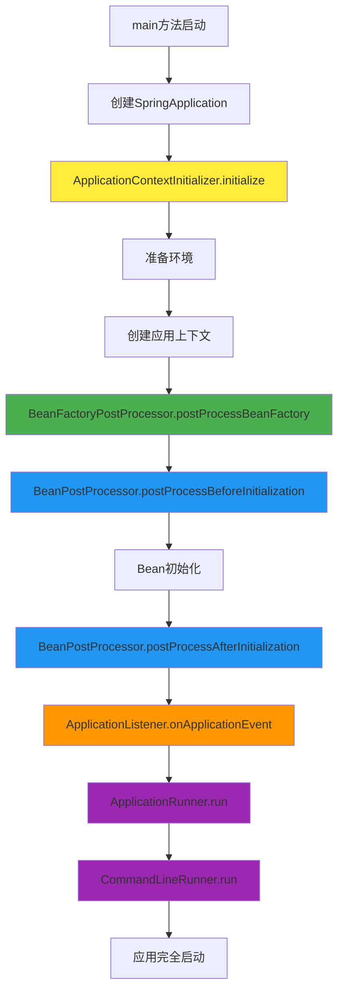

# SpringBoot启动组件使用指南

## 🎯 概述

本指南详细介绍了SpringBoot启动过程中各种组件的使用方法、执行时机和实际应用场景。

## 📋 组件列表

| 组件 | 执行时机 | 主要作用 | 使用场景 |
|------|---------|---------|---------|
| ApplicationContextInitializer | 上下文刷新前 | 初始化应用上下文 | 环境配置、Bean定义注册 |
| ApplicationListener | 事件发生时 | 监听应用事件 | 启动监控、资源初始化 |
| ApplicationRunner | 应用启动完成后 | 执行启动后逻辑 | 数据初始化、定时任务启动 |
| CommandLineRunner | 应用启动完成后 | 执行命令行逻辑 | 命令行参数处理、批处理任务 |
| BeanPostProcessor | Bean实例化前后 | 处理Bean实例 | AOP代理、属性注入 |
| BeanFactoryPostProcessor | Bean定义加载后 | 修改Bean定义 | 自动配置、属性占位符解析 |

## 🚀 快速开始

### 1. 运行演示程序

```bash
# 编译项目
mvn clean compile

# 运行演示程序
mvn exec:java -Dexec.mainClass="com.learning.analysis.StartupComponentsDemo"

# 带命令行参数运行
mvn exec:java -Dexec.mainClass="com.learning.analysis.StartupComponentsDemo" -Dexec.args="init-db"

# 运行测试
mvn test -Dtest=StartupComponentsTest
```

### 2. 查看执行日志

运行程序后，你会看到类似以下的日志输出：

```
🚀 === SpringBoot启动组件对比演示 ===
📋 命令行参数: []

🔧 === ApplicationContextInitializer.initialize() ===
  📍 执行时机：ApplicationContext刷新之前
  🏗️ 上下文类型: AnnotationConfigServletWebServerApplicationContext
  🌍 环境信息: StandardEnvironment
  📋 活跃Profile: 
  ✅ 设置活跃Profile为: dev
  ✅ ApplicationContextInitializer执行完成

🏭 === BeanFactoryPostProcessor.postProcessBeanFactory() ===
  📍 执行时机：Bean定义加载后，Bean实例化前
  📊 Bean定义数量: 15
  📊 修改了 0 个Bean定义
  ✅ BeanFactoryPostProcessor执行完成

🔧 === BeanPostProcessor.postProcessBeforeInitialization() ===
  📍 执行时机：Bean初始化之前
  🏷️ Bean名称: startupComponentsDemo.CustomApplicationContextInitializer
  🏗️ Bean类型: CustomApplicationContextInitializer
  ✅ BeanPostProcessor前置处理完成

🔧 === BeanPostProcessor.postProcessAfterInitialization() ===
  📍 执行时机：Bean初始化之后
  🏷️ Bean名称: startupComponentsDemo.CustomApplicationContextInitializer
  🏗️ Bean类型: CustomApplicationContextInitializer
  ✅ BeanPostProcessor后置处理完成

🎧 === ApplicationListener.onApplicationEvent() ===
  📍 执行时机：ContextRefreshedEvent事件发生时
  🏗️ 事件类型: ContextRefreshedEvent
  🕐 时间戳: Mon Jan 01 10:00:00 CST 2024
  📊 Bean数量: 15
  🌍 活跃Profile: [dev]
  ✅ ApplicationListener执行完成

🚀 === ApplicationRunner.run() ===
  📍 执行时机：应用完全启动后
  📋 命令行参数: []
  🏷️ 选项参数: []
  📊 初始化数据...
  ✅ 数据初始化完成
  ⏰ 启动定时任务...
  ✅ 定时任务启动完成
  🏥 注册健康检查...
  ✅ 健康检查注册完成
  ✅ ApplicationRunner执行完成

💻 === CommandLineRunner.run() ===
  📍 执行时机：应用完全启动后
  📋 命令行参数: []
  ℹ️ 无命令行参数，执行默认逻辑
  🔧 执行默认逻辑...
  ✅ 默认逻辑执行完成
  ✅ CommandLineRunner执行完成

🎉 === 应用启动完成 ===
📊 Bean数量: 15
🏗️ 应用类型: AnnotationConfigServletWebServerApplicationContext

🔄 关闭应用...
✅ 应用已关闭
```

## 🔧 组件详解

### 1. ApplicationContextInitializer

**作用**：在ApplicationContext刷新之前进行初始化配置

**使用场景**：
- 设置环境变量和Profile
- 注册自定义Bean定义
- 配置属性源
- 早期初始化逻辑

**实现示例**：
```java
@Component
@Order(Ordered.HIGHEST_PRECEDENCE)
public class CustomApplicationContextInitializer 
        implements ApplicationContextInitializer<ConfigurableApplicationContext> {
    
    @Override
    public void initialize(ConfigurableApplicationContext applicationContext) {
        // 设置活跃Profile
        applicationContext.getEnvironment().setActiveProfiles("dev");
        
        // 注册自定义Bean定义
        BeanDefinitionRegistry registry = (BeanDefinitionRegistry) applicationContext.getBeanFactory();
        GenericBeanDefinition beanDefinition = new GenericBeanDefinition();
        beanDefinition.setBeanClass(CustomService.class);
        registry.registerBeanDefinition("customService", beanDefinition);
    }
}
```

### 2. ApplicationListener

**作用**：监听应用生命周期事件

**使用场景**：
- 启动监控和日志记录
- 资源初始化
- 事件驱动的业务逻辑
- 应用状态管理

**实现示例**：
```java
@Component
public class CustomApplicationListener implements ApplicationListener<ContextRefreshedEvent> {
    
    @Override
    public void onApplicationEvent(ContextRefreshedEvent event) {
        // 处理上下文刷新完成事件
        System.out.println("应用上下文刷新完成: " + event.getTimestamp());
    }
}

// 使用@EventListener注解
@Component
public class EventListenerService {
    @EventListener
    public void handleApplicationReady(ApplicationReadyEvent event) {
        System.out.println("应用启动完成: " + event.getTimestamp());
    }
}
```

### 3. ApplicationRunner

**作用**：在应用完全启动后执行业务逻辑

**使用场景**：
- 数据初始化
- 定时任务启动
- 外部服务连接
- 监控和日志配置

**实现示例**：
```java
@Component
@Order(1)
public class CustomApplicationRunner implements ApplicationRunner {
    
    @Override
    public void run(ApplicationArguments args) throws Exception {
        // 执行启动后的业务逻辑
        initializeData();
        startScheduledTasks();
        registerHealthChecks();
    }
    
    private void initializeData() {
        // 数据初始化逻辑
    }
}
```

### 4. CommandLineRunner

**作用**：处理命令行参数，执行命令行相关逻辑

**使用场景**：
- 命令行工具开发
- 数据库操作（初始化、迁移、备份）
- 批量文件处理
- 系统维护任务

**实现示例**：
```java
@Component
@Order(2)
public class CustomCommandLineRunner implements CommandLineRunner {
    
    @Override
    public void run(String... args) throws Exception {
        if (args.length > 0) {
            String command = args[0];
            switch (command) {
                case "init-db":
                    initializeDatabase();
                    break;
                case "migrate":
                    runMigrations();
                    break;
                default:
                    System.out.println("未知命令: " + command);
            }
        }
    }
}
```

### 5. BeanPostProcessor

**作用**：在Bean实例化前后进行处理

**使用场景**：
- AOP代理创建
- 属性注入
- Bean生命周期管理
- 性能监控

**实现示例**：
```java
@Component
public class CustomBeanPostProcessor implements BeanPostProcessor {
    
    @Override
    public Object postProcessBeforeInitialization(Object bean, String beanName) throws BeansException {
        // Bean初始化前的处理
        System.out.println("Bean初始化前: " + beanName);
        return bean;
    }
    
    @Override
    public Object postProcessAfterInitialization(Object bean, String beanName) throws BeansException {
        // Bean初始化后的处理
        System.out.println("Bean初始化后: " + beanName);
        return bean;
    }
}
```

### 6. BeanFactoryPostProcessor

**作用**：修改Bean定义

**使用场景**：
- 自动配置
- 属性占位符解析
- Bean定义修改
- 条件注解处理

**实现示例**：
```java
@Component
public class CustomBeanFactoryPostProcessor implements BeanFactoryPostProcessor {
    
    @Override
    public void postProcessBeanFactory(ConfigurableListableBeanFactory beanFactory) throws BeansException {
        // 修改Bean定义
        String[] beanNames = beanFactory.getBeanDefinitionNames();
        for (String beanName : beanNames) {
            BeanDefinition beanDefinition = beanFactory.getBeanDefinition(beanName);
            // 修改Bean定义属性
            beanDefinition.setLazyInit(true);
        }
    }
}
```

## 📊 执行顺序



## 🎯 最佳实践

### 1. 选择合适的组件

- **早期配置**：使用ApplicationContextInitializer
- **事件驱动**：使用ApplicationListener
- **启动后逻辑**：使用ApplicationRunner
- **命令行处理**：使用CommandLineRunner
- **Bean处理**：使用BeanPostProcessor
- **Bean定义修改**：使用BeanFactoryPostProcessor

### 2. 控制执行顺序

```java
@Component
@Order(1) // 数字越小，优先级越高
public class HighPriorityRunner implements ApplicationRunner {
    // 实现
}

@Component
@Order(2)
public class LowPriorityRunner implements ApplicationRunner {
    // 实现
}
```

### 3. 异常处理

```java
@Component
public class SafeApplicationRunner implements ApplicationRunner {
    
    @Override
    public void run(ApplicationArguments args) throws Exception {
        try {
            // 业务逻辑
            doSomething();
        } catch (Exception e) {
            // 记录日志，但不抛出异常，避免影响应用启动
            logger.error("启动后逻辑执行失败", e);
        }
    }
}
```

### 4. 性能考虑

```java
@Component
public class EfficientApplicationRunner implements ApplicationRunner {
    
    @Override
    public void run(ApplicationArguments args) throws Exception {
        // 异步执行耗时操作
        CompletableFuture.runAsync(() -> {
            // 耗时操作
            initializeData();
        });
    }
}
```

## 🔍 调试技巧

### 1. 启用调试日志

```properties
# application.properties
logging.level.com.learning.analysis=DEBUG
logging.level.org.springframework.boot=DEBUG
```

### 2. 添加断点

在关键方法中添加断点，观察执行流程：
- ApplicationContextInitializer.initialize()
- ApplicationListener.onApplicationEvent()
- ApplicationRunner.run()
- CommandLineRunner.run()

### 3. 使用Spring Boot Actuator

```xml
<dependency>
    <groupId>org.springframework.boot</groupId>
    <artifactId>spring-boot-starter-actuator</artifactId>
</dependency>
```

```properties
# application.properties
management.endpoints.web.exposure.include=health,info,beans
```

## 📚 常见问题

### 1. 组件不执行

**问题**：自定义组件没有被执行

**解决方案**：
- 确保类上有@Component注解
- 检查包扫描路径
- 验证组件注册方式

### 2. 执行顺序问题

**问题**：组件执行顺序不符合预期

**解决方案**：
- 使用@Order注解控制顺序
- 数字越小，优先级越高
- 注意Ordered接口的常量值

### 3. 异常处理

**问题**：组件中的异常影响应用启动

**解决方案**：
- 在组件中捕获异常
- 记录日志但不抛出异常
- 使用异步执行耗时操作

## 📝 总结

SpringBoot启动组件提供了丰富的扩展点，理解它们的执行时机和使用场景对于开发高质量的SpringBoot应用至关重要。通过合理使用这些组件，可以实现：

- **灵活的配置管理**
- **事件驱动的架构**
- **优雅的启动流程**
- **强大的扩展能力**

建议在实际开发中根据具体需求选择合适的组件，并遵循最佳实践，确保应用的稳定性和可维护性。
