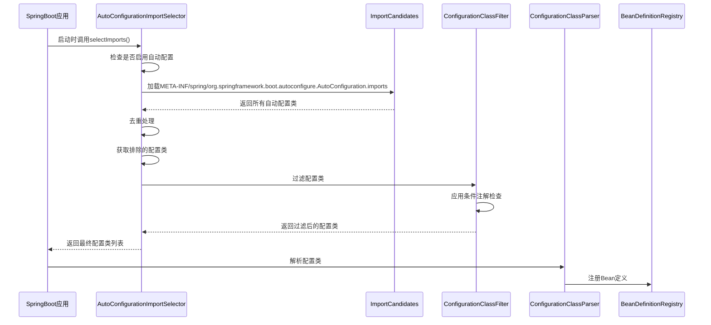
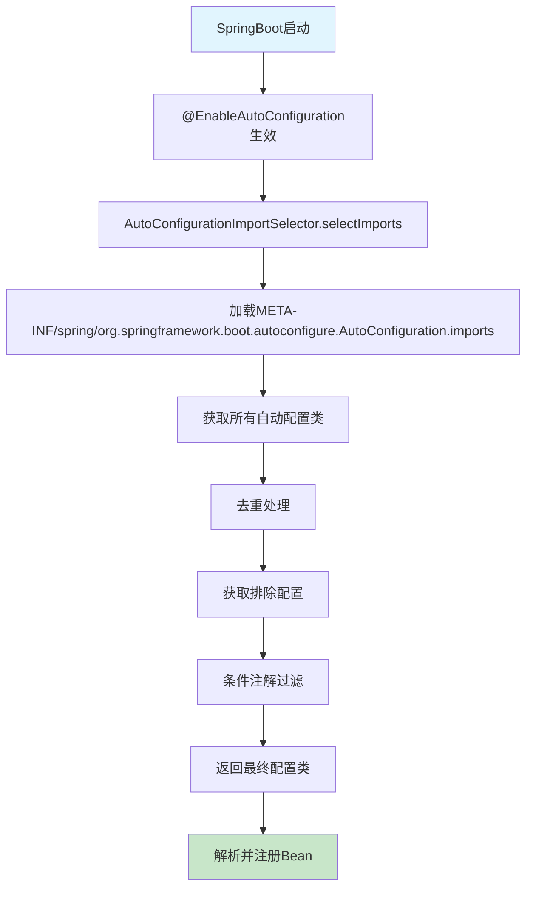
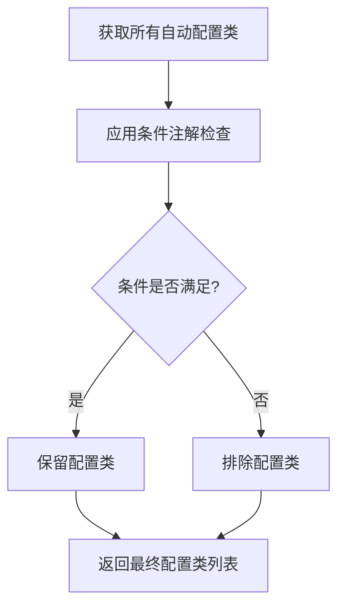
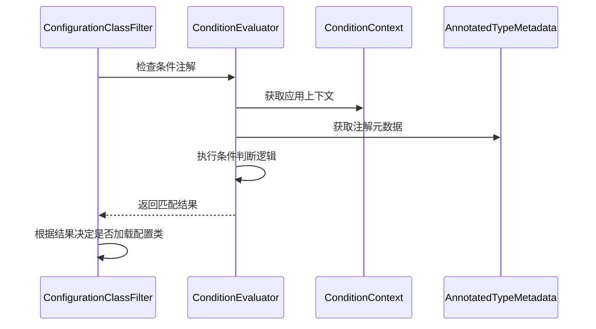

# SpringBoot启动流程-自动配置机制-深度解析

## 1. 自动配置机制概述

SpringBoot的自动配置机制是其核心特性之一，它能够根据类路径中的依赖自动配置Spring应用。这个机制基于条件注解和配置类的组合，实现了"约定优于配置"的设计理念。

### 1.1 核心组件

- **@EnableAutoConfiguration**: 启用自动配置的注解
- **AutoConfigurationImportSelector**: 自动配置导入选择器
- **@ConditionalOnXxx**: 条件注解系列
- **AutoConfigurationMetadata**: 自动配置元数据
- **ConfigurationClassPostProcessor**: 配置类后处理器

### 1.2 自动配置执行流程



## 2. 自动配置核心流程

### 2.1 启动入口

```java
@SpringBootApplication  // 包含@EnableAutoConfiguration
public class Application {
    public static void main(String[] args) {
        SpringApplication.run(Application.class, args);
    }
}
```

### 2.2 自动配置执行步骤



## 3. 核心组件详解

### 3.1 AutoConfigurationImportSelector

**作用**: 负责选择需要导入的自动配置类

**核心方法**:

```java
public String[] selectImports(AnnotationMetadata annotationMetadata) {
    // 1. 检查是否启用自动配置
    if (!isEnabled(annotationMetadata)) {
        return NO_IMPORTS;
    }
    
    // 2. 获取自动配置入口
    AutoConfigurationEntry autoConfigurationEntry = getAutoConfigurationEntry(annotationMetadata);
    
    // 3. 返回配置类数组
    return StringUtils.toStringArray(autoConfigurationEntry.getConfigurations());
}
```

### 3.2 自动配置类获取流程


**重要变化说明**:

从SpringBoot 2.7开始，自动配置类的加载方式发生了变化：

- **旧版本**: 使用`SpringFactoriesLoader.loadFactoryNames()`从`META-INF/spring.factories`文件加载
- **新版本**: 使用`ImportCandidates.load()`从`META-INF/spring/org.springframework.boot.autoconfigure.AutoConfiguration.imports`文件加载

新方式的优势：

1. **更清晰的命名**: 文件名明确表示其用途
2. **更好的性能**: 减少了不必要的解析开销
3. **更简单的格式**: 每行一个配置类，无需键值对格式

**关键代码**:

```java
protected List<String> getCandidateConfigurations(AnnotationMetadata metadata, AnnotationAttributes attributes) {
    // 从META-INF/spring/org.springframework.boot.autoconfigure.AutoConfiguration.imports文件中加载自动配置类
    List<String> configurations = ImportCandidates.load(AutoConfiguration.class, this.getBeanClassLoader()).getCandidates();
    Assert.notEmpty(configurations, "No auto configuration classes found in META-INF/spring/org.springframework.boot.autoconfigure.AutoConfiguration.imports. If you are using a custom packaging, make sure that file is correct.");
    return configurations;
}
```

### 3.3 条件注解过滤机制

**作用**: 根据条件注解决定是否加载某个自动配置类

**过滤流程**:



## 4. 条件注解体系

### 4.1 常用条件注解

| 注解 | 作用 | 示例 |
|------|------|------|
| `@ConditionalOnClass` | 类路径存在指定类时生效 | `@ConditionalOnClass(DataSource.class)` |
| `@ConditionalOnMissingClass` | 类路径不存在指定类时生效 | `@ConditionalOnMissingClass("com.example.CustomDataSource")` |
| `@ConditionalOnBean` | 容器中存在指定Bean时生效 | `@ConditionalOnBean(DataSource.class)` |
| `@ConditionalOnMissingBean` | 容器中不存在指定Bean时生效 | `@ConditionalOnMissingBean(DataSource.class)` |
| `@ConditionalOnProperty` | 配置属性满足条件时生效 | `@ConditionalOnProperty(name = "spring.datasource.url")` |
| `@ConditionalOnWebApplication` | Web应用时生效 | `@ConditionalOnWebApplication(type = Type.SERVLET)` |
| `@ConditionalOnExpression` | 表达式为true时生效 | `@ConditionalOnExpression("'${spring.profiles.active}'.contains('dev')")` |

### 4.2 条件注解执行流程



### 4.3 实际应用示例

**数据源自动配置示例**:

```java
@Configuration(proxyBeanMethods = false)
@ConditionalOnClass({ DataSource.class, EmbeddedDatabaseType.class })
@ConditionalOnMissingBean(type = "javax.sql.DataSource")
@EnableConfigurationProperties(DataSourceProperties.class)
public class DataSourceAutoConfiguration {
    
    @Configuration(proxyBeanMethods = false)
    @ConditionalOnClass(HikariDataSource.class)
    @ConditionalOnMissingBean(DataSource.class)
    @ConditionalOnProperty(name = "spring.datasource.type", 
                          havingValue = "com.zaxxer.hikari.HikariDataSource",
                          matchIfMissing = true)
    static class Hikari {
        
        @Bean
        @ConfigurationProperties(prefix = "spring.datasource.hikari")
        DataSource dataSource(DataSourceProperties properties) {
            return createDataSource(properties, HikariDataSource.class);
        }
    }
}
```

**条件注解执行逻辑**:

1. `@ConditionalOnClass`: 检查类路径是否存在`DataSource`和`EmbeddedDatabaseType`
2. `@ConditionalOnMissingBean`: 检查容器中是否已存在`DataSource`类型的Bean
3. `@ConditionalOnProperty`: 检查配置属性`spring.datasource.type`的值

## 5. 自动配置类设计模式

### 5.1 标准自动配置类结构

```java
@Configuration(proxyBeanMethods = false)  // 1. 禁用代理提高性能
@ConditionalOnClass(RedisOperations.class)  // 2. 类路径条件
@EnableConfigurationProperties(RedisProperties.class)  // 3. 启用配置属性
@Import({ LettuceConnectionConfiguration.class })  // 4. 导入其他配置
public class RedisAutoConfiguration {
    
    @Bean
    @ConditionalOnMissingBean(name = "redisTemplate")  // 5. 避免重复配置
    @ConditionalOnSingleCandidate(RedisConnectionFactory.class)  // 6. 单例条件
    public RedisTemplate<Object, Object> redisTemplate(RedisConnectionFactory factory) {
        RedisTemplate<Object, Object> template = new RedisTemplate<>();
        template.setConnectionFactory(factory);
        return template;
    }
}
```

### 5.2 设计原则

1. **条件化配置**: 使用条件注解控制配置的生效
2. **避免重复**: 使用`@ConditionalOnMissingBean`避免重复配置
3. **配置属性**: 使用`@EnableConfigurationProperties`绑定配置
4. **性能优化**: 使用`proxyBeanMethods = false`提高性能
5. **模块化**: 使用内部类或`@Import`组织相关配置

## 6. 自动配置排除机制

### 6.1 排除自动配置类

#### 方式一: 注解排除

```java
@SpringBootApplication(exclude = { 
    DataSourceAutoConfiguration.class, 
    RedisAutoConfiguration.class 
})
public class Application {
    public static void main(String[] args) {
        SpringApplication.run(Application.class, args);
    }
}
```

#### 方式二: 属性排除

```yaml
# application.yml
spring:
  autoconfigure:
    exclude:
      - org.springframework.boot.autoconfigure.data.redis.RedisAutoConfiguration
      - org.springframework.boot.autoconfigure.jdbc.DataSourceAutoConfiguration
```

#### 方式三: 启动参数排除

```bash
java -jar app.jar --spring.autoconfigure.exclude=org.springframework.boot.autoconfigure.data.redis.RedisAutoConfiguration
```

## 7. 自定义自动配置

### 7.1 创建自定义自动配置类

```java
@Configuration(proxyBeanMethods = false)
@ConditionalOnClass(CustomService.class)
@ConditionalOnMissingBean(CustomService.class)
@EnableConfigurationProperties(CustomProperties.class)
public class CustomAutoConfiguration {
    
    @Bean
    @ConditionalOnProperty(prefix = "custom", name = "enabled", havingValue = "true", matchIfMissing = true)
    public CustomService customService(CustomProperties properties) {
        return new CustomService(properties);
    }
    
    @Bean
    @ConditionalOnMissingBean
    public CustomTemplate customTemplate(CustomService customService) {
        return new CustomTemplate(customService);
    }
}
```

### 7.2 配置属性类

```java
@ConfigurationProperties(prefix = "custom")
public class CustomProperties {
    
    private boolean enabled = true;
    private String name = "default";
    private int timeout = 5000;
    private List<String> hosts = new ArrayList<>();
    
    // getter和setter方法
    public boolean isEnabled() { return enabled; }
    public void setEnabled(boolean enabled) { this.enabled = enabled; }
    
    public String getName() { return name; }
    public void setName(String name) { this.name = name; }
    
    public int getTimeout() { return timeout; }
    public void setTimeout(int timeout) { this.timeout = timeout; }
    
    public List<String> getHosts() { return hosts; }
    public void setHosts(List<String> hosts) { this.hosts = hosts; }
}
```

### 7.3 注册自动配置类

**META-INF/spring/org.springframework.boot.autoconfigure.AutoConfiguration.imports**:

```properties
com.example.autoconfigure.CustomAutoConfiguration
```

**META-INF/spring-autoconfigure-metadata.properties**:

```properties
com.example.autoconfigure.CustomAutoConfiguration=
com.example.autoconfigure.CustomAutoConfiguration.ConditionalOnClass=com.example.service.CustomService
com.example.autoconfigure.CustomAutoConfiguration.ConditionalOnMissingBean=com.example.service.CustomService
com.example.autoconfigure.CustomAutoConfiguration.ConditionalOnProperty=prefix=custom,name=enabled
```

## 8. 自动配置测试

### 8.1 基本测试

```java
@RunWith(SpringRunner.class)
@SpringBootTest
public class CustomAutoConfigurationTest {
    
    @Autowired(required = false)
    private CustomService customService;
    
    @Test
    public void testCustomServiceAutoConfiguration() {
        assertThat(customService).isNotNull();
        assertThat(customService.getName()).isEqualTo("default");
    }
}
```

### 8.2 条件化测试

```java
@RunWith(SpringRunner.class)
@SpringBootTest(properties = "custom.enabled=false")
public class CustomAutoConfigurationDisabledTest {
    
    @Autowired(required = false)
    private CustomService customService;
    
    @Test
    public void testCustomServiceNotConfigured() {
        assertThat(customService).isNull();
    }
}
```

## 9. 最佳实践

### 9.1 自动配置类设计原则

1. **使用条件注解**: 确保配置只在合适的时候生效
2. **避免重复配置**: 使用`@ConditionalOnMissingBean`
3. **性能优化**: 使用`proxyBeanMethods = false`
4. **配置属性**: 使用`@EnableConfigurationProperties`
5. **模块化设计**: 使用内部类或`@Import`组织配置

### 9.2 常见问题解决

#### 问题1: 自动配置类不生效

- 检查`META-INF/spring/org.springframework.boot.autoconfigure.AutoConfiguration.imports`文件
- 验证条件注解是否正确
- 确认类路径中是否存在依赖

#### 问题2: 配置类冲突

- 使用`@AutoConfigureOrder`设置优先级
- 使用`@ConditionalOnSingleCandidate`避免冲突

#### 问题3: 配置属性绑定失败

- 使用`@Validated`进行验证
- 在`@PostConstruct`方法中验证配置

## 10. 总结

SpringBoot自动配置机制的核心特点：

1. **智能配置**: 根据类路径和条件自动配置应用
2. **条件控制**: 通过条件注解精确控制配置生效
3. **扩展能力**: 支持自定义自动配置
4. **高效加载**: 通过元数据和条件过滤提高效率
5. **测试支持**: 提供丰富的测试工具

掌握自动配置机制对于SpringBoot应用开发和面试都至关重要。
