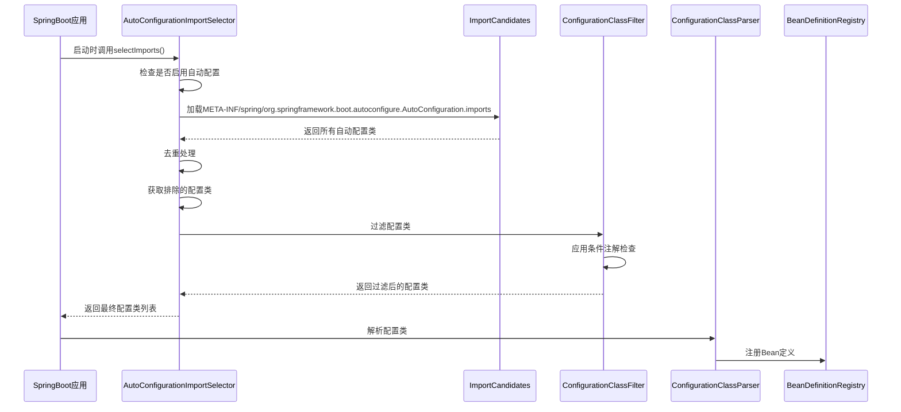
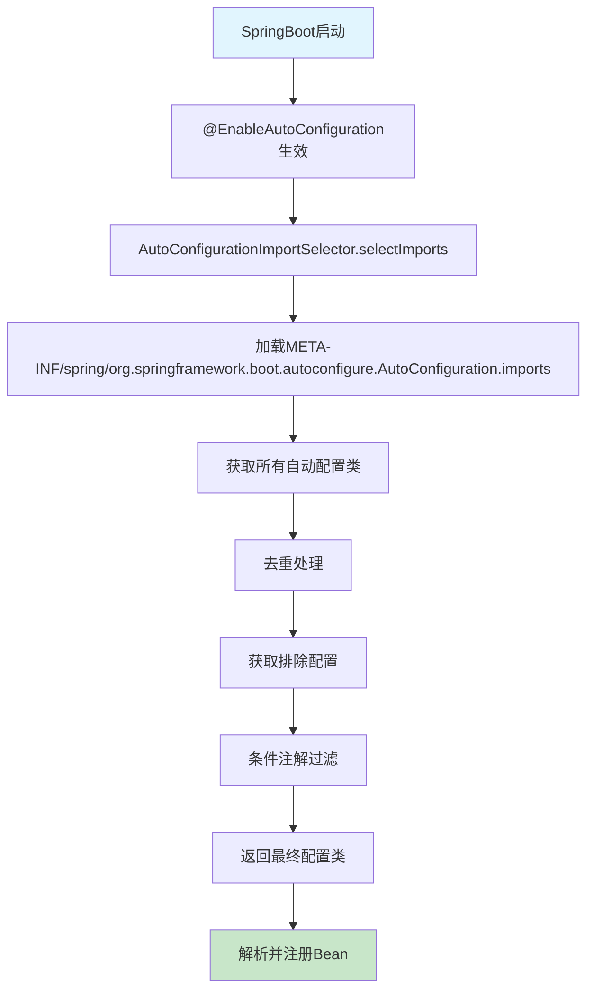
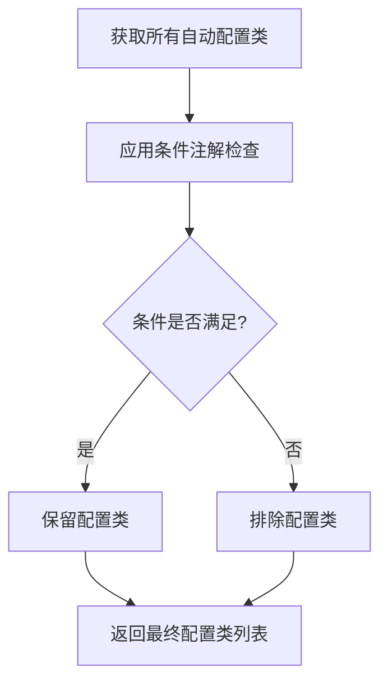
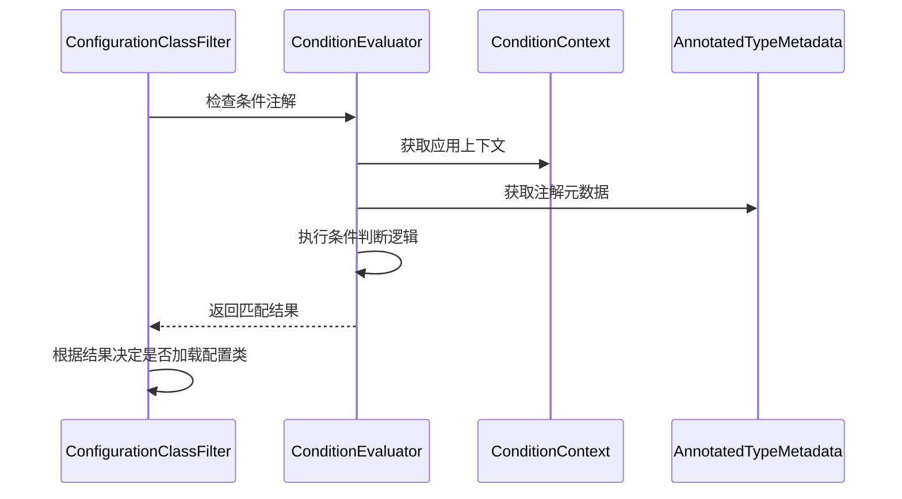

# SpringBoot启动流程-自动配置机制-深度解析

## 1. 自动配置机制概述

SpringBoot的自动配置机制是其核心特性之一，它能够根据类路径中的依赖自动配置Spring应用。这个机制基于条件注解和配置类的组合，实现了"约定优于配置"的设计理念。

### 1.1 核心组件

- **@EnableAutoConfiguration**: 启用自动配置的注解
- **AutoConfigurationImportSelector**: 自动配置导入选择器
- **@ConditionalOnXxx**: 条件注解系列
- **AutoConfigurationMetadata**: 自动配置元数据
- **ConfigurationClassPostProcessor**: 配置类后处理器

### 1.2 自动配置执行流程



## 2. 自动配置核心流程

### 2.1 启动入口

```java
@SpringBootApplication  // 包含@EnableAutoConfiguration
public class Application {
    public static void main(String[] args) {
        SpringApplication.run(Application.class, args);
    }
}
```

### 2.2 自动配置执行步骤



## 3. 核心组件详解

### 3.1 AutoConfigurationImportSelector

**作用**: 负责选择需要导入的自动配置类

**核心方法**:

```java
public String[] selectImports(AnnotationMetadata annotationMetadata) {
    // 1. 检查是否启用自动配置
    if (!isEnabled(annotationMetadata)) {
        return NO_IMPORTS;
    }
    
    // 2. 获取自动配置入口
    AutoConfigurationEntry autoConfigurationEntry = getAutoConfigurationEntry(annotationMetadata);
    
    // 3. 返回配置类数组
    return StringUtils.toStringArray(autoConfigurationEntry.getConfigurations());
}
```

### 3.2 自动配置类获取流程


**重要变化说明**:

从SpringBoot 2.7开始，自动配置类的加载方式发生了变化：

- **旧版本**: 使用`SpringFactoriesLoader.loadFactoryNames()`从`META-INF/spring.factories`文件加载
- **新版本**: 使用`ImportCandidates.load()`从`META-INF/spring/org.springframework.boot.autoconfigure.AutoConfiguration.imports`文件加载

新方式的优势：

1. **更清晰的命名**: 文件名明确表示其用途
2. **更好的性能**: 减少了不必要的解析开销
3. **更简单的格式**: 每行一个配置类，无需键值对格式

**关键代码**:

```java
protected List<String> getCandidateConfigurations(AnnotationMetadata metadata, AnnotationAttributes attributes) {
    // 从META-INF/spring/org.springframework.boot.autoconfigure.AutoConfiguration.imports文件中加载自动配置类
    List<String> configurations = ImportCandidates.load(AutoConfiguration.class, this.getBeanClassLoader()).getCandidates();
    Assert.notEmpty(configurations, "No auto configuration classes found in META-INF/spring/org.springframework.boot.autoconfigure.AutoConfiguration.imports. If you are using a custom packaging, make sure that file is correct.");
    return configurations;
}
```

### 3.3 条件注解过滤机制

**作用**: 根据条件注解决定是否加载某个自动配置类

**过滤流程**:



## 4. 条件注解体系

### 4.1 常用条件注解

| 注解 | 作用 | 示例 |
|------|------|------|
| `@ConditionalOnClass` | 类路径存在指定类时生效 | `@ConditionalOnClass(DataSource.class)` |
| `@ConditionalOnMissingClass` | 类路径不存在指定类时生效 | `@ConditionalOnMissingClass("com.example.CustomDataSource")` |
| `@ConditionalOnBean` | 容器中存在指定Bean时生效 | `@ConditionalOnBean(DataSource.class)` |
| `@ConditionalOnMissingBean` | 容器中不存在指定Bean时生效 | `@ConditionalOnMissingBean(DataSource.class)` |
| `@ConditionalOnProperty` | 配置属性满足条件时生效 | `@ConditionalOnProperty(name = "spring.datasource.url")` |
| `@ConditionalOnWebApplication` | Web应用时生效 | `@ConditionalOnWebApplication(type = Type.SERVLET)` |
| `@ConditionalOnExpression` | 表达式为true时生效 | `@ConditionalOnExpression("'${spring.profiles.active}'.contains('dev')")` |

### 4.2 条件注解执行流程



### 4.3 实际应用示例

**数据源自动配置示例**:

```java
@Configuration(proxyBeanMethods = false)
@ConditionalOnClass({ DataSource.class, EmbeddedDatabaseType.class })
@ConditionalOnMissingBean(type = "javax.sql.DataSource")
@EnableConfigurationProperties(DataSourceProperties.class)
public class DataSourceAutoConfiguration {
    
    @Configuration(proxyBeanMethods = false)
    @ConditionalOnClass(HikariDataSource.class)
    @ConditionalOnMissingBean(DataSource.class)
    @ConditionalOnProperty(name = "spring.datasource.type", 
                          havingValue = "com.zaxxer.hikari.HikariDataSource",
                          matchIfMissing = true)
    static class Hikari {
        
        @Bean
        @ConfigurationProperties(prefix = "spring.datasource.hikari")
        DataSource dataSource(DataSourceProperties properties) {
            return createDataSource(properties, HikariDataSource.class);
        }
    }
}
```

**条件注解执行逻辑**:

1. `@ConditionalOnClass`: 检查类路径是否存在`DataSource`和`EmbeddedDatabaseType`
2. `@ConditionalOnMissingBean`: 检查容器中是否已存在`DataSource`类型的Bean
3. `@ConditionalOnProperty`: 检查配置属性`spring.datasource.type`的值

## 5. 自动配置类设计模式

### 5.1 标准自动配置类结构

```java
@Configuration(proxyBeanMethods = false)  // 1. 禁用代理提高性能
@ConditionalOnClass(RedisOperations.class)  // 2. 类路径条件
@EnableConfigurationProperties(RedisProperties.class)  // 3. 启用配置属性
@Import({ LettuceConnectionConfiguration.class })  // 4. 导入其他配置
public class RedisAutoConfiguration {
    
    @Bean
    @ConditionalOnMissingBean(name = "redisTemplate")  // 5. 避免重复配置
    @ConditionalOnSingleCandidate(RedisConnectionFactory.class)  // 6. 单例条件
    public RedisTemplate<Object, Object> redisTemplate(RedisConnectionFactory factory) {
        RedisTemplate<Object, Object> template = new RedisTemplate<>();
        template.setConnectionFactory(factory);
        return template;
    }
}
```

### 5.2 设计原则

1. **条件化配置**: 使用条件注解控制配置的生效
2. **避免重复**: 使用`@ConditionalOnMissingBean`避免重复配置
3. **配置属性**: 使用`@EnableConfigurationProperties`绑定配置
4. **性能优化**: 使用`proxyBeanMethods = false`提高性能
5. **模块化**: 使用内部类或`@Import`组织相关配置

## 6. 自动配置排除机制

### 6.1 排除自动配置类

#### 方式一: 注解排除

```java
@SpringBootApplication(exclude = { 
    DataSourceAutoConfiguration.class, 
    RedisAutoConfiguration.class 
})
public class Application {
    public static void main(String[] args) {
        SpringApplication.run(Application.class, args);
    }
}
```

#### 方式二: 属性排除

```yaml
# application.yml
spring:
  autoconfigure:
    exclude:
      - org.springframework.boot.autoconfigure.data.redis.RedisAutoConfiguration
      - org.springframework.boot.autoconfigure.jdbc.DataSourceAutoConfiguration
```

#### 方式三: 启动参数排除

```bash
java -jar app.jar --spring.autoconfigure.exclude=org.springframework.boot.autoconfigure.data.redis.RedisAutoConfiguration
```

## 7. 自定义自动配置

### 7.1 创建自定义自动配置类

```java
@Configuration(proxyBeanMethods = false)
@ConditionalOnClass(CustomService.class)
@ConditionalOnMissingBean(CustomService.class)
@EnableConfigurationProperties(CustomProperties.class)
public class CustomAutoConfiguration {
    
    @Bean
    @ConditionalOnProperty(prefix = "custom", name = "enabled", havingValue = "true", matchIfMissing = true)
    public CustomService customService(CustomProperties properties) {
        return new CustomService(properties);
    }
    
    @Bean
    @ConditionalOnMissingBean
    public CustomTemplate customTemplate(CustomService customService) {
        return new CustomTemplate(customService);
    }
}
```

### 7.2 配置属性类

```java
@ConfigurationProperties(prefix = "custom")
public class CustomProperties {
    
    private boolean enabled = true;
    private String name = "default";
    private int timeout = 5000;
    private List<String> hosts = new ArrayList<>();
    
    // getter和setter方法
    public boolean isEnabled() { return enabled; }
    public void setEnabled(boolean enabled) { this.enabled = enabled; }
    
    public String getName() { return name; }
    public void setName(String name) { this.name = name; }
    
    public int getTimeout() { return timeout; }
    public void setTimeout(int timeout) { this.timeout = timeout; }
    
    public List<String> getHosts() { return hosts; }
    public void setHosts(List<String> hosts) { this.hosts = hosts; }
}
```

### 7.3 注册自动配置类

**META-INF/spring/org.springframework.boot.autoconfigure.AutoConfiguration.imports**:

```properties
com.example.autoconfigure.CustomAutoConfiguration
```

**META-INF/spring-autoconfigure-metadata.properties**:

```properties
com.example.autoconfigure.CustomAutoConfiguration=
com.example.autoconfigure.CustomAutoConfiguration.ConditionalOnClass=com.example.service.CustomService
com.example.autoconfigure.CustomAutoConfiguration.ConditionalOnMissingBean=com.example.service.CustomService
com.example.autoconfigure.CustomAutoConfiguration.ConditionalOnProperty=prefix=custom,name=enabled
```

## 8. 自动配置测试

### 8.1 基本测试

```java
@RunWith(SpringRunner.class)
@SpringBootTest
public class CustomAutoConfigurationTest {
    
    @Autowired(required = false)
    private CustomService customService;
    
    @Test
    public void testCustomServiceAutoConfiguration() {
        assertThat(customService).isNotNull();
        assertThat(customService.getName()).isEqualTo("default");
    }
}
```

### 8.2 条件化测试

```java
@RunWith(SpringRunner.class)
@SpringBootTest(properties = "custom.enabled=false")
public class CustomAutoConfigurationDisabledTest {
    
    @Autowired(required = false)
    private CustomService customService;
    
    @Test
    public void testCustomServiceNotConfigured() {
        assertThat(customService).isNull();
    }
}
```

## 9. 最佳实践

### 9.1 自动配置类设计原则

1. **使用条件注解**: 确保配置只在合适的时候生效
2. **避免重复配置**: 使用`@ConditionalOnMissingBean`
3. **性能优化**: 使用`proxyBeanMethods = false`
4. **配置属性**: 使用`@EnableConfigurationProperties`
5. **模块化设计**: 使用内部类或`@Import`组织配置

### 9.2 常见问题解决

#### 问题1: 自动配置类不生效

- 检查`META-INF/spring/org.springframework.boot.autoconfigure.AutoConfiguration.imports`文件
- 验证条件注解是否正确
- 确认类路径中是否存在依赖

#### 问题2: 配置类冲突

- 使用`@AutoConfigureOrder`设置优先级
- 使用`@ConditionalOnSingleCandidate`避免冲突

#### 问题3: 配置属性绑定失败

- 使用`@Validated`进行验证
- 在`@PostConstruct`方法中验证配置

## 10. 总结

SpringBoot自动配置机制的核心特点：

1. **智能配置**: 根据类路径和条件自动配置应用
2. **条件控制**: 通过条件注解精确控制配置生效
3. **扩展能力**: 支持自定义自动配置
4. **高效加载**: 通过元数据和条件过滤提高效率
5. **测试支持**: 提供丰富的测试工具

掌握自动配置机制对于SpringBoot应用开发和面试都至关重要。

## 11. 面试话术与思路

### 11.1 面试介绍思路

**开场白**：
"SpringBoot的自动配置机制是其核心特性之一，它实现了'约定优于配置'的设计理念。我来详细介绍一下它的工作原理。"

**核心思路**：
1. **先总后分**：先介绍整体机制，再深入细节
2. **结合源码**：关键点要能说出具体的类和方法
3. **举例说明**：用具体的自动配置类来说明
4. **对比分析**：说明新旧版本的变化
5. **实际应用**：结合项目经验谈应用场景

### 11.2 详细话术模板

#### 11.2.1 整体机制介绍

**话术**：
"SpringBoot的自动配置机制主要通过以下几个核心组件实现：

1. **@EnableAutoConfiguration注解**：这是启动自动配置的入口，它被包含在@SpringBootApplication中
2. **AutoConfigurationImportSelector**：这是核心的选择器，负责决定哪些自动配置类需要被加载
3. **条件注解体系**：如@ConditionalOnClass、@ConditionalOnBean等，用于控制配置类的生效条件
4. **配置类加载机制**：从META-INF/spring/org.springframework.boot.autoconfigure.AutoConfiguration.imports文件中加载所有自动配置类

整个流程可以概括为：启动时扫描→条件过滤→配置生效→Bean注册。"

#### 11.2.2 核心流程详解

**话术**：
"让我详细说一下自动配置的执行流程：

**第一步：触发自动配置**
当SpringBoot应用启动时，@EnableAutoConfiguration注解会触发AutoConfigurationImportSelector的selectImports方法。

**第二步：加载候选配置类**
selectImports方法会调用getCandidateConfigurations方法，这个方法会通过ImportCandidates.load()从META-INF/spring/org.springframework.boot.autoconfigure.AutoConfiguration.imports文件中加载所有的自动配置类。

**第三步：条件过滤**
加载完所有候选配置类后，会通过ConfigurationClassFilter进行过滤，应用各种@ConditionalOnXxx条件注解，只有满足条件的配置类才会被保留。

**第四步：返回最终配置**
过滤后的配置类会被返回给Spring容器，然后进行Bean定义的注册和实例化。"

#### 11.2.3 条件注解机制

**话术**：
"条件注解是自动配置机制的核心，它决定了配置类是否生效。常用的条件注解包括：

- **@ConditionalOnClass**：当类路径中存在指定类时生效，比如@ConditionalOnClass(DataSource.class)
- **@ConditionalOnMissingBean**：当容器中不存在指定Bean时生效，避免重复配置
- **@ConditionalOnProperty**：当配置属性满足条件时生效
- **@ConditionalOnWebApplication**：当是Web应用时生效

这些条件注解通过ConditionEvaluator进行评估，只有所有条件都满足时，配置类才会生效。"

#### 11.2.4 版本变化说明

**话术**：
"这里需要特别说明一个重要的版本变化：

**SpringBoot 2.7之前**：自动配置类是从META-INF/spring.factories文件中加载的，使用SpringFactoriesLoader.loadFactoryNames()方法。

**SpringBoot 2.7之后**：改为从META-INF/spring/org.springframework.boot.autoconfigure.AutoConfiguration.imports文件中加载，使用ImportCandidates.load()方法。

新方式的优势是：
1. 文件名更明确，直接表明用途
2. 格式更简单，每行一个配置类
3. 性能更好，减少了不必要的解析开销

这个变化体现了SpringBoot在持续优化用户体验和性能。"

#### 11.2.5 实际应用举例

**话术**：
"我举个具体的例子来说明自动配置是如何工作的：

以DataSourceAutoConfiguration为例：

```java
@Configuration(proxyBeanMethods = false)
@ConditionalOnClass({ DataSource.class, EmbeddedDatabaseType.class })
@ConditionalOnMissingBean(type = "javax.sql.DataSource")
@EnableConfigurationProperties(DataSourceProperties.class)
public class DataSourceAutoConfiguration {
    // 配置逻辑
}
```

这个配置类的生效条件是：
1. 类路径中必须存在DataSource和EmbeddedDatabaseType类
2. 容器中不能已经存在DataSource类型的Bean
3. 启用了DataSourceProperties配置属性绑定

只有当这些条件都满足时，数据源的自动配置才会生效，这就是SpringBoot智能配置的体现。"

#### 11.2.6 自定义自动配置

**话术**：
"在实际项目中，我们也可以创建自定义的自动配置类。基本步骤是：

1. **创建配置类**：使用@Configuration注解，并添加适当的条件注解
2. **创建配置属性类**：使用@ConfigurationProperties绑定配置
3. **注册配置类**：在META-INF/spring/org.springframework.boot.autoconfigure.AutoConfiguration.imports文件中注册
4. **添加元数据**：在META-INF/spring-autoconfigure-metadata.properties中添加条件信息

这样就能实现自己的自动配置，让其他开发者使用我们的starter时能够自动配置相关组件。"

### 11.3 面试技巧

#### 11.3.1 回答策略

1. **结构化回答**：按照"是什么→为什么→怎么做"的逻辑来回答
2. **层次递进**：从宏观到微观，从概念到实现
3. **举例说明**：每个关键点都要有具体的例子
4. **源码结合**：能说出关键的类名和方法名
5. **实际经验**：结合项目中的实际应用场景

#### 11.3.2 常见追问及回答

**Q1：自动配置和手动配置有什么区别？**
**A1**：
"自动配置的优势是：
1. 减少样板代码，提高开发效率
2. 遵循最佳实践，减少配置错误
3. 智能判断，只在需要时生效
4. 统一标准，团队开发更规范

但自动配置也有局限性：
1. 黑盒操作，问题排查困难
2. 不够灵活，特殊需求难以满足
3. 学习成本，需要了解各种条件注解

所以在实际项目中，我们通常采用'自动配置为主，手动配置为辅'的策略。"

**Q2：如何调试自动配置问题？**
**A2**：
"调试自动配置问题的方法：

1. **开启调试日志**：设置logging.level.org.springframework.boot.autoconfigure=DEBUG
2. **使用条件报告**：添加--debug启动参数，查看条件评估报告
3. **排除自动配置**：使用@SpringBootApplication(exclude)临时排除问题配置
4. **查看Bean定义**：使用ApplicationContext的getBeanDefinitionNames()方法
5. **使用Actuator**：通过/actuator/beans端点查看Bean信息

这些方法能帮助我们快速定位自动配置的问题。"

**Q3：自动配置的性能如何？**
**A3**：
"SpringBoot在自动配置性能方面做了很多优化：

1. **条件缓存**：条件评估结果会被缓存，避免重复计算
2. **延迟加载**：使用@Lazy注解实现Bean的延迟初始化
3. **代理优化**：使用proxyBeanMethods = false减少代理开销
4. **元数据优化**：通过spring-autoconfigure-metadata.properties提供预编译的条件信息
5. **过滤机制**：在加载阶段就过滤掉不满足条件的配置类

这些优化使得自动配置机制既强大又高效。"

### 11.4 总结话术

**结束语**：
"总的来说，SpringBoot的自动配置机制通过条件注解和配置类的组合，实现了智能化的应用配置。它不仅提高了开发效率，还保证了配置的一致性和最佳实践。

掌握这个机制对于SpringBoot开发非常重要，它不仅能帮助我们更好地使用SpringBoot，还能指导我们设计自己的starter和自动配置类。

在实际面试中，我建议从整体流程开始介绍，然后深入到具体的实现细节，最后结合实际应用场景，这样能够全面展示对自动配置机制的理解。"