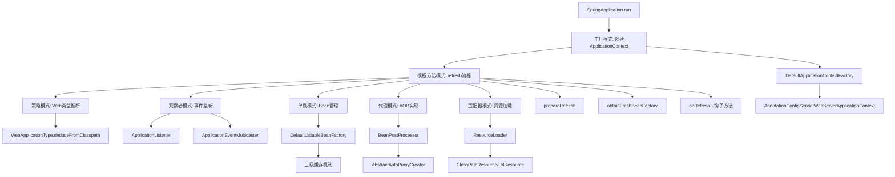

# SpringBoot启动流程设计模式分析

## 🎯 概述

SpringBoot启动流程是一个复杂而精妙的过程，其中运用了多种经典的设计模式。这些设计模式不仅体现了Spring框架的优秀设计思想，也为理解SpringBoot的工作原理提供了重要线索。

## 📋 设计模式总览

| 设计模式 | 应用场景 | 关键类/方法 | 作用 |
|---------|---------|------------|------|
| **模板方法模式** | 应用上下文刷新流程 | `AbstractApplicationContext.refresh()` | 定义启动算法骨架 |
| **工厂模式** | 创建应用上下文 | `ApplicationContextFactory` | 根据类型创建不同上下文 |
| **观察者模式** | 事件监听机制 | `ApplicationListener` | 监听启动事件 |
| **策略模式** | Web应用类型推断 | `WebApplicationType.deduceFromClasspath()` | 根据类路径选择策略 |
| **单例模式** | Bean管理 | `DefaultListableBeanFactory` | 管理单例Bean |
| **代理模式** | AOP实现 | `BeanPostProcessor` | 创建代理对象 |
| **建造者模式** | 环境构建 | `EnvironmentBuilder` | 构建复杂环境对象 |
| **适配器模式** | 资源加载 | `ResourceLoader` | 适配不同资源类型 |

## 🔧 详细设计模式分析

### 1. 模板方法模式（Template Method Pattern）

#### 1.1 核心应用：AbstractApplicationContext.refresh()

```java
public void refresh() throws BeansException, IllegalStateException {
    synchronized (this.startupShutdownMonitor) {
        // 1. 准备刷新
        prepareRefresh();
        
        // 2. 获取BeanFactory
        ConfigurableListableBeanFactory beanFactory = obtainFreshBeanFactory();
        
        // 3. 准备BeanFactory
        prepareBeanFactory(beanFactory);
        
        try {
            // 4. 后处理BeanFactory
            postProcessBeanFactory(beanFactory);
            
            // 5. 调用BeanFactoryPostProcessor
            invokeBeanFactoryPostProcessors(beanFactory);
            
            // 6. 注册BeanPostProcessor
            registerBeanPostProcessors(beanFactory);
            
            // 7. 初始化MessageSource
            initMessageSource();
            
            // 8. 初始化ApplicationEventMulticaster
            initApplicationEventMulticaster();
            
            // 9. 刷新特定上下文（钩子方法）
            onRefresh();
            
            // 10. 注册监听器
            registerListeners();
            
            // 11. 实例化所有单例Bean
            finishBeanFactoryInitialization(beanFactory);
            
            // 12. 完成刷新
            finishRefresh();
        }
        catch (BeansException ex) {
            // 异常处理
        }
    }
}
```

#### 1.2 模板方法模式要素

- **模板方法**：`refresh()` - 定义算法骨架，控制执行流程
- **具体方法**：`prepareRefresh()`、`prepareBeanFactory()` 等 - 固定实现
- **钩子方法**：`onRefresh()` - 子类可重写，提供扩展点
- **抽象方法**：无（此例中所有方法都有默认实现）

#### 1.3 子类实现示例

```java
// ServletWebServerApplicationContext
@Override
protected void onRefresh() {
    super.onRefresh();
    try {
        createWebServer(); // 启动内嵌Web服务器
    }
    catch (Throwable ex) {
        throw new ApplicationContextException("Unable to start web server", ex);
    }
}
```

### 2. 工厂模式（Factory Pattern）

#### 2.1 应用上下文工厂

```java
public interface ApplicationContextFactory {
    ConfigurableApplicationContext create(WebApplicationType webApplicationType);
}

public class DefaultApplicationContextFactory implements ApplicationContextFactory {
    @Override
    public ConfigurableApplicationContext create(WebApplicationType webApplicationType) {
        return switch (webApplicationType) {
            case SERVLET -> new AnnotationConfigServletWebServerApplicationContext();
            case REACTIVE -> new AnnotationConfigReactiveWebServerApplicationContext();
            case NONE -> new AnnotationConfigApplicationContext();
        };
    }
}
```

#### 2.2 Web服务器工厂

```java
public interface ServletWebServerFactory {
    WebServer getWebServer(ServletContextInitializer... initializers);
}

// 具体实现
public class TomcatServletWebServerFactory implements ServletWebServerFactory {
    @Override
    public WebServer getWebServer(ServletContextInitializer... initializers) {
        // 创建Tomcat服务器
    }
}

public class JettyServletWebServerFactory implements ServletWebServerFactory {
    @Override
    public WebServer getWebServer(ServletContextInitializer... initializers) {
        // 创建Jetty服务器
    }
}
```

### 3. 观察者模式（Observer Pattern）

#### 3.1 事件监听机制

```java
public interface ApplicationListener<E extends ApplicationEvent> extends EventListener {
    void onApplicationEvent(E event);
}

// 事件多播器
public class SimpleApplicationEventMulticaster implements ApplicationEventMulticaster {
    private final Set<ApplicationListener<?>> applicationListeners = new LinkedHashSet<>();
    
    @Override
    public void multicastEvent(ApplicationEvent event) {
        for (ApplicationListener<?> listener : applicationListeners) {
            invokeListener(listener, event);
        }
    }
}
```

#### 3.2 启动事件监听

```java
@Component
public class StartupEventListener implements ApplicationListener<ContextRefreshedEvent> {
    @Override
    public void onApplicationEvent(ContextRefreshedEvent event) {
        System.out.println("应用上下文刷新完成: " + event.getTimestamp());
    }
}
```

### 4. 策略模式（Strategy Pattern）

#### 4.1 Web应用类型推断

```java
public enum WebApplicationType {
    SERVLET, REACTIVE, NONE;
    
    static WebApplicationType deduceFromClasspath() {
        // 策略1：检查WebFlux相关类
        if (ClassUtils.isPresent("org.springframework.web.reactive.DispatcherHandler", null)
                && !ClassUtils.isPresent("org.springframework.web.servlet.DispatcherServlet", null)) {
            return REACTIVE;
        }
        
        // 策略2：检查Servlet相关类
        for (String className : SERVLET_INDICATOR_CLASSES) {
            if (!ClassUtils.isPresent(className, null)) {
                return NONE;
            }
        }
        return SERVLET;
    }
}
```

#### 4.2 条件注解评估策略

```java
public class ConditionEvaluator {
    public boolean shouldSkip(AnnotatedTypeMetadata metadata) {
        // 根据不同的条件注解选择不同的评估策略
        for (Condition condition : conditions) {
            if (!condition.matches(context, metadata)) {
                return true;
            }
        }
        return false;
    }
}
```

### 5. 单例模式（Singleton Pattern）

#### 5.1 Bean单例管理

```java
public class DefaultListableBeanFactory {
    // 一级缓存：完全初始化好的Bean
    private final Map<String, Object> singletonObjects = new ConcurrentHashMap<>(256);
    
    // 二级缓存：早期暴露的Bean
    private final Map<String, Object> earlySingletonObjects = new HashMap<>(16);
    
    // 三级缓存：Bean工厂
    private final Map<String, ObjectFactory<?>> singletonFactories = new HashMap<>(16);
    
    @Override
    public Object getSingleton(String beanName) {
        // 从一级缓存获取
        Object singletonObject = this.singletonObjects.get(beanName);
        if (singletonObject == null) {
            // 从二级缓存获取
            singletonObject = this.earlySingletonObjects.get(beanName);
            if (singletonObject == null) {
                // 从三级缓存获取并创建
                ObjectFactory<?> singletonFactory = this.singletonFactories.get(beanName);
                if (singletonFactory != null) {
                    singletonObject = singletonFactory.getObject();
                    // 移动到二级缓存
                    this.earlySingletonObjects.put(beanName, singletonObject);
                    this.singletonFactories.remove(beanName);
                }
            }
        }
        return singletonObject;
    }
}
```

### 6. 代理模式（Proxy Pattern）

#### 6.1 AOP代理创建

```java
public class AbstractAutoProxyCreator implements BeanPostProcessor {
    @Override
    public Object postProcessAfterInitialization(Object bean, String beanName) {
        if (bean != null) {
            Object cacheKey = getCacheKey(bean.getClass(), beanName);
            if (this.earlyProxyReferences.remove(cacheKey) != bean) {
                return wrapIfNecessary(bean, beanName, cacheKey);
            }
        }
        return bean;
    }
    
    protected Object wrapIfNecessary(Object bean, String beanName, Object cacheKey) {
        // 创建代理对象
        Object[] specificInterceptors = getAdvicesAndAdvisorsForBean(bean.getClass(), beanName, null);
        if (specificInterceptors != DO_NOT_PROXY) {
            this.advisedBeans.put(cacheKey, Boolean.TRUE);
            Object proxy = createProxy(bean.getClass(), beanName, specificInterceptors, new SingletonTargetSource(bean));
            this.proxyTypes.put(cacheKey, proxy.getClass());
            return proxy;
        }
        this.advisedBeans.put(cacheKey, Boolean.FALSE);
        return bean;
    }
}
```

### 7. 建造者模式（Builder Pattern）

#### 7.1 环境构建

```java
public class StandardEnvironment extends AbstractEnvironment {
    public static class Builder {
        private final Set<String> activeProfiles = new LinkedHashSet<>();
        private final Set<String> defaultProfiles = new LinkedHashSet<>();
        private final Map<String, Object> systemProperties = new HashMap<>();
        private final Map<String, Object> systemEnvironment = new HashMap<>();
        
        public Builder withActiveProfiles(String... profiles) {
            this.activeProfiles.addAll(Arrays.asList(profiles));
            return this;
        }
        
        public Builder withDefaultProfiles(String... profiles) {
            this.defaultProfiles.addAll(Arrays.asList(profiles));
            return this;
        }
        
        public StandardEnvironment build() {
            StandardEnvironment environment = new StandardEnvironment();
            environment.setActiveProfiles(this.activeProfiles.toArray(new String[0]));
            environment.setDefaultProfiles(this.defaultProfiles.toArray(new String[0]));
            return environment;
        }
    }
}
```

### 8. 适配器模式（Adapter Pattern）

#### 8.1 资源加载适配

```java
public interface ResourceLoader {
    Resource getResource(String location);
}

public class DefaultResourceLoader implements ResourceLoader {
    @Override
    public Resource getResource(String location) {
        // 根据不同的资源类型选择不同的适配器
        if (location.startsWith("/")) {
            return getResourceByPath(location);
        }
        else if (location.startsWith(CLASSPATH_URL_PREFIX)) {
            return new ClassPathResource(location.substring(CLASSPATH_URL_PREFIX.length()), getClassLoader());
        }
        else {
            try {
                URL url = new URL(location);
                return new UrlResource(url);
            }
            catch (MalformedURLException ex) {
                return getResourceByPath(location);
            }
        }
    }
}
```

## 🎨 设计模式协作图



## 🎯 设计模式优势分析

### 1. 模板方法模式优势

- **代码复用**：统一的启动流程，避免重复代码
- **扩展性强**：通过钩子方法支持不同实现
- **维护性好**：统一的流程便于维护和调试

### 2. 工厂模式优势

- **解耦合**：客户端不需要知道具体实现类
- **扩展性**：可以轻松添加新的产品类型
- **统一管理**：集中管理对象创建逻辑

### 3. 观察者模式优势

- **松耦合**：事件发布者和监听者解耦
- **动态性**：可以动态添加和移除监听器
- **可扩展**：支持多种事件类型

### 4. 策略模式优势

- **算法切换**：运行时选择不同算法
- **扩展性**：可以轻松添加新策略
- **消除条件语句**：避免大量的if-else判断

## 📚 面试重点总结

### 1. 核心问题

1. **SpringBoot启动流程中使用了哪些设计模式？**
   - 模板方法模式：refresh()方法
   - 工厂模式：ApplicationContextFactory
   - 观察者模式：ApplicationListener
   - 策略模式：Web应用类型推断
   - 单例模式：Bean管理
   - 代理模式：AOP实现

2. **模板方法模式在SpringBoot中的应用？**
   - AbstractApplicationContext.refresh()定义算法骨架
   - 子类通过onRefresh()钩子方法扩展
   - 保证启动流程的一致性

3. **工厂模式如何支持不同类型的应用上下文？**
   - ApplicationContextFactory接口定义创建规范
   - 根据WebApplicationType选择具体实现
   - 支持SERVLET、REACTIVE、NONE三种类型

### 2. 设计优势

1. **高内聚低耦合**：各组件职责明确，依赖关系清晰
2. **可扩展性强**：通过接口和抽象类支持扩展
3. **代码复用性高**：模板方法模式避免重复代码
4. **维护性好**：统一的设计模式便于理解和维护

### 3. 实际应用价值

1. **学习价值**：理解经典设计模式的实际应用
2. **开发指导**：为日常开发提供设计思路
3. **架构设计**：为系统架构设计提供参考
4. **面试准备**：深入理解SpringBoot的设计思想

## 🔍 源码位置总结

| 设计模式 | 关键类 | 源码位置 |
|---------|--------|----------|
| 模板方法模式 | AbstractApplicationContext | org.springframework.context.support |
| 工厂模式 | ApplicationContextFactory | org.springframework.boot |
| 观察者模式 | ApplicationListener | org.springframework.context |
| 策略模式 | WebApplicationType | org.springframework.boot |
| 单例模式 | DefaultListableBeanFactory | org.springframework.beans.factory.support |
| 代理模式 | AbstractAutoProxyCreator | org.springframework.aop.framework.autoproxy |
| 建造者模式 | EnvironmentBuilder | org.springframework.core.env |
| 适配器模式 | ResourceLoader | org.springframework.core.io |

## 📝 总结

SpringBoot启动流程中运用的设计模式体现了框架的优秀设计思想：

1. **模板方法模式**确保了启动流程的一致性和可扩展性
2. **工厂模式**提供了灵活的对象创建机制
3. **观察者模式**实现了松耦合的事件驱动架构
4. **策略模式**支持了灵活的算法选择
5. **单例模式**保证了Bean的唯一性和性能
6. **代理模式**实现了AOP的横切关注点
7. **建造者模式**简化了复杂对象的构建
8. **适配器模式**统一了不同资源的访问接口

这些设计模式的综合运用，使得SpringBoot不仅功能强大，而且具有良好的可扩展性、可维护性和可测试性，为Java企业级应用开发提供了坚实的基础。
