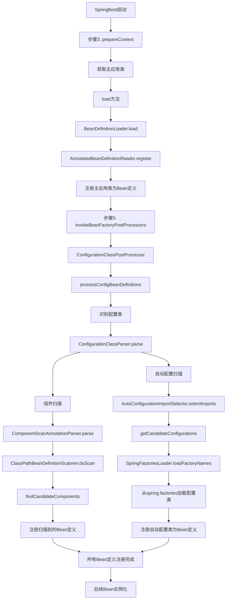

# SpringBoot启动过程中Bean定义扫描步骤详解

## 🎯 概述

在SpringBoot启动流程中，Bean定义扫描是一个关键过程，它负责发现和注册应用程序中的各种组件。本文档详细分析了启动过程中涉及Bean定义扫描的各个步骤。

## 📋 扫描步骤总览

SpringBoot启动过程中，Bean定义扫描主要涉及以下两个关键步骤：

1. **步骤3：准备上下文（prepareContext）** - 主应用类注册
2. **步骤5：调用BeanFactoryPostProcessor** - 组件扫描和自动配置扫描

## 🔍 详细步骤分析

### 步骤1：主应用类注册（prepareContext阶段）

**执行位置：** `SpringApplication.prepareContext()` → `load()` 方法

**执行时机：** 在应用上下文创建后，刷新前执行

**扫描内容：** 主应用类（包含@SpringBootApplication注解）

#### 主应用类注册源码分析

```java
// prepareContext方法中的关键代码
private void prepareContext(DefaultBootstrapContext bootstrapContext, ConfigurableApplicationContext context,
        ConfigurableEnvironment environment, SpringApplicationRunListeners listeners,
        ApplicationArguments applicationArguments, Banner printedBanner) {
    
    // ... 其他准备工作 ...
    
    // 9. 获取所有源（主要是主应用类）
    Set<Object> sources = getAllSources();
    Assert.notEmpty(sources, "Sources must not be empty");
    
    // 10. 加载Bean定义
    load(context, sources.toArray(new Object[0]));
}

// load方法实现
protected void load(ApplicationContext context, Object[] sources) {
    // 创建Bean定义加载器
    BeanDefinitionLoader loader = createBeanDefinitionLoader(getBeanDefinitionRegistry(context), sources);
    
    // 设置各种配置
    if (this.beanNameGenerator != null) {
        loader.setBeanNameGenerator(this.beanNameGenerator);
    }
    
    // 加载Bean定义（这里会注册主应用类）
    loader.load();
}

// BeanDefinitionLoader.load()方法
public int load() {
    int count = 0;
    for (Object source : this.sources) {
        count += load(source);
    }
    return count;
}

// 加载Class类型（主应用类）
private int load(Class<?> source) {
    // 使用AnnotatedBeanDefinitionReader注册主应用类
    this.annotatedReader.register(source);
    return 1;
}
```

#### 主应用类注册过程

```java
// AnnotatedBeanDefinitionReader.register()
public void register(Class<?>... componentClasses) {
    for (Class<?> componentClass : componentClasses) {
        registerBean(componentClass);
    }
}

private <T> void doRegisterBean(Class<T> beanClass, @Nullable String name,
        @Nullable Class<? extends Annotation>[] qualifiers, @Nullable Supplier<T> supplier,
        @Nullable BeanDefinitionCustomizer[] customizers) {
    
    // 1. 创建Bean定义
    AnnotatedGenericBeanDefinition abd = new AnnotatedGenericBeanDefinition(beanClass);
    
    // 2. 检查是否需要跳过
    if (this.conditionEvaluator.shouldSkip(abd.getMetadata())) {
        return;
    }
    
    // 3. 设置作用域
    ScopeMetadata scopeMetadata = this.scopeMetadataResolver.resolveScopeMetadata(abd);
    abd.setScope(scopeMetadata.getScopeName());
    
    // 4. 生成Bean名称
    String beanName = (name != null ? name : this.beanNameGenerator.generateBeanName(abd, this.registry));
    
    // 5. 处理通用注解
    AnnotationConfigUtils.processCommonDefinitionAnnotations(abd);
    
    // 6. 注册Bean定义
    BeanDefinitionReaderUtils.registerBeanDefinition(definitionHolder, this.registry);
}
```

**关键点：**

- 主应用类被注册为Bean定义
- @SpringBootApplication注解包含@ComponentScan、@EnableAutoConfiguration、@Configuration等元注解
- 为后续的组件扫描和自动配置做准备

### 步骤2：组件扫描和自动配置扫描（invokeBeanFactoryPostProcessors阶段）

**执行位置：** `AbstractApplicationContext.refresh()` → `invokeBeanFactoryPostProcessors()` 方法

**执行时机：** 在BeanFactory准备完成后，BeanPostProcessor注册前执行

**扫描内容：**

- 组件扫描：@Component、@Service、@Repository、@Controller等
- 配置类扫描：@Configuration类
- 自动配置扫描：@EnableAutoConfiguration触发的自动配置类

#### 源码分析

```java
// refresh方法中的关键步骤
public void refresh() throws BeansException, IllegalStateException {
    synchronized (this.startupShutdownMonitor) {
        // ... 前面的步骤 ...
        
        // 5. 调用BeanFactoryPostProcessor（核心扫描步骤）
        invokeBeanFactoryPostProcessors(beanFactory);
        
        // ... 后面的步骤 ...
    }
}

// invokeBeanFactoryPostProcessors方法
protected void invokeBeanFactoryPostProcessors(ConfigurableListableBeanFactory beanFactory) {
    PostProcessorRegistrationDelegate.invokeBeanFactoryPostProcessors(beanFactory, this);
}
```

#### ConfigurationClassPostProcessor处理过程

```java
// PostProcessorRegistrationDelegate.invokeBeanFactoryPostProcessors()
public static void invokeBeanFactoryPostProcessors(
        ConfigurableListableBeanFactory beanFactory, List<BeanFactoryPostProcessor> beanFactoryPostProcessors) {
    
    // 1. 首先处理BeanDefinitionRegistryPostProcessor
    String[] postProcessorNames = beanFactory.getBeanNamesForType(BeanDefinitionRegistryPostProcessor.class, true, false);
    
    for (String ppName : postProcessorNames) {
        if (beanFactory.isTypeMatch(ppName, PriorityOrdered.class)) {
            currentRegistryProcessors.add(beanFactory.getBean(ppName, BeanDefinitionRegistryPostProcessor.class));
            processedBeans.add(ppName);
        }
    }
    
    // 2. 按优先级排序并执行
    sortPostProcessors(currentRegistryProcessors, beanFactory);
    registryProcessors.addAll(currentRegistryProcessors);
    invokeBeanDefinitionRegistryPostProcessors(currentRegistryProcessors, registry);
    
    // 3. 处理ConfigurationClassPostProcessor（自动配置的核心）
    // 这个处理器负责：
    // - 扫描@Component、@Service、@Repository、@Controller等注解
    // - 处理@Configuration类
    // - 执行@Import注解
    // - 处理@ConditionalOnXxx条件注解
    // - 加载spring.factories中的自动配置类
}
```

#### 配置类解析详细过程

```java
// ConfigurationClassPostProcessor.postProcessBeanDefinitionRegistry()
@Override
public void postProcessBeanDefinitionRegistry(BeanDefinitionRegistry registry) {
    int registryId = System.identityHashCode(registry);
    if (this.registriesPostProcessed.contains(registryId)) {
        throw new IllegalStateException("Cannot process configuration classes");
    }
    
    this.registriesPostProcessed.add(registryId);
    
    // 核心方法：处理配置类
    processConfigBeanDefinitions(registry);
}

private void processConfigBeanDefinitions(BeanDefinitionRegistry registry) {
    List<BeanDefinitionHolder> configCandidates = new ArrayList<>();
    String[] candidateNames = registry.getBeanDefinitionNames();
    
    // 1. 识别配置类（@Configuration、@Component等）
    for (String beanName : candidateNames) {
        BeanDefinition beanDef = registry.getBeanDefinition(beanName);
        if (ConfigurationClassUtils.isFullConfigurationClass(beanDef) ||
                ConfigurationClassUtils.isLiteConfigurationClass(beanDef)) {
            configCandidates.add(new BeanDefinitionHolder(beanDef, beanName));
        }
    }
    
    // 2. 创建配置类解析器
    ConfigurationClassParser parser = new ConfigurationClassParser(
            this.metadataReaderFactory, this.problemReporter, this.environment,
            this.resourceLoader, this.componentScanBeanNameGenerator, registry);
    
    Set<BeanDefinitionHolder> candidates = new LinkedHashSet<>(configCandidates);
    Set<ConfigurationClass> alreadyParsed = new HashSet<>(configCandidates.size());
    
    do {
        // 3. 解析配置类（包括组件扫描和自动配置）
        parser.parse(candidates);
        parser.validate();
        
        Set<ConfigurationClass> configClasses = new LinkedHashSet<>(parser.getConfigurationClasses());
        configClasses.removeAll(alreadyParsed);
        
        // 4. 创建BeanDefinitionReader
        if (this.reader == null) {
            this.reader = new ConfigurationClassBeanDefinitionReader(
                    registry, this.sourceExtractor, this.resourceLoader, this.environment,
                    this.importBeanNameGenerator, parser.getImportRegistry());
        }
        
        // 5. 加载Bean定义
        this.reader.loadBeanDefinitions(configClasses);
        alreadyParsed.addAll(configClasses);
        
        // 6. 检查是否有新的配置类需要处理
        candidates.clear();
        if (registry.getBeanDefinitionCount() > candidateNames.length) {
            String[] newCandidateNames = registry.getBeanDefinitionNames();
            Set<String> oldCandidateNames = new HashSet<>(Arrays.asList(candidateNames));
            Set<String> alreadyParsedClasses = new HashSet<>();
            for (ConfigurationClass configurationClass : alreadyParsed) {
                alreadyParsedClasses.add(configurationClass.getMetadata().getClassName());
            }
            for (String candidateName : newCandidateNames) {
                if (!oldCandidateNames.contains(candidateName)) {
                    BeanDefinition bd = registry.getBeanDefinition(candidateName);
                    if (ConfigurationClassUtils.checkConfigurationClassCandidate(bd, this.metadataReaderFactory) &&
                            !alreadyParsedClasses.contains(bd.getBeanClassName())) {
                        candidates.add(new BeanDefinitionHolder(bd, candidateName));
                    }
                }
            }
            candidateNames = newCandidateNames;
        }
    }
    while (!candidates.isEmpty());
}
```

#### 组件扫描详细过程

```java
// ComponentScanAnnotationParser.parse()
public Set<BeanDefinitionHolder> parse(AnnotationAttributes componentScan, String declaringClass) {
    ClassPathBeanDefinitionScanner scanner = new ClassPathBeanDefinitionScanner(this.registry,
            componentScan.getBoolean("useDefaultFilters"), this.environment, this.resourceLoader);
    
    // 1. 设置Bean名称生成器
    Class<? extends BeanNameGenerator> generatorClass = componentScan.getClass("nameGenerator");
    BeanNameGenerator beanNameGenerator = (generatorClass != BeanNameGenerator.class ?
            BeanUtils.instantiateClass(generatorClass) : this.beanNameGenerator);
    scanner.setBeanNameGenerator(beanNameGenerator);
    
    // 2. 设置作用域代理模式
    ScopedProxyMode scopedProxyMode = componentScan.getEnum("scopedProxy");
    if (scopedProxyMode != ScopedProxyMode.DEFAULT) {
        scanner.setScopedProxyMode(scopedProxyMode);
    } else {
        Class<? extends ScopeMetadataResolver> resolverClass = componentScan.getClass("scopeResolver");
        scanner.setScopeMetadataResolver(BeanUtils.instantiateClass(resolverClass));
    }
    
    // 3. 设置资源模式
    scanner.setResourcePattern(componentScan.getString("resourcePattern"));
    
    // 4. 添加包含过滤器
    for (AnnotationAttributes filter : componentScan.getAnnotationArray("includeFilters")) {
        for (TypeFilter typeFilter : typeFiltersFor(filter)) {
            scanner.addIncludeFilter(typeFilter);
        }
    }
    
    // 5. 添加排除过滤器
    for (AnnotationAttributes filter : componentScan.getAnnotationArray("excludeFilters")) {
        for (TypeFilter typeFilter : typeFiltersFor(filter)) {
            scanner.addExcludeFilter(typeFilter);
        }
    }
    
    // 6. 执行扫描
    return scanner.doScan(StringUtils.toStringArray(basePackages));
}

// ClassPathBeanDefinitionScanner.doScan()
protected Set<BeanDefinitionHolder> doScan(String... basePackages) {
    Set<BeanDefinitionHolder> beanDefinitions = new LinkedHashSet<>();
    for (String basePackage : basePackages) {
        // 扫描包下的所有类
        Set<BeanDefinition> candidates = findCandidateComponents(basePackage);
        for (BeanDefinition candidate : candidates) {
            ScopeMetadata scopeMetadata = this.scopeMetadataResolver.resolveScopeMetadata(candidate);
            candidate.setScope(scopeMetadata.getScopeName());
            String beanName = this.beanNameGenerator.generateBeanName(candidate, this.registry);
            
            // 处理通用注解
            if (candidate instanceof AbstractBeanDefinition) {
                postProcessBeanDefinition((AbstractBeanDefinition) candidate, beanName);
            }
            
            // 处理通用注解（@Lazy、@Primary、@DependsOn等）
            if (candidate instanceof AnnotatedBeanDefinition) {
                AnnotationConfigUtils.processCommonDefinitionAnnotations((AnnotatedBeanDefinition) candidate);
            }
            
            // 检查是否已经注册
            if (checkCandidate(beanName, candidate)) {
                BeanDefinitionHolder definitionHolder = new BeanDefinitionHolder(candidate, beanName);
                definitionHolder = AnnotationConfigUtils.applyScopedProxyMode(scopeMetadata, definitionHolder, this.registry);
                beanDefinitions.add(definitionHolder);
                registerBeanDefinition(definitionHolder, this.registry);
            }
        }
    }
    return beanDefinitions;
}
```

#### 自动配置扫描详细过程

```java
// AutoConfigurationImportSelector.selectImports()
@Override
public String[] selectImports(AnnotationMetadata annotationMetadata) {
    if (!isEnabled(annotationMetadata)) {
        return NO_IMPORTS;
    }
    
    // 1. 获取自动配置条目
    AutoConfigurationEntry autoConfigurationEntry = getAutoConfigurationEntry(annotationMetadata);
    return StringUtils.toStringArray(autoConfigurationEntry.getConfigurations());
}

protected AutoConfigurationEntry getAutoConfigurationEntry(AnnotationMetadata annotationMetadata) {
    if (!isEnabled(annotationMetadata)) {
        return EMPTY_ENTRY;
    }
    
    // 2. 获取注解属性
    AnnotationAttributes attributes = getAttributes(annotationMetadata);
    
    // 3. 获取候选配置
    List<String> configurations = getCandidateConfigurations(annotationMetadata, attributes);
    
    // 4. 去重
    configurations = removeDuplicates(configurations);
    
    // 5. 获取排除项
    Set<String> exclusions = getExclusions(annotationMetadata, attributes);
    checkExcludedClasses(configurations, exclusions);
    
    // 6. 移除排除项
    configurations.removeAll(exclusions);
    
    // 7. 过滤（应用条件注解）
    configurations = getConfigurationClassFilter().filter(configurations);
    
    // 8. 触发自动配置导入事件
    fireAutoConfigurationImportEvents(configurations, exclusions);
    
    return new AutoConfigurationEntry(configurations, exclusions);
}

// 从spring.factories加载自动配置类
protected List<String> getCandidateConfigurations(AnnotationMetadata metadata, AnnotationAttributes attributes) {
    List<String> configurations = SpringFactoriesLoader.loadFactoryNames(getSpringFactoriesLoaderFactoryClass(),
            getBeanClassLoader());
    Assert.notEmpty(configurations, "No auto configuration classes found in META-INF/spring.factories. " +
            "If you are using a custom packaging, make sure that file is correct.");
    return configurations;
}
```

## 📊 扫描步骤对比表

| 步骤 | 执行位置 | 扫描内容 | 扫描范围 | 扫描结果 |
|------|----------|----------|----------|----------|
| **步骤1** | `prepareContext()` → `load()` | 主应用类 | 主应用类本身 | 注册主应用类为Bean定义 |
| **步骤2** | `invokeBeanFactoryPostProcessors()` | 组件扫描 | @ComponentScan指定的包 | 注册@Component、@Service等为Bean定义 |
| **步骤2** | `invokeBeanFactoryPostProcessors()` | 自动配置 | spring.factories中的配置类 | 注册自动配置类为Bean定义 |
| **步骤2** | `invokeBeanFactoryPostProcessors()` | 配置类 | @Configuration类 | 注册@Configuration类为Bean定义 |

## 🔄 扫描执行流程图



## 🎯 关键设计思想

### 1. 分层扫描策略

- **主应用类注册**：在prepareContext阶段注册主应用类，为后续扫描提供入口
- **组件扫描**：在invokeBeanFactoryPostProcessors阶段扫描用户定义的组件
- **自动配置扫描**：在invokeBeanFactoryPostProcessors阶段扫描框架提供的自动配置

### 2. 延迟加载机制

- Bean定义在扫描阶段注册，但Bean实例在finishBeanFactoryInitialization阶段创建
- 支持懒加载和条件注解，提高启动效率

### 3. 扩展性设计

- 通过BeanFactoryPostProcessor接口支持自定义扫描逻辑
- 通过@Import注解支持自定义配置类导入
- 通过条件注解支持条件化配置

## 🔧 实际应用示例

### 1. 主应用类示例

```java
@SpringBootApplication  // 包含@ComponentScan、@EnableAutoConfiguration、@Configuration
public class SpringbootLearningApplication {
    public static void main(String[] args) {
        SpringApplication.run(SpringbootLearningApplication.class, args);
    }
}
```

### 2. 组件扫描示例

```java
@Service
public class UserService {
    // 这个类会被@ComponentScan扫描到并注册为Bean定义
}

@Repository
public class UserRepository {
    // 这个类会被@ComponentScan扫描到并注册为Bean定义
}

@Controller
public class UserController {
    // 这个类会被@ComponentScan扫描到并注册为Bean定义
}
```

### 3. 自动配置示例

```java
// 在spring.factories文件中定义
org.springframework.boot.autoconfigure.EnableAutoConfiguration=\
com.example.autoconfigure.DataSourceAutoConfiguration,\
com.example.autoconfigure.WebMvcAutoConfiguration

// 自动配置类
@Configuration
@ConditionalOnClass(DataSource.class)
@EnableConfigurationProperties(DataSourceProperties.class)
public class DataSourceAutoConfiguration {
    // 这个类会被自动配置扫描到并注册为Bean定义
}
```

## 📝 面试重点

### 1. 扫描时机问题

- **Q: Bean定义扫描在启动流程的哪个阶段执行？**
- **A: 主要在步骤3（prepareContext）和步骤5（invokeBeanFactoryPostProcessors）执行**

### 2. 扫描顺序问题

- **Q: 组件扫描和自动配置扫描的执行顺序是什么？**
- **A: 先执行组件扫描，再执行自动配置扫描，都在invokeBeanFactoryPostProcessors阶段**

### 3. 扫描范围问题

- **Q: @ComponentScan的扫描范围是如何确定的？**
- **A: 默认扫描主应用类所在的包及其子包，可以通过basePackages属性自定义**

### 4. 条件注解问题

- **Q: @ConditionalOnXxx注解是在哪个阶段被评估的？**
- **A: 在ConfigurationClassPostProcessor阶段被评估，决定是否注册Bean定义**

### 5. 自动配置问题

- **Q: 自动配置类是如何被发现的？**
- **A: 通过SpringFactoriesLoader从META-INF/spring.factories文件中加载**

## 🚀 性能优化建议

### 1. 减少扫描范围

```java
@SpringBootApplication
@ComponentScan(basePackages = "com.example.service")  // 只扫描特定包
public class Application {
    // ...
}
```

### 2. 使用条件注解

```java
@Configuration
@ConditionalOnProperty(name = "feature.enabled", havingValue = "true")
public class FeatureConfiguration {
    // 只在特定条件下才加载
}
```

### 3. 懒加载配置

```java
@Configuration
@Lazy
public class LazyConfiguration {
    // 延迟加载配置
}
```

## 📚 总结

SpringBoot启动过程中的Bean定义扫描是一个复杂而精妙的过程，主要涉及两个关键步骤：

1. **prepareContext阶段**：注册主应用类为Bean定义
2. **invokeBeanFactoryPostProcessors阶段**：执行组件扫描和自动配置扫描

通过这种分层扫描策略，SpringBoot能够：

- 自动发现和注册用户定义的组件
- 加载框架提供的自动配置
- 支持条件化配置和扩展性
- 提供高效的启动性能

理解这些扫描步骤对于深入掌握SpringBoot的工作原理和进行性能优化都具有重要意义。
