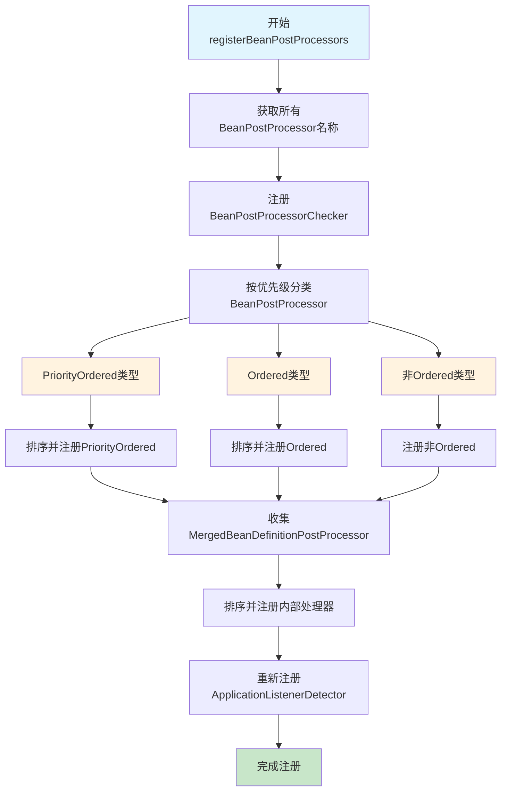

# registerBeanPostProcessors方法详细解析

## 概述

`registerBeanPostProcessors` 方法是SpringBoot启动流程中的第6个关键步骤，负责注册所有的BeanPostProcessor实例。BeanPostProcessor是Spring框架中一个非常重要的扩展点，允许开发者在Bean实例化前后进行自定义处理，是实现AOP、依赖注入、生命周期管理等核心功能的基础。

## 方法签名和调用位置

### 方法签名

```java
protected void registerBeanPostProcessors(ConfigurableListableBeanFactory beanFactory) {
    PostProcessorRegistrationDelegate.registerBeanPostProcessors(beanFactory, this);
}
```

### 在启动流程中的位置

```java
public void refresh() throws BeansException, IllegalStateException {
    synchronized (this.startupShutdownMonitor) {
        // ... 前面的步骤 ...
        
        // 5. 调用BeanFactoryPostProcessor（组件扫描和自动配置）
        invokeBeanFactoryPostProcessors(beanFactory);
        
        // 6. 注册BeanPostProcessor（当前步骤）
        registerBeanPostProcessors(beanFactory);
        
        // 7. 初始化MessageSource
        initMessageSource();
        
        // ... 后面的步骤 ...
    }
}
```

## 执行时机和重要性

### 执行时机

- **执行阶段**：在BeanFactoryPostProcessor执行完成后，Bean实例化之前
- **执行顺序**：第6步，位于组件扫描之后，Bean实例化之前
- **执行目的**：为后续的Bean实例化过程准备必要的后处理器

### 重要性

1. **AOP基础**：AOP代理的创建依赖于BeanPostProcessor
2. **依赖注入**：@Autowired、@Resource等注解的处理需要BeanPostProcessor
3. **生命周期管理**：@PostConstruct、@PreDestroy等生命周期注解的处理
4. **扩展性**：为开发者提供Bean创建过程中的扩展点

## 详细源码分析

### PostProcessorRegistrationDelegate.registerBeanPostProcessors方法

```java
public static void registerBeanPostProcessors(
        ConfigurableListableBeanFactory beanFactory, AbstractApplicationContext applicationContext) {

    // 1. 获取所有BeanPostProcessor的Bean名称
    String[] postProcessorNames = beanFactory.getBeanNamesForType(BeanPostProcessor.class, true, false);

    // 2. 注册BeanPostProcessorChecker（用于检查BeanPostProcessor的数量）
    int beanProcessorTargetCount = beanFactory.getBeanPostProcessorCount() + 1 + postProcessorNames.length;
    beanFactory.addBeanPostProcessor(new BeanPostProcessorChecker(beanFactory, beanProcessorTargetCount));

    // 3. 分离不同类型的BeanPostProcessor
    List<BeanPostProcessor> priorityOrderedPostProcessors = new ArrayList<>();
    List<BeanPostProcessor> internalPostProcessors = new ArrayList<>();
    List<String> orderedPostProcessorNames = new ArrayList<>();
    List<String> nonOrderedPostProcessorNames = new ArrayList<>();

    for (String ppName : postProcessorNames) {
        if (beanFactory.isTypeMatch(ppName, PriorityOrdered.class)) {
            BeanPostProcessor pp = beanFactory.getBean(ppName, BeanPostProcessor.class);
            priorityOrderedPostProcessors.add(pp);
            if (pp instanceof MergedBeanDefinitionPostProcessor) {
                internalPostProcessors.add(pp);
            }
        }
        else if (beanFactory.isTypeMatch(ppName, Ordered.class)) {
            orderedPostProcessorNames.add(ppName);
        }
        else {
            nonOrderedPostProcessorNames.add(ppName);
        }
    }

    // 4. 注册PriorityOrdered类型的BeanPostProcessor
    sortPostProcessors(priorityOrderedPostProcessors, beanFactory);
    registerBeanPostProcessors(beanFactory, priorityOrderedPostProcessors);

    // 5. 注册Ordered类型的BeanPostProcessor
    List<BeanPostProcessor> orderedPostProcessors = new ArrayList<>();
    for (String ppName : orderedPostProcessorNames) {
        BeanPostProcessor pp = beanFactory.getBean(ppName, BeanPostProcessor.class);
        orderedPostProcessors.add(pp);
        if (pp instanceof MergedBeanDefinitionPostProcessor) {
            internalPostProcessors.add(pp);
        }
    }
    sortPostProcessors(orderedPostProcessors, beanFactory);
    registerBeanPostProcessors(beanFactory, orderedPostProcessors);

    // 6. 注册非Ordered类型的BeanPostProcessor
    List<BeanPostProcessor> nonOrderedPostProcessors = new ArrayList<>();
    for (String ppName : nonOrderedPostProcessorNames) {
        BeanPostProcessor pp = beanFactory.getBean(ppName, BeanPostProcessor.class);
        nonOrderedPostProcessors.add(pp);
        if (pp instanceof MergedBeanDefinitionPostProcessor) {
            internalPostProcessors.add(pp);
        }
    }
    registerBeanPostProcessors(beanFactory, nonOrderedPostProcessors);

    // 7. 注册内部BeanPostProcessor（MergedBeanDefinitionPostProcessor）
    sortPostProcessors(internalPostProcessors, beanFactory);
    registerBeanPostProcessors(beanFactory, internalPostProcessors);

    // 8. 重新注册ApplicationListenerDetector（确保它在最后执行）
    beanFactory.addBeanPostProcessor(new ApplicationListenerDetector(applicationContext));
}
```

## 关键处理步骤详解

### 1. 获取BeanPostProcessor名称

```java
String[] postProcessorNames = beanFactory.getBeanNamesForType(BeanPostProcessor.class, true, false);
```

**作用**：从BeanFactory中获取所有实现了BeanPostProcessor接口的Bean名称

**包含的BeanPostProcessor**：

- `AutowiredAnnotationBeanPostProcessor`：处理@Autowired注解
- `CommonAnnotationBeanPostProcessor`：处理@Resource、@PostConstruct、@PreDestroy注解
- `ApplicationContextAwareProcessor`：处理Aware接口
- `ConfigurationClassPostProcessor`：处理配置类
- 自定义的BeanPostProcessor

### 2. 注册BeanPostProcessorChecker

```java
int beanProcessorTargetCount = beanFactory.getBeanPostProcessorCount() + 1 + postProcessorNames.length;
beanFactory.addBeanPostProcessor(new BeanPostProcessorChecker(beanFactory, beanProcessorTargetCount));
```

**作用**：注册一个检查器，用于监控BeanPostProcessor的数量变化

**用途**：

- 在Bean创建过程中检查BeanPostProcessor的数量
- 如果数量发生变化，会输出警告信息
- 帮助开发者发现BeanPostProcessor的注册问题

### 3. 分类处理BeanPostProcessor

```java
// 按优先级分类
if (beanFactory.isTypeMatch(ppName, PriorityOrdered.class)) {
    // 最高优先级
    priorityOrderedPostProcessors.add(pp);
}
else if (beanFactory.isTypeMatch(ppName, Ordered.class)) {
    // 普通优先级
    orderedPostProcessorNames.add(ppName);
}
else {
    // 无优先级
    nonOrderedPostProcessorNames.add(ppName);
}
```

**分类依据**：

- `PriorityOrdered`：最高优先级，最先执行
- `Ordered`：普通优先级，按@Order注解排序
- 无优先级：最后执行

### 4. 按优先级注册

```java
// 1. 注册PriorityOrdered类型
sortPostProcessors(priorityOrderedPostProcessors, beanFactory);
registerBeanPostProcessors(beanFactory, priorityOrderedPostProcessors);

// 2. 注册Ordered类型
sortPostProcessors(orderedPostProcessors, beanFactory);
registerBeanPostProcessors(beanFactory, orderedPostProcessors);

// 3. 注册非Ordered类型
registerBeanPostProcessors(beanFactory, nonOrderedPostProcessors);
```

**注册顺序**：

1. PriorityOrdered类型（按@Priority排序）
2. Ordered类型（按@Order排序）
3. 非Ordered类型（按注册顺序）

### 5. 特殊处理MergedBeanDefinitionPostProcessor

```java
if (pp instanceof MergedBeanDefinitionPostProcessor) {
    internalPostProcessors.add(pp);
}
```

**作用**：将MergedBeanDefinitionPostProcessor单独处理

**原因**：这类处理器需要在Bean定义合并后执行，有特殊的执行时机要求

### 6. 重新注册ApplicationListenerDetector

```java
beanFactory.addBeanPostProcessor(new ApplicationListenerDetector(applicationContext));
```

**作用**：确保ApplicationListenerDetector在最后执行

**原因**：需要检测所有Bean，确保事件监听器能够正确注册

## 常见的BeanPostProcessor类型

### 1. AutowiredAnnotationBeanPostProcessor

```java
@Component
public class AutowiredAnnotationBeanPostProcessor implements BeanPostProcessor {
    
    @Override
    public Object postProcessBeforeInitialization(Object bean, String beanName) throws BeansException {
        // 处理@Autowired注解的依赖注入
        return bean;
    }
    
    @Override
    public Object postProcessAfterInitialization(Object bean, String beanName) throws BeansException {
        return bean;
    }
}
```

**功能**：

- 处理@Autowired注解的依赖注入
- 处理@Value注解的属性注入
- 处理@Lookup注解的方法查找

### 2. CommonAnnotationBeanPostProcessor

```java
@Component
public class CommonAnnotationBeanPostProcessor implements BeanPostProcessor {
    
    @Override
    public Object postProcessBeforeInitialization(Object bean, String beanName) throws BeansException {
        // 处理@PostConstruct注解
        return bean;
    }
    
    @Override
    public Object postProcessAfterInitialization(Object bean, String beanName) throws BeansException {
        // 处理@PreDestroy注解
        return bean;
    }
}
```

**功能**：

- 处理@PostConstruct注解的初始化方法
- 处理@PreDestroy注解的销毁方法
- 处理@Resource注解的依赖注入

### 3. ApplicationContextAwareProcessor

```java
public class ApplicationContextAwareProcessor implements BeanPostProcessor {
    
    @Override
    public Object postProcessBeforeInitialization(Object bean, String beanName) throws BeansException {
        // 处理各种Aware接口
        if (bean instanceof ApplicationContextAware) {
            ((ApplicationContextAware) bean).setApplicationContext(this.applicationContext);
        }
        if (bean instanceof BeanFactoryAware) {
            ((BeanFactoryAware) bean).setBeanFactory(this.beanFactory);
        }
        // ... 其他Aware接口
        return bean;
    }
}
```

**功能**：

- 处理ApplicationContextAware接口
- 处理BeanFactoryAware接口
- 处理其他各种Aware接口

## 执行流程图



## 实际应用示例

### 1. 自定义BeanPostProcessor

```java
@Component
@Order(1) // 设置执行顺序
public class CustomBeanPostProcessor implements BeanPostProcessor {
    
    private static final Logger logger = LoggerFactory.getLogger(CustomBeanPostProcessor.class);
    
    @Override
    public Object postProcessBeforeInitialization(Object bean, String beanName) throws BeansException {
        logger.info("Bean初始化前处理: {}", beanName);
        
        // 可以在这里进行一些预处理
        if (bean instanceof MyService) {
            logger.info("处理MyService实例: {}", beanName);
        }
        
        return bean;
    }
    
    @Override
    public Object postProcessAfterInitialization(Object bean, String beanName) throws BeansException {
        logger.info("Bean初始化后处理: {}", beanName);
        
        // 可以在这里进行一些后处理，比如代理创建
        if (bean instanceof MyService) {
            logger.info("MyService初始化完成: {}", beanName);
        }
        
        return bean;
    }
}
```

### 2. 使用BeanPostProcessor实现AOP

```java
@Component
public class AopBeanPostProcessor implements BeanPostProcessor {
    
    @Override
    public Object postProcessAfterInitialization(Object bean, String beanName) throws BeansException {
        // 检查是否需要创建AOP代理
        if (needsProxy(bean)) {
            return createProxy(bean);
        }
        return bean;
    }
    
    private boolean needsProxy(Object bean) {
        // 检查类或方法是否有@Transactional、@Async等注解
        return hasTransactionalAnnotation(bean) || hasAsyncAnnotation(bean);
    }
    
    private Object createProxy(Object bean) {
        // 创建AOP代理
        return Proxy.newProxyInstance(
            bean.getClass().getClassLoader(),
            bean.getClass().getInterfaces(),
            new AopInvocationHandler(bean)
        );
    }
}
```

### 3. 使用BeanPostProcessor进行性能监控

```java
@Component
public class PerformanceMonitoringBeanPostProcessor implements BeanPostProcessor {
    
    @Override
    public Object postProcessAfterInitialization(Object bean, String beanName) throws BeansException {
        // 为需要监控的Bean创建代理
        if (shouldMonitor(bean)) {
            return new PerformanceMonitoringProxy(bean);
        }
        return bean;
    }
    
    private boolean shouldMonitor(Object bean) {
        // 检查是否有@Monitor注解
        return bean.getClass().isAnnotationPresent(Monitor.class);
    }
}
```

## 关键设计思想

### 1. 优先级机制

- **PriorityOrdered**：最高优先级，用于框架核心功能
- **Ordered**：普通优先级，用于业务逻辑
- **无优先级**：最后执行，用于通用处理

### 2. 分类处理策略

- **按类型分类**：不同类型的BeanPostProcessor有不同的处理方式
- **按时机分类**：MergedBeanDefinitionPostProcessor需要特殊处理
- **按功能分类**：内部处理器和外部处理器分别处理

### 3. 扩展性设计

- **接口设计**：BeanPostProcessor接口简单易用
- **注册机制**：支持动态注册和移除
- **执行顺序**：通过优先级机制控制执行顺序

## 面试重点

### 1. 基本概念问题

**Q: BeanPostProcessor是什么？有什么作用？**

**A:** BeanPostProcessor是Spring框架中的一个重要扩展点，允许开发者在Bean实例化前后进行自定义处理。主要作用包括：

- 依赖注入处理（@Autowired、@Resource）
- AOP代理创建
- 生命周期管理（@PostConstruct、@PreDestroy）
- 自定义扩展功能

### 2. 执行时机问题

**Q: BeanPostProcessor在什么时候被注册？**

**A:** BeanPostProcessor在SpringBoot启动流程的第6步被注册，具体时机是：

- 在BeanFactoryPostProcessor执行完成后
- 在Bean实例化之前
- 在MessageSource初始化之前

### 3. 执行顺序问题

**Q: 多个BeanPostProcessor的执行顺序是如何确定的？**

**A:** 执行顺序按以下规则确定：

1. PriorityOrdered类型（按@Priority排序）
2. Ordered类型（按@Order排序）
3. 非Ordered类型（按注册顺序）
4. MergedBeanDefinitionPostProcessor类型（特殊处理）
5. ApplicationListenerDetector（最后执行）

### 4. 常见类型问题

**Q: Spring框架中有哪些常见的BeanPostProcessor？**

**A:** 常见的BeanPostProcessor包括：

- AutowiredAnnotationBeanPostProcessor：处理@Autowired注解
- CommonAnnotationBeanPostProcessor：处理@PostConstruct、@PreDestroy注解
- ApplicationContextAwareProcessor：处理Aware接口
- ConfigurationClassPostProcessor：处理配置类
- ApplicationListenerDetector：检测事件监听器

### 5. 自定义扩展问题

**Q: 如何自定义BeanPostProcessor？**

**A:** 自定义BeanPostProcessor的步骤：

1. 实现BeanPostProcessor接口
2. 重写postProcessBeforeInitialization和postProcessAfterInitialization方法
3. 使用@Component注解注册为Spring Bean
4. 可选：使用@Order注解设置执行顺序

## 性能优化建议

### 1. 减少BeanPostProcessor数量

```java
// 避免创建过多的BeanPostProcessor
// 可以将多个功能合并到一个BeanPostProcessor中
@Component
public class CombinedBeanPostProcessor implements BeanPostProcessor {
    
    @Override
    public Object postProcessBeforeInitialization(Object bean, String beanName) throws BeansException {
        // 合并多个处理逻辑
        handleAutowired(bean, beanName);
        handlePostConstruct(bean, beanName);
        handleAware(bean, beanName);
        return bean;
    }
}
```

### 2. 使用条件判断优化性能

```java
@Component
public class OptimizedBeanPostProcessor implements BeanPostProcessor {
    
    @Override
    public Object postProcessBeforeInitialization(Object bean, String beanName) throws BeansException {
        // 只处理需要的Bean类型
        if (bean instanceof MyTargetType) {
            // 执行处理逻辑
            processBean(bean, beanName);
        }
        return bean;
    }
}
```

### 3. 避免在BeanPostProcessor中创建Bean

```java
@Component
public class SafeBeanPostProcessor implements BeanPostProcessor {
    
    @Override
    public Object postProcessBeforeInitialization(Object bean, String beanName) throws BeansException {
        // 避免在BeanPostProcessor中创建新的Bean
        // 这可能导致循环依赖或性能问题
        return bean;
    }
}
```

## 总结

`registerBeanPostProcessors`方法是SpringBoot启动流程中的关键步骤，负责注册所有的BeanPostProcessor实例。通过优先级机制和分类处理策略，确保BeanPostProcessor能够按照正确的顺序执行，为后续的Bean实例化过程提供必要的处理能力。

理解BeanPostProcessor的注册机制对于深入掌握Spring框架的工作原理和进行自定义扩展都具有重要意义。通过合理使用BeanPostProcessor，开发者可以在Bean的生命周期中插入自定义逻辑，实现各种高级功能。
